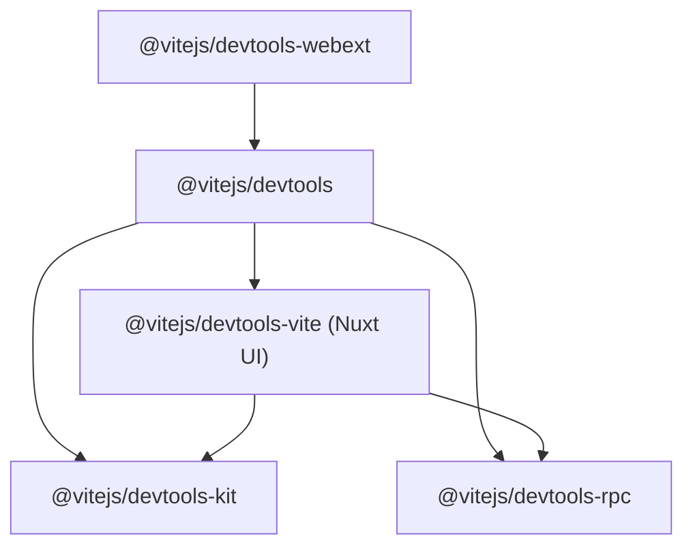

# AGENTS GUIDE

Quick reference for future agents working on this repo.

## Stack & Structure
- Monorepo via `pnpm` workspaces; builds orchestrated with `turbo`.
- ESM TypeScript everywhere; bundling with `tsdown`.
- Key packages:
  - `packages/core` (`@vitejs/devtools`): Vite plugin, CLI, host/runtime (docks, views, terminals), websocket RPC server, standalone/webcomponents client.
  - `packages/kit` (`@vitejs/devtools-kit`): public types/utilities (`defineRpcFunction`, shared state, events) for integration authors; client helpers.
  - `packages/rpc` (`@vitejs/devtools-rpc`): thin typed RPC wrapper over `birpc`, with WS presets.
  - `packages/vite` (`@vitejs/devtools-vite`): Nuxt-based UI served from the plugin; registers Vite dock and RPC functions for Rolldown build data.
  - `packages/webext`: browser extension scaffolding (currently ancillary).
- Docs under `docs/` (VitePress); user-facing guides in `docs/guide`.
- Path aliases defined in `alias.ts` and propagated to `tsconfig.base.json` (do not edit paths manually).

## Runtime Architecture (high level)
- Plugin entry (`createDevToolsContext` in `packages/core/src/node/context.ts`) builds a `DevToolsNodeContext` with hosts for RPC, docks, views, terminals. It registers built-in RPC functions and invokes `plugin.devtools.setup` hooks from Vite plugins.
- Node context vs client context:
  - **Node context**: server-side state (cwd, workspaceRoot, vite config, mode, rpc/docks/views/terminals hosts) plus internal storage (auth) from `context-internal.ts`. Used by plugins and RPC handlers.
  - **Client context**: webcomponents/Nuxt UI state (`packages/core/src/client/webcomponents/state/*`), holding dock entries, selected panels, and RPC client; created with `clientType` of `embedded` or `standalone`.
- Websocket server (`packages/core/src/node/ws.ts`) exposes RPC via `@vitejs/devtools-rpc/presets/ws`. Auth is skipped in build mode or when `devtools.clientAuth` is `false`; trusted IDs stored under `node_modules/.vite/devtools/auth.json`.
- DevTools middleware (`packages/core/src/node/server.ts`) serves connection meta and standalone client assets.
- The Vite UI plugin (`packages/vite/src/node/plugin.ts`) registers RPC functions (Rolldown data fetchers) and hosts the Nuxt-generated static UI at `/.devtools-vite/`, adding a dock entry.
- Nuxt app config (`packages/vite/src/nuxt.config.ts`): SPA, base `/.devtools-vite/`, disables Nuxt devtools, enables typed pages, uses Unocss/VueUse; sets `vite.devtools.clientAuth = false` for UI.

## Client Modes (kit/core)
- **Embedded mode**: default overlay injected into the host app; docks render inside the app shell; use `clientType: 'embedded'` when creating client context.
- **Standalone mode**: runs the webcomponents UI as an independent page (see `packages/core/src/client/standalone`); useful for external access or when not injecting into the host app UI.

## Development Workflow
- Install: `pnpm install` (repo requires `pnpm@10.x`).
- Build all: `pnpm build` (runs `turbo run build`; for UI data, build generates Rolldown metadata under `packages/vite/node_modules/.rolldown`).
- Dev:
  - Core playground: `pnpm -C packages/core run play`
  - Vite UI: `pnpm -C packages/vite run dev`
  - Standalone core client: `pnpm -C packages/core run dev:standalone`
- Tests: `pnpm test` (Vitest; projects under `packages/*` and `test`).
- Typecheck: `pnpm typecheck` (via `vue-tsc -b`).
- Lint: `pnpm lint`
  - Use `pnpm lint --fix` to auto-resolve common issues.
- Docs: `pnpm -C docs run docs` / `docs:build` / `docs:serve`.

## Conventions & Guardrails
- Prefer workspace imports via aliases from `alias.ts`.
- Keep RPC additions typed; use `defineRpcFunction` from kit when adding server functions.
- Docks/views/terminals are registered through hosts on `DevToolsNodeContext`; mutations should update shared state (`@vitejs/devtools-kit/utils/shared-state`).
- When touching websocket auth or storage, note persisted state lives in `node_modules/.vite/devtools/auth.json` (created by `createStorage`).
- For Nuxt UI changes, base path must remain `/.devtools-vite/`; keep `clientAuth` considerations in mind if exposing over network.
- Project is currently focused on Rolldown build-mode analysis; dev-mode support is deferred.

## Useful Paths
- Core runtime: `packages/core/src/node/*`
- Core webcomponents: `packages/core/src/client/webcomponents`
- Kit utilities: `packages/kit/src/utils/*`
- RPC presets: `packages/rpc/src/presets/ws/*`
- Vite UI app: `packages/vite/src/app`
- Docs: `docs/guide/*`

## Quick Checks Before PRs
- Run `pnpm lint && pnpm test && pnpm typecheck`.
- Ensure `pnpm build` succeeds (regenerates Rolldown metadata if needed).
- Follow conventional commit style (`feat:`, `fix:`, etc.). README flags project as WIP; set expectations accordingly.
