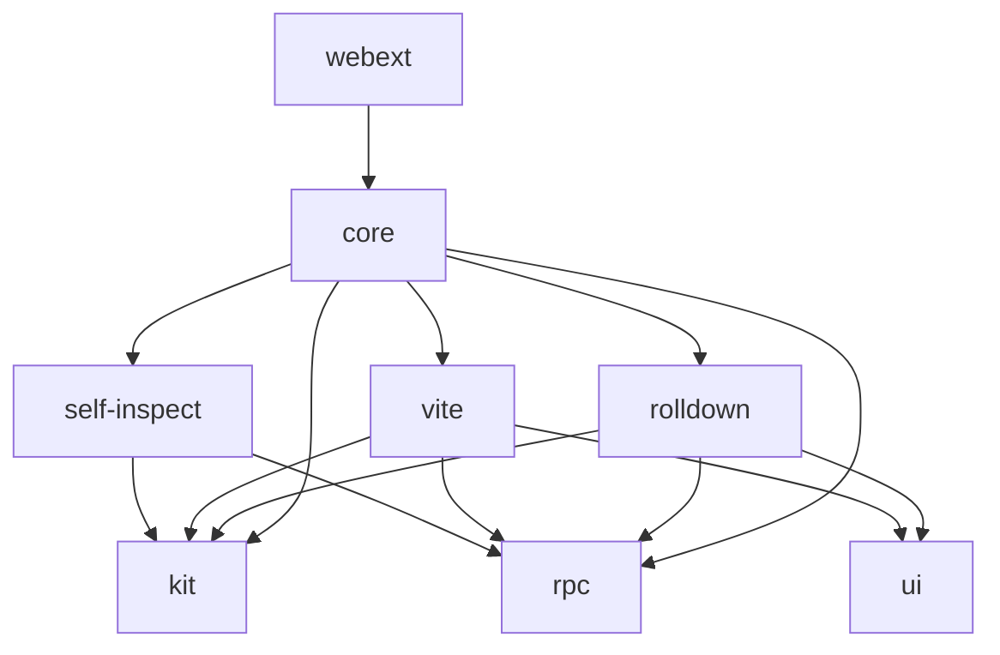

# AGENTS GUIDE

## Stack & Structure

Monorepo (`pnpm` workspaces + `turbo`). ESM TypeScript; bundled with `tsdown`. Path aliases in `alias.ts` (propagated to `tsconfig.base.json` — do not edit manually).

### Packages

| Package | npm | Description |
|---------|-----|-------------|
| `packages/core` | `@vitejs/devtools` | Vite plugin, CLI, runtime hosts (docks, views, terminals), WS RPC server, standalone/webcomponents client |
| `packages/kit` | `@vitejs/devtools-kit` | Public types/utilities for integration authors (`defineRpcFunction`, shared state, events, client helpers) |
| `packages/rpc` | `@vitejs/devtools-rpc` | Typed RPC wrapper over `birpc` with WS presets |
| `packages/ui` | `@vitejs/devtools-ui` | Shared UI components, composables, and UnoCSS preset (`presetDevToolsUI`). Private, not published |
| `packages/rolldown` | `@vitejs/devtools-rolldown` | Nuxt UI for Rolldown build data. Serves at `/.devtools-rolldown/` |
| `packages/vite` | `@vitejs/devtools-vite` | Nuxt UI for Vite DevTools (WIP). Serves at `/.devtools-vite/` |
| `packages/self-inspect` | `@vitejs/devtools-self-inspect` | Meta-introspection — DevTools for the DevTools. Serves at `/.devtools-self-inspect/` |
| `packages/webext` | — | Browser extension scaffolding (ancillary) |

Other top-level directories:
- `docs/` — VitePress docs; guides in `docs/guide/`
- `skills/` — Agent skill files generated from docs via [Agent Skills](https://agentskills.io/home). Structured references (RPC patterns, dock types, shared state, project structure) for AI agent context.


```mermaid
flowchart TD
  core["core"] --> kit & rpc
  core --> rolldown & vite & self-inspect
  rolldown --> kit & rpc & ui
  vite --> kit & rpc & ui
  self-inspect --> kit & rpc
  webext --> core
```

## Architecture

- **Entry**: `createDevToolsContext` (`packages/core/src/node/context.ts`) builds `DevToolsNodeContext` with hosts for RPC, docks, views, terminals. Invokes `plugin.devtools.setup` hooks.
- **Node context**: server-side (cwd, vite config, mode, hosts, auth storage at `node_modules/.vite/devtools/auth.json`).
- **Client context**: webcomponents/Nuxt UI state (`packages/core/src/client/webcomponents/state/*`) — dock entries, panels, RPC client. Two modes: `embedded` (overlay in host app) and `standalone` (independent page).
- **WS server** (`packages/core/src/node/ws.ts`): RPC via `@vitejs/devtools-rpc/presets/ws`. Auth skipped in build mode or when `devtools.clientAuth` is `false`.
- **Nuxt UI plugins** (rolldown, vite, self-inspect): each registers RPC functions and hosts static Nuxt SPA at its own base path.

## Development

```sh
pnpm install                          # requires pnpm@10.x
pnpm build                            # turbo run build
pnpm test                             # Vitest
pnpm typecheck                        # vue-tsc -b
pnpm lint --fix                       # ESLint
pnpm -C packages/core run play        # core playground
pnpm -C packages/rolldown run dev     # rolldown UI dev
pnpm -C packages/core run dev:standalone  # standalone client
pnpm -C docs run docs                 # docs dev server
```

## Conventions

- Use workspace aliases from `alias.ts`.
- RPC functions must use `defineRpcFunction` from kit; always namespace IDs (`my-plugin:fn-name`).
- Shared state via `@vitejs/devtools-kit/utils/shared-state`; keep values serializable.
- Nuxt UI base paths: `/.devtools-rolldown/`, `/.devtools-vite/`, `/.devtools-self-inspect/`.
- Shared UI components/preset in `packages/ui`; use `presetDevToolsUI` from `@vitejs/devtools-ui/unocss`.
- Currently focused on Rolldown build-mode analysis; dev-mode support is deferred.

## Structured Diagnostics (Error Codes)

All node-side warnings and errors use structured diagnostics via [`logs-sdk`](https://github.com/vercel-labs/logs-sdk). Never use raw `console.warn`, `console.error`, or `throw new Error` with ad-hoc messages in node-side code — always define a coded diagnostic.

### Code prefixes

| Prefix | Package(s) | Diagnostics file |
|--------|-----------|-----------------|
| `DTK` | `packages/rpc`, `packages/core` | `packages/rpc/src/diagnostics.ts`, `packages/core/src/node/diagnostics.ts` |
| `RDDT` | `packages/rolldown` | `packages/rolldown/src/node/diagnostics.ts` |
| `VDT` | `packages/vite` (reserved) | — |

Codes are sequential 4-digit numbers per prefix (e.g. `DTK0033`, `RDDT0003`). Check the existing diagnostics file to find the next available number.

### Adding a new error

1. **Define the code** in the appropriate `diagnostics.ts`:
   ```txt
   // diagnostics.ts
   DTK0033: {
     message: (p: { name: string }) => `Something went wrong with "${p.name}"`,
     hint: 'Optional hint for the user.',
     level: 'warn', // defaults to 'error' if omitted
   },
   ```

2. **Use the logger** at the call site:
   ```ts
   import { logger } from './diagnostics'

   // For thrown errors — always prefix with `throw` for TypeScript control flow:
   throw logger.DTK0033({ name }).throw()

   // For logged warnings/errors (not thrown):
   logger.DTK0033({ name }).log() // uses definition level
   logger.DTK0033({ name }).warn() // override to warn
   logger.DTK0033({ name }, { cause: error }).log() // attach cause
   ```

3. **Create a docs page** at `docs/errors/DTK0033.md`:
   ```md
   ---
   outline: deep
   ---
   # DTK0033: Short Title
   > Package: `@vitejs/devtools`
   ## Message
   > Something went wrong with "`{name}`"
   ## Cause
   When and why this occurs.
   ## Example
   Code that triggers it.
   ## Fix
   How to resolve it.
   ## Source
   `packages/core/src/node/filename.ts`
   ```

4. **Update the index** at `docs/errors/index.md` — add a row to the table.

5. **Update the sidebar** in `docs/.vitepress/config.ts` — the DTK items are auto-generated from `Array.from({ length: N })`, so increment the length. RDDT items are listed manually.

### Scope

- **Node-side only**: `packages/rpc`, `packages/core/src/node`, `packages/rolldown/src/node`.
- **Client-side excluded**: Vue components, webcomponents, and browser-only code keep using `console.*` / `throw`.

## Before PRs

```sh
pnpm lint && pnpm test && pnpm typecheck && pnpm build
```

Follow conventional commits (`feat:`, `fix:`, etc.).
