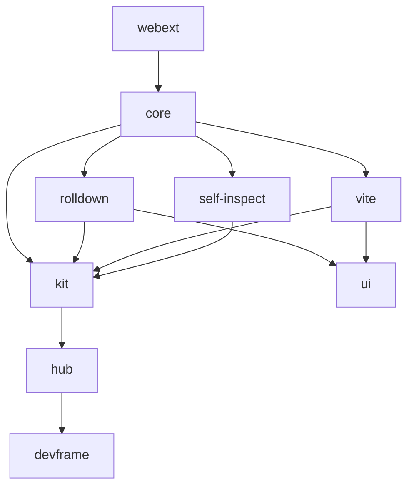

# AGENTS GUIDE

## Positioning

Three layers, one mental model:

- **`devframe`** — *the container for one devtool integration, portable across viewers.* External project; lives at [`github.com/devframes/devframe`](https://github.com/devframes/devframe), docs at [`devfra.me`](https://devfra.me). Consumed here as an npm dependency (`catalog:deps`).
- **`@devframes/hub`** — *the framework-neutral hub layer on top of devframe.* Owns docks, terminals, messages, commands, the `mountDevframe` primitive, and the json-render factory — anything that only matters once a host wants to combine multiple devframes into one UI. External project, same repo as devframe; consumed via npm.
- **`@vitejs/devtools-kit`** — *the Vite-flavored skin over `@devframes/hub`.* Re-exports hub's hosts and primitives under the kit's `DevTools*` names, adds the Vite-specific extensions (`ViteDevToolsNodeContext`, `PluginWithDevTools`, `DevToolsPluginOptions`, `createViteDevToolsHost`, the `~viteplus` dock category), pins the kit-side mount path at `/__devtools/`, and ships `createPluginFromDevframe` to drop a portable devframe into Vite DevTools as a Vite plugin.

When deciding where something belongs: if a single-app standalone CLI would still need it, it belongs upstream in devframe; if it only matters once a host combines multiple integrations, it belongs in `@devframes/hub` (or in `@vitejs/devtools-kit` if it's Vite-specific).

## Stack & Structure

Monorepo (`pnpm` workspaces + `turbo`). ESM TypeScript; bundled with `tsdown`. Path aliases in `alias.ts` (propagated to `tsconfig.base.json` — do not edit manually).

### Packages

| Package | npm | Description |
|---------|-----|-------------|
| `packages/kit` | `@vitejs/devtools-kit` | Vite-flavored skin over `@devframes/hub`. `createKitContext` wraps hub's `createHubContext` and surfaces the Vite-augmented context type (`viteConfig`/`viteServer`); hub hosts (`docks` / `terminals` / `messages` / `commands`) and the `mountDevframe` primitive are re-exported under the kit's `DevTools*` aliases. `createPluginFromDevframe` delegates to `mountDevframe` and wraps it in a `Plugin.devtools.setup` Vite plugin shell. |
| `packages/core` | `@vitejs/devtools` | Vite plugin + CLI + standalone/webcomponents client for Vite DevTools itself. Calls kit's `createKitContext`, scans Vite plugins for `.devtools.setup`, and serves the dock UI. |
| `packages/ui` | `@vitejs/devtools-ui` | Shared UI components, composables, and UnoCSS preset (`presetDevToolsUI`). Private, not published. |
| `packages/rolldown` | `@vitejs/devtools-rolldown` | Nuxt UI for Rolldown build data. Hub-mounted via `Plugin.devtools.setup`. Serves at `/__devtools-rolldown/`. |
| `packages/vite` | `@vitejs/devtools-vite` | Nuxt UI for Vite DevTools (WIP). Hub-mounted via `Plugin.devtools.setup`. Serves at `/__devtools-vite/`. |
| `packages/self-inspect` | `@vitejs/devtools-self-inspect` | Meta-introspection — DevTools for the DevTools. Hub-mounted via `Plugin.devtools.setup`. Serves at `/__devtools-self-inspect/`. |
| `packages/webext` | — | Browser extension scaffolding (ancillary). |

Other top-level directories:
- `docs/` — VitePress docs; guides in `docs/guide/`
- `skills/` — Agent skill files generated from docs via [Agent Skills](https://agentskills.io/home). Structured references (RPC patterns, dock types, shared state, project structure) for AI agent context.


```mermaid
flowchart TD
  hub --> devframe
  kit --> hub
  core --> kit
  core --> rolldown & vite & self-inspect
  rolldown --> kit & ui
  vite --> kit & ui
  self-inspect --> kit
  webext --> core
```

## Dep Boundary

`devframe` and `@devframes/hub` are external packages consumed via `catalog:deps` — contribute upstream at [github.com/devframes/devframe](https://github.com/devframes/devframe). `packages/kit` and above build on top of them. Features that require multi-integration awareness (docks, terminals, messages, commands) belong upstream in `@devframes/hub`. Features that only matter to Vite — `ViteDevToolsNodeContext`, `PluginWithDevTools`, the `~viteplus` category, the kit-pinned `/__devtools/` mount path, the `vite:open-in-editor`/`vite:open-in-finder` commands — stay in `@vitejs/devtools-kit` and `@vitejs/devtools`.

`devframe/node/hub-internals` is a marked-public-but-low-level subpath exposing a small set of helpers (`getInternalContext`, `resolveBasePath`) for first-party adapters reaching into devframe's hub-side machinery — kit's adapters use `getInternalContext` for remote-dock token allocation and WS-endpoint metadata. End users should not import it.

## Architecture

- **Devframe context** (external — see [devfra.me](https://devfra.me)): `createHostContext` returns a `DevframeNodeContext` carrying `rpc`, `views` (HTTP file-serving via `hostStatic`), `diagnostics`, `agent`, plus `cwd`/`workspaceRoot`/`mode`/`host`. No docks, no terminals, no json-render.
- **Hub context** (external `@devframes/hub/node`): `createHubContext` wraps `createHostContext` and attaches the four hub hosts — `docks`, `terminals`, `messages`, `commands` — plus the `createJsonRenderer` factory. Wires the `'devframe:docks'` / `'devframe:commands'` shared-state sync and seeds the built-in `~terminals` / `~messages` / `~settings` docks. Also ships `mountDevframe(ctx, def)` — the framework-neutral primitive that registers any `DevframeDefinition` as a dock.
- **Kit context** (`packages/kit/src/node/context.ts`): `createKitContext` wraps `createHubContext` and surfaces Vite-specific `viteConfig`/`viteServer` slots when mounted inside Vite DevTools. `KitNodeContext` extends `DevframeHubContext` so all the hub hosts come along for free.
- **Bridge** (`packages/kit/src/node/create-plugin-from-devframe.ts`): `createPluginFromDevframe(d, opts?)` returns `PluginWithDevTools`; in its `setup`, delegates to `mountDevframe(ctx, d, opts)` to mount the SPA, register the auto-derived iframe dock entry, and run `d.setup(ctx)`, then runs `opts.setup?.(ctx)` for kit-only extensions.
- **Vite DevTools entry** (`packages/core/src/node/context.ts`): `createDevToolsContext` calls `createKitContext`, registers Vite-specific commands (`vite:open-in-editor`, `vite:open-in-finder`), then scans Vite plugins for `.devtools.setup` hooks (which now receive the kit-augmented context).
- **Client context**: webcomponents/Nuxt UI state (`packages/core/src/client/webcomponents/state/*`) — dock entries, panels, RPC client. Two modes: `embedded` (overlay in host app) and `standalone` (independent page).
- **WS server** (`packages/core/src/node/ws.ts`): RPC via `devframe/rpc/transports/ws-server`. Auth skipped in build mode or when `devtools.clientAuth` is `false`.
- **Hub-mounted Nuxt UI plugins** (rolldown, vite, self-inspect): each implements `Plugin.devtools.setup`, receives a `KitNodeContext`, registers RPC functions, hosts a static Nuxt SPA, and registers its dock entry.

## Development

```sh
pnpm install                          # requires pnpm@11.x
pnpm build                            # turbo run build
pnpm test                             # Vitest
pnpm typecheck                        # vue-tsc -b
pnpm lint --fix                       # ESLint
pnpm -C packages/core run play        # core playground
pnpm -C packages/rolldown run dev     # rolldown UI dev
pnpm -C packages/core run dev:standalone  # standalone client
pnpm -C docs run docs                 # docs dev server
```

## Conventions

- Use workspace aliases from `alias.ts`.
- RPC functions must use `defineRpcFunction` from kit; always namespace IDs (`my-plugin:fn-name`).
- Shared state via `devframe/utils/shared-state`; keep values serializable.
- Nuxt UI base paths: `/__devtools-rolldown/`, `/__devtools-vite/`, `/__devtools-self-inspect/`.
- Shared UI components/preset in `packages/ui`; use `presetDevToolsUI` from `@vitejs/devtools-ui/unocss`.
- Currently focused on Rolldown build-mode analysis; dev-mode support is deferred.

Devframe's internal design principles (single-integration scope, headless-by-default, mount-path / SPA-basePath conventions, CLI flag composition) live in its own AGENTS.md upstream. Read them at [github.com/devframes/devframe/blob/main/AGENTS.md](https://github.com/devframes/devframe/blob/main/AGENTS.md) before contributing patches.

### Kit design principles

The kit is the integration hub. When adding to it, the question is "does this help unify multiple devtools?" — not "is this useful in general?".

- **Hub-only features.** `docks`, `terminals`, `messages`, `commands`, the auto-derived dock entry in `createPluginFromDevframe`, the unified user-settings shared state — these only have meaning across integrations and stay kit-side.
- **Devframe definitions stay portable.** `createPluginFromDevframe(devframeApp, opts?)` is the bridge. The devframe's own `setup(ctx)` should not assume kit context; if it needs hub features, contribute them via `opts.setup` or via a kit-only Vite plugin that augments the same context.
- **Auto-derive what you can, override via options.** `createPluginFromDevframe` synthesizes the iframe dock entry from `id`/`name`/`icon`/`basePath`. Callers customise via `opts.dock` (category, when-clause, custom icon override) or `opts.setup` (terminals, additional dock entries). Don't push these into the portable `DevframeDefinition`.

## Structured Diagnostics (Error Codes)

All node-side warnings and errors use structured diagnostics via [`nostics`](https://github.com/vercel-labs/nostics). Never use raw `console.warn`, `console.error`, or `throw new Error` with ad-hoc messages in node-side code — always define a coded diagnostic.

### Code prefixes

| Prefix | Package(s) | Diagnostics file |
|--------|-----------|-----------------|
| `DTK` | `packages/kit` + `packages/core` (shared codespace, Vite-side) | `packages/kit/src/node/diagnostics.ts`, `packages/core/src/node/diagnostics.ts` |
| `RDDT` | `packages/rolldown` | `packages/rolldown/src/node/diagnostics.ts` |
| `VDT` | `packages/vite` (reserved) | — |

`DF` codes belong to the upstream devframe/hub projects — file new ones there. The `DF8xxx` sub-range covers `@devframes/hub` (DF8100–DF8199 docks, DF8200–DF8299 terminals, DF8300–DF8399 messages, DF8400–DF8499 commands).

`DTK` is shared between core and kit because they're sibling layers of Vite DevTools. Coordinate code numbers across both files: kit reserves `DTK0050+` for Vite-specific kit codes; core's existing codes top out below that. The hub-domain DTK codes (DTK0050–DTK0057) retired when their conditions moved upstream to `DF8100`–`DF8403`.

Codes are sequential 4-digit numbers per prefix (e.g. `DTK0033`, `RDDT0003`). Check the existing diagnostics file to find the next available number.

### Adding a new error

1. **Define the code** in the appropriate `diagnostics.ts`:
   ```txt
   // diagnostics.ts
   DTK0033: {
     why: (p: { name: string }) => `Something went wrong with "${p.name}"`,
     fix: 'Optional remediation hint for the user.',
   },
   ```

2. **Emit the diagnostic** at the call site:
   ```ts
   import { diagnostics } from './diagnostics'

   // For thrown errors — always prefix with `throw` for TypeScript control flow:
   throw diagnostics.DTK0033({ name })

   // For reported (non-thrown) diagnostics. The default console method is `warn`;
   // override with the 2nd-arg reporter options when needed:
   diagnostics.DTK0033({ name }) // console.warn
   diagnostics.DTK0033({ name }, { method: 'error' }) // console.error
   diagnostics.DTK0033({ name, cause: error }) // attach cause via params
   ```

3. **Create a docs page** at `docs/errors/DTK0033.md`:
   ```md
   ---
   outline: deep
   ---
   # DTK0033: Short Title

   ## Message
   > Something went wrong with "`{name}`"

   ## Cause
   When and why this occurs.

   ## Example
   Code that triggers it.

   ## Fix
   How to resolve it.

   ## Source
   - [`packages/core/src/node/filename.ts`](https://github.com/vitejs/devtools/blob/main/packages/core/src/node/filename.ts) — `functionName()` throws this when …
   ```

   The `## Source` section lists each call site that emits the code, with a one-line role per entry. Don't list the `diagnostics.ts` definition — it's implied. Add additional bullets only when the same code is genuinely thrown from multiple files.

4. **Update the index** at `docs/errors/index.md` — add a row with `Code | Level | Title` (no Package column).

The sidebar in `docs/.vitepress/config.ts` globs the `errors/` directory by prefix, so the new page is picked up automatically — no sidebar edit needed.

### Scope

- **Node-side only**: `packages/rpc`, `packages/core/src/node`, `packages/rolldown/src/node`.
- **Client-side excluded**: Vue components, webcomponents, and browser-only code keep using `console.*` / `throw`.

## Before PRs

```sh
pnpm lint && pnpm test && pnpm typecheck && pnpm build
```

Follow conventional commits (`feat:`, `fix:`, etc.).

## Documentation style

These rules apply to every Markdown file under `docs/` (the error reference pages are template-driven and exempt). Apply them on every doc edit, not just dedicated revision passes.

### 1. Positive framing

Describe what *is*, not what *isn't*. Replace constructions like "X is for Y, not Z" or "there is no X for Y" with the closest natural positive phrasing. Don't document features that don't exist yet — release notes are the place for "now supported" announcements; docs describe what works today.

- ❌ "Build mode only; dev mode is not supported yet."
- ✅ "Analyses production builds in Vite 8+."

- ❌ "For tools that don't need Vite at all."
- ✅ "Standalone tools can build directly on Devframe."

### 2. Use callouts sparingly

Callouts (`> [!NOTE]`, `> [!TIP]`, `> [!INFO]`, `::: tip`, etc.) interrupt the reading flow and should earn their visual weight. Default to prose; reach for a callout only for genuinely critical material.

- **`[!WARNING]` / `[!DANGER]`** — security hazards, footguns, breaking-change pitfalls, experimental-API stability warnings. Keep these.
- **Bad-practice "✗" inline blocks** — fine inside code samples to contrast with a `✓` good example.
- **Everything else** — fold into the surrounding prose. A `[!NOTE]` that says "you only need this as a dev dependency" reads better as a sentence in the install section.

### 3. Kit-first in `/docs/`

The main docs site is for **Vite DevTools** and **`@vitejs/devtools-kit`** users. Devframe is the framework-neutral foundation underneath; link to [`devfra.me`](https://devfra.me/guide/) for its docs and lead examples and guides with the Kit / Vite plugin path.

### 4. Concise and precise

Trim filler intros, redundant cross-links (one link per page is enough — VitePress sidebars handle navigation), and code samples that demonstrate more than the point being made. Lead each page with one sentence that says what the reader can build with this. Strip out promises about future work, marketing language ("powerful", "seamless"), and exposition that the surrounding code already conveys.

### What goes where

- Critical security / data-loss hazard → `[!WARNING]` callout.
- Experimental API / stability caveat → `[!WARNING]` callout at the top of the page.
- Bad-practice contrast → inline `// ✗ Bad` / `// ✓ Good` comments inside code blocks.
- Anything else worth saying → prose.
