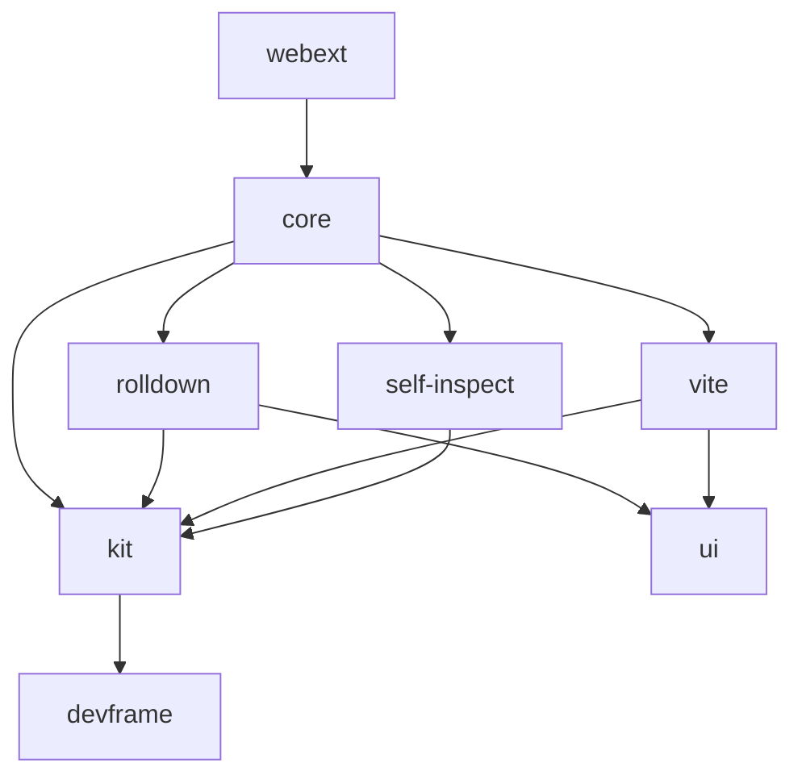

# AGENTS GUIDE

## Positioning

Two layers, one mental model:

- **`devframe`** — *the container for one devtool integration, portable across viewers.* Build a single tool (its RPC, its SPA, its diagnostics, its CLI/build/spa/embedded outputs) without caring how it'll be displayed. A devframe app runs standalone (CLI, static deploy, embedded SPA) just as well as it mounts inside a hub.
- **`@vitejs/devtools-kit`** — *the hub that unites many devtools integrations.* Owns docking, the command palette, toasts, terminal sessions — anything that only makes sense when more than one tool shares a UI. Provides `createPluginFromDevframe(devframeApp)` so a portable devframe definition drops into Vite DevTools as a Vite plugin, with the dock entry auto-derived from the definition's metadata.

When deciding where something belongs: if a single-app standalone CLI would still need it, it lives in devframe; if it only matters once you have multiple integrations or a host UI, it lives in the kit.

## Stack & Structure

Monorepo (`pnpm` workspaces + `turbo`). ESM TypeScript; bundled with `tsdown`. Path aliases in `alias.ts` (propagated to `tsconfig.base.json` — do not edit manually).

### Packages

| Package | npm | Description |
|---------|-----|-------------|
| `devframe/packages/devframe` | `devframe` | Framework-neutral container for one devtool integration. RPC layer (birpc + valibot + WS presets), `createHostContext`, six deployment adapters at `devframe/adapters/*` (cli/dev/build/vite/embedded/mcp), `connectDevframe` client. No docks, no terminals, no command palette — those are hub concerns. |
| `packages/kit` | `@vitejs/devtools-kit` | The hub. `createKitContext` wraps devframe's context with `docks` / `terminals` / `messages` / `commands` host subsystems plus the Vite-augmented context type. `createPluginFromDevframe` bridges a portable devframe app into a `Plugin.devtools.setup` Vite plugin, auto-deriving its iframe dock entry from the definition. |
| `packages/core` | `@vitejs/devtools` | Vite plugin + CLI + standalone/webcomponents client for Vite DevTools itself. Calls kit's `createKitContext`, scans Vite plugins for `.devtools.setup`, and serves the dock UI. |
| `packages/ui` | `@vitejs/devtools-ui` | Shared UI components, composables, and UnoCSS preset (`presetDevToolsUI`). Private, not published. |
| `packages/rolldown` | `@vitejs/devtools-rolldown` | Nuxt UI for Rolldown build data. Hub-mounted via `Plugin.devtools.setup`. Serves at `/__devtools-rolldown/`. |
| `packages/vite` | `@vitejs/devtools-vite` | Nuxt UI for Vite DevTools (WIP). Hub-mounted via `Plugin.devtools.setup`. Serves at `/__devtools-vite/`. |
| `packages/self-inspect` | `@vitejs/devtools-self-inspect` | Meta-introspection — DevTools for the DevTools. Hub-mounted via `Plugin.devtools.setup`. Serves at `/__devtools-self-inspect/`. |
| `packages/webext` | — | Browser extension scaffolding (ancillary). |

Other top-level directories:
- `docs/` — VitePress docs; guides in `docs/guide/`
- `skills/` — Agent skill files generated from docs via [Agent Skills](https://agentskills.io/home). Structured references (RPC patterns, dock types, shared state, project structure) for AI agent context.


```mermaid
flowchart TD
  kit --> devframe
  core --> kit
  core --> rolldown & vite & self-inspect
  rolldown --> kit & ui
  vite --> kit & ui
  self-inspect --> kit
  webext --> core
```

## Dep Boundary

`devframe/packages/devframe` is the lowest-level package in this monorepo and is positioned to be extracted into its own repo. It MUST NOT import from `vite`, `@vitejs/*`, or any hub-only concept (docks, terminals, messages, commands) — not as a `dependencies` entry, not as an inlined dep, not as a source import. `packages/kit` and above build on top of devframe; never the reverse. If a feature requires multi-integration awareness, it goes in kit.

`devframe/node/internal` is a marked-internal subpath that exposes a small set of helpers (`getInternalContext`, `resolveBasePath`) for first-party adapters that need to reach into devframe's private machinery — kit's relocated `DocksHost` uses it for remote-dock token allocation. End users should not import it.

## Architecture

- **Devframe context** (`devframe/packages/devframe/src/node/context.ts`): `createHostContext` returns a `DevToolsNodeContext` carrying `rpc`, `views` (HTTP file-serving via `hostStatic`), `diagnostics`, `agent`, plus `cwd`/`workspaceRoot`/`mode`/`host`. No docks, no terminals, no json-render.
- **Kit context** (`packages/kit/src/node/context.ts`): `createKitContext` wraps `createHostContext` and attaches the four hub hosts — `docks`, `terminals`, `messages`, `commands` — plus the `createJsonRenderer` factory. Optionally surfaces `viteConfig`/`viteServer` when mounted inside Vite DevTools. Wires the `'devframe:docks'` / `'devframe:commands'` shared-state sync.
- **Bridge** (`packages/kit/src/node/create-plugin-from-devframe.ts`): `createPluginFromDevframe(d, opts?)` returns `PluginWithDevTools`; in its `setup`, mounts the SPA via `views.hostStatic`, auto-registers an iframe dock entry from `id`/`name`/`icon`/`basePath`, runs `d.setup(ctx)` for the devframe-level wiring, then runs `opts.setup?.(ctx)` for kit-only extensions.
- **Vite DevTools entry** (`packages/core/src/node/context.ts`): `createDevToolsContext` calls `createKitContext`, registers Vite-specific commands (`vite:open-in-editor`, `vite:open-in-finder`), then scans Vite plugins for `.devtools.setup` hooks (which now receive the kit-augmented context).
- **Client context**: webcomponents/Nuxt UI state (`packages/core/src/client/webcomponents/state/*`) — dock entries, panels, RPC client. Two modes: `embedded` (overlay in host app) and `standalone` (independent page).
- **WS server** (`packages/core/src/node/ws.ts`): RPC via `devframe/rpc/transports/ws-server`. Auth skipped in build mode or when `devtools.clientAuth` is `false`.
- **Hub-mounted Nuxt UI plugins** (rolldown, vite, self-inspect): each implements `Plugin.devtools.setup`, receives a `KitNodeContext`, registers RPC functions, hosts a static Nuxt SPA, and registers its dock entry.

## Development

```sh
pnpm install                          # requires pnpm@10.x
pnpm build                            # turbo run build
pnpm test                             # Vitest
pnpm typecheck                        # vue-tsc -b
pnpm lint --fix                       # ESLint
pnpm -C packages/core run play        # core playground
pnpm -C packages/rolldown run dev     # rolldown UI dev
pnpm -C packages/core run dev:standalone  # standalone client
pnpm -C docs run docs                 # docs dev server
```

## Conventions

- Use workspace aliases from `alias.ts`.
- RPC functions must use `defineRpcFunction` from kit; always namespace IDs (`my-plugin:fn-name`).
- Shared state via `devframe/utils/shared-state`; keep values serializable.
- Nuxt UI base paths: `/__devtools-rolldown/`, `/__devtools-vite/`, `/__devtools-self-inspect/`.
- Shared UI components/preset in `packages/ui`; use `presetDevToolsUI` from `@vitejs/devtools-ui/unocss`.
- Currently focused on Rolldown build-mode analysis; dev-mode support is deferred.

### Devframe design principles

These apply to everything inside `devframe/packages/devframe` and reinforce its positioning as "the container for one devtool integration, portable to multiple viewers". When in doubt, err on the side of "devframe provides primitives, the hub provides UX".

- **Single-integration scope.** Devframe describes one tool. If a feature only makes sense when multiple tools share a UI — docking, a unified command palette, cross-tool toasts, terminal aggregation — it lives in `@vitejs/devtools-kit`, not here.
- **Headless by default.** No default startup banners, no opinionated logging to stdout, no default styling. Provide hooks (`onReady`, `cli.configure`, etc.); let the application print its own branding. Structured diagnostics via `logs-sdk` are fine — ad-hoc `console.log`s baked into adapters are not.
- **File watching is the app's job, not devframe's.** Don't add a generic watcher primitive. Authors wire chokidar / fs.watch / watchman themselves and signal change via `ctx.rpc.sharedState.set(...)` or event-type RPCs. devframe stays out of the filesystem-observation business.
- **Mount path depends on adapter context.** Given `id: 'foo'`, the default mount path is `/__foo/` for *hosted* adapters (`vite`, `embedded`, kit's `createPluginFromDevframe`) and `/` for *standalone* adapters (`cli`, `spa`, `build`). Authors override via `DevframeDefinition.basePath`. Don't hardcode `DEVTOOLS_MOUNT_PATH` in adapter code paths that may run standalone.
- **SPAs own their basePath at runtime.** Build SPAs with relative asset paths (`vite.base: './'`); discover the effective base in the browser from the executing script's location / `document.baseURI`. `createBuild` / `createSpa` copy SPA output verbatim — no HTML rewriting, no build-time `--base` injection. The client (`connectDevframe`) resolves `.connection.json` relative to the runtime base automatically.
- **CLI flags compose from both sides.** The `cac` instance backing `createCli` is exposed both to the `DevframeDefinition` (`cli.configure(cli)`) — for capabilities contributed by the tool itself — and to the `createCli` caller — for flags added at the final assembly stage. Parsed flag values are forwarded to `setup(ctx, { flags })`. Never hardcode domain-specific flags into `createCli`.

### Kit design principles

The kit is the integration hub. When adding to it, the question is "does this help unify multiple devtools?" — not "is this useful in general?".

- **Hub-only features.** `docks`, `terminals`, `messages`, `commands`, the auto-derived dock entry in `createPluginFromDevframe`, the unified user-settings shared state — these only have meaning across integrations and stay kit-side.
- **Devframe definitions stay portable.** `createPluginFromDevframe(devframeApp, opts?)` is the bridge. The devframe's own `setup(ctx)` should not assume kit context; if it needs hub features, contribute them via `opts.setup` or via a kit-only Vite plugin that augments the same context.
- **Auto-derive what you can, override via options.** `createPluginFromDevframe` synthesizes the iframe dock entry from `id`/`name`/`icon`/`basePath`. Callers customise via `opts.dock` (category, when-clause, custom icon override) or `opts.setup` (terminals, additional dock entries). Don't push these into the portable `DevframeDefinition`.

## Structured Diagnostics (Error Codes)

All node-side warnings and errors use structured diagnostics via [`logs-sdk`](https://github.com/vercel-labs/logs-sdk). Never use raw `console.warn`, `console.error`, or `throw new Error` with ad-hoc messages in node-side code — always define a coded diagnostic.

### Code prefixes

| Prefix | Package(s) | Diagnostics file |
|--------|-----------|-----------------|
| `DF` | `devframe/packages/devframe` | `devframe/packages/devframe/src/node/diagnostics.ts`, `devframe/packages/devframe/src/rpc/diagnostics.ts` |
| `DTK` | `packages/kit` + `packages/core` (shared codespace, hub-side) | `packages/kit/src/node/diagnostics.ts`, `packages/core/src/node/diagnostics.ts` |
| `RDDT` | `packages/rolldown` | `packages/rolldown/src/node/diagnostics.ts` |
| `VDT` | `packages/vite` (reserved) | — |

`DTK` is shared between core and kit because they're sibling layers of the Vite DevTools hub. Coordinate code numbers across both files: kit currently reserves `DTK0050+`; core's existing codes top out below that.

Codes are sequential 4-digit numbers per prefix (e.g. `DTK0033`, `RDDT0003`). Check the existing diagnostics file to find the next available number.

### Adding a new error

1. **Define the code** in the appropriate `diagnostics.ts`:
   ```txt
   // diagnostics.ts
   DTK0033: {
     message: (p: { name: string }) => `Something went wrong with "${p.name}"`,
     hint: 'Optional hint for the user.',
     level: 'warn', // defaults to 'error' if omitted
   },
   ```

2. **Use the logger** at the call site:
   ```ts
   import { logger } from './diagnostics'

   // For thrown errors — always prefix with `throw` for TypeScript control flow:
   throw logger.DTK0033({ name }).throw()

   // For logged warnings/errors (not thrown):
   logger.DTK0033({ name }).log() // uses definition level
   logger.DTK0033({ name }).warn() // override to warn
   logger.DTK0033({ name }, { cause: error }).log() // attach cause
   ```

3. **Create a docs page** at `docs/errors/DTK0033.md`:
   ```md
   ---
   outline: deep
   ---
   # DTK0033: Short Title

   ## Message
   > Something went wrong with "`{name}`"

   ## Cause
   When and why this occurs.

   ## Example
   Code that triggers it.

   ## Fix
   How to resolve it.

   ## Source
   - [`packages/core/src/node/filename.ts`](https://github.com/vitejs/devtools/blob/main/packages/core/src/node/filename.ts) — `functionName()` throws this when …
   ```

   The `## Source` section lists each call site that emits the code, with a one-line role per entry. Don't list the `diagnostics.ts` definition — it's implied. Add additional bullets only when the same code is genuinely thrown from multiple files.

4. **Update the index** at `docs/errors/index.md` — add a row with `Code | Level | Title` (no Package column).

The sidebar in `docs/.vitepress/config.ts` (and `devframe/docs/.vitepress/config.ts` for `DF` codes) globs the `errors/` directory by prefix, so the new page is picked up automatically — no sidebar edit needed.

### Scope

- **Node-side only**: `packages/rpc`, `packages/core/src/node`, `packages/rolldown/src/node`.
- **Client-side excluded**: Vue components, webcomponents, and browser-only code keep using `console.*` / `throw`.

## Before PRs

```sh
pnpm lint && pnpm test && pnpm typecheck && pnpm build
```

Follow conventional commits (`feat:`, `fix:`, etc.).

## Documentation style

These rules apply to every Markdown file under `docs/` and `devframe/docs/` (the error reference pages are template-driven and exempt). Apply them on every doc edit, not just dedicated revision passes.

### 1. Positive framing

Describe what *is*, not what *isn't*. Replace constructions like "X is for Y, not Z" or "there is no X for Y" with the closest natural positive phrasing. Don't document features that don't exist yet — release notes are the place for "now supported" announcements; docs describe what works today.

- ❌ "Build mode only; dev mode is not supported yet."
- ✅ "Analyses production builds in Vite 8+."

- ❌ "For tools that don't need Vite at all."
- ✅ "Standalone tools can build directly on Devframe."

### 2. Use callouts sparingly

Callouts (`> [!NOTE]`, `> [!TIP]`, `> [!INFO]`, `::: tip`, etc.) interrupt the reading flow and should earn their visual weight. Default to prose; reach for a callout only for genuinely critical material.

- **`[!WARNING]` / `[!DANGER]`** — security hazards, footguns, breaking-change pitfalls, experimental-API stability warnings. Keep these.
- **Bad-practice "✗" inline blocks** — fine inside code samples to contrast with a `✓` good example.
- **Everything else** — fold into the surrounding prose. A `[!NOTE]` that says "you only need this as a dev dependency" reads better as a sentence in the install section.

### 3. Kit-first in `/docs/`

The main docs site is for **Vite DevTools** and **`@vitejs/devtools-kit`** users. Devframe is the framework-neutral foundation underneath; mention it where relevant ("Kit is built on Devframe; standalone tools can use Devframe directly — see [Devframe](https://devfra.me/guide/)") but lead examples and guides with the Kit / Vite plugin path.

`devframe/docs/` is the inverse: Devframe-first, with cross-links to Kit for hub-only features (docks, terminals, messages, commands).

### 4. Concise and precise

Trim filler intros, redundant cross-links (one link per page is enough — VitePress sidebars handle navigation), and code samples that demonstrate more than the point being made. Lead each page with one sentence that says what the reader can build with this. Strip out promises about future work, marketing language ("powerful", "seamless"), and exposition that the surrounding code already conveys.

### What goes where

- Critical security / data-loss hazard → `[!WARNING]` callout.
- Experimental API / stability caveat → `[!WARNING]` callout at the top of the page.
- Bad-practice contrast → inline `// ✗ Bad` / `// ✓ Good` comments inside code blocks.
- Anything else worth saying → prose.
