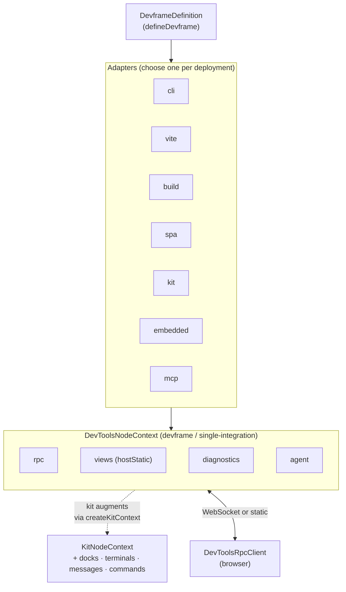

# Devframe

**Devframe** is the container for one devtool integration, portable across viewers. You describe a single tool — its RPC surface, its data model, its SPA, its CLI shape — and Devframe deploys the same definition through any number of runtime adapters: a standalone CLI, a self-contained static report, an embedded SPA, an MCP server, or mounted inside a multi-integration hub.

Devframe's surface is one tool. Hub-level features — docking, the command palette, terminal aggregation, cross-tool toasts — live in [`@vitejs/devtools-kit`](https://devtools.vite.dev/kit/). To drop a Devframe app into Vite DevTools, wrap it with `createPluginFromDevframe` from `@vitejs/devtools-kit/node`; the kit synthesises the dock entry from your definition's `id` / `name` / `icon` / `basePath` and routes the hub-level ctx fields (`docks`, `terminals`, …) accordingly.

> [!WARNING] Experimental
> The Devframe API is still in development and may change between versions. The agent-native surface (`agent` on `defineRpcFunction`, `ctx.agent`, and the MCP adapter) is additionally flagged as experimental.

## Design principles

Devframe keeps its surface small and pushes hub-level UX to the kit consuming it:

- **Single-integration scope.** Devframe describes one tool. Anything that only matters across tools — docks, palette, cross-tool toasts, unified terminals — belongs in the [DevTools Kit](https://devtools.vite.dev/kit/).
- **Headless.** Hook into `onReady`, `cli.configure`, and friends to print your own startup banners and styling — Devframe stays out of the way.
- **App-owned file watching.** Wire your own watcher (chokidar, fs.watch, …) and signal change via `ctx.rpc.sharedState.set(...)` or event-typed RPCs.
- **Context-aware mount paths.** Standalone adapters (`cli`, `spa`, `build`) serve at `/` by default; hosted adapters (`vite`, `embedded`, kit's `createPluginFromDevframe`) serve at `/.<id>/`. Override via `DevframeDefinition.basePath`.
- **SPAs own their base at runtime.** Build with relative asset paths (`vite.base: './'`); `connectDevframe` discovers the effective base from the executing script's location.
- **CLI flags compose.** The `cac` instance is exposed to both the devframe (`cli.configure`) and the caller of `createCli`, so capability flags and app flags merge cleanly.

## What Devframe provides

| Subsystem | What it does |
|-----------|--------------|
| **[Devframe Definition](./devframe-definition)** | One `defineDevframe` call describes your tool once; the adapters deploy it anywhere. |
| **[RPC](./rpc)** | Type-safe bidirectional calls built on birpc + valibot. Supports `query`, `static`, `action`, and `event` types. |
| **[Shared State](./shared-state)** | Observable, patch-synced state that survives reconnects and bridges server ↔ browser. |
| **[Diagnostics](./diagnostics)** | Coded warnings/errors via `logs-sdk` — registered into the host logger so adapters and consumers share the same surface. |
| **[Streaming](./streaming)** | One-way (RPC streaming) and two-way (uploads) channel primitives for long-running data. |
| **[When Clauses](./when-clauses)** | VS Code-style conditional expressions for docks, commands, and custom UI. |
| **[Utilities](./utilities)** | Bundled helpers under `devframe/utils/*` — terminal colors, hashing, editor launch, structured-clone serialization, and more. |
| **[Client](./client)** | Browser-side RPC client (`connectDevframe`) with auto-auth and WebSocket / static modes. |
| **[Agent-Native](./agent-native)** | Opt-in exposure of your tool's surface to coding agents over MCP. |

Hub-only subsystems — [Dock System](https://devtools.vite.dev/kit/dock-system), [Commands](https://devtools.vite.dev/kit/commands), [Messages](https://devtools.vite.dev/kit/messages), [Terminals](https://devtools.vite.dev/kit/terminals) — live in the [Vite DevTools Kit](https://devtools.vite.dev/kit/) docs.

## Architecture



## Install

```sh
pnpm add devframe
```

`devframe` ships ESM-only and has no Vite dependency. Adapters with optional peers (the MCP adapter needs `@modelcontextprotocol/sdk`) surface the requirement at import time.

## Hello, Devframe

A minimal devframe with a CLI entry point:

```ts twoslash
import { defineDevframe, defineRpcFunction } from 'devframe'
import { createCli } from 'devframe/adapters/cli'

const devframe = defineDevframe({
  id: 'my-devframe',
  name: 'My Devframe',
  icon: 'ph:gauge-duotone',
  cli: {
    distDir: 'client/dist',
  },
  setup(ctx) {
    ctx.rpc.register(defineRpcFunction({
      name: 'my-devframe:hello',
      type: 'static',
      jsonSerializable: true,
      handler: () => ({ message: 'hello' }),
    }))
  },
})

await createCli(devframe).parse()
```

Drop the same definition into Vite DevTools — the kit auto-derives the iframe dock entry from `id` / `name` / `icon` / `basePath`:

```ts
// vite.config.ts
import { createPluginFromDevframe } from '@vitejs/devtools-kit/node'
import devframe from './my-devframe'

export default {
  plugins: [createPluginFromDevframe(devframe)],
}
```

Run it:

```sh
node ./my-devframe.js        # dev server on http://localhost:9999/
node ./my-devframe.js build  # self-contained static deploy in dist-static/
node ./my-devframe.js mcp    # stdio MCP server (experimental)
```

The CLI adapter serves the SPA at `/` by default. When the same devframe is embedded inside a host (`vite`, `kit`, `embedded`), the default becomes `/.my-devframe/`. Override either side via `defineDevframe({ basePath })`.

## Adapters at a glance

Devframe deploys the same `DevframeDefinition` through one of these adapters:

| Adapter | Entry | Target |
|---------|-------|--------|
| `cli` | `createCli(d).parse()` | Standalone CLI with dev / build / mcp subcommands |
| `vite` | `createVitePlugin(d, opts?)` | Plain Vite plugin that mounts the SPA |
| `build` | `createBuild(d, opts?)` | Self-contained static deploy with baked RPC dumps |
| **kit (bridge)** | `createPluginFromDevframe(d, opts?)` *(from `@vitejs/devtools-kit/node`)* | Mount the devframe into Vite DevTools' hub UI |
| `embedded` | `createEmbedded(d, { ctx })` | Runtime registration into an existing host |
| `mcp` | `createMcpServer(d, opts)` | Model Context Protocol server |

`createPluginFromDevframe` lives in the kit because mounting into a multi-integration hub is a kit responsibility. See [Adapters](./adapters) for the full reference.

## Dependency boundary

Devframe is the lowest-level package in the Vite DevTools monorepo and is positioned to be extracted into its own repo. Imports from Vite or any `@vitejs/*` package are out of scope, in source and at the dependency-graph level. Hub-only concepts (docks, terminals, messages, commands) belong in the layers above:

- `@vitejs/devtools-kit` — the hub. Owns docking, terminals, messages, and the command palette; provides `createPluginFromDevframe` to bridge a Devframe app into Vite DevTools.
- `@vitejs/devtools` — the integration. Vite plugin that wraps the kit and exposes Vite DevTools' own UI.

For porting an existing inspector, use the [`cli`](./adapters#cli) adapter standalone and `createPluginFromDevframe` (from `@vitejs/devtools-kit/node`) to surface it inside Vite DevTools.

## What's next

- [Devframe Definition](./devframe-definition) — understand `defineDevframe` and the `DevToolsNodeContext`
- [Adapters](./adapters) — pick the right deployment target for your tool
- [RPC](./rpc) — define type-safe server functions your client can call
- [Agent-Native](./agent-native) — expose your devframe to Claude Desktop, Cursor, or any MCP client
