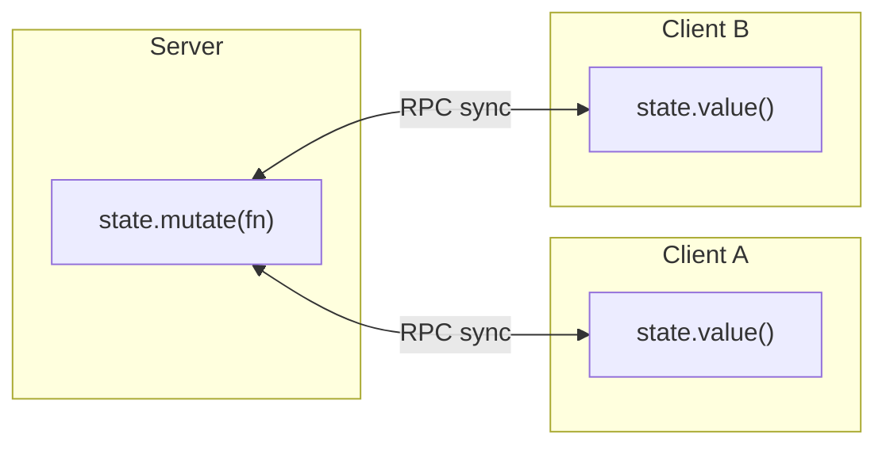

# Shared State

Shared state is observable, immutable-by-default state synced between the server and every connected client. It is built on [`immer`](https://immerjs.github.io/immer/) so you mutate a draft and DevFrame computes the patches to broadcast.

Shared state survives reconnects — a newly connected client receives the current snapshot before any further updates. Prefer it over ad-hoc RPC events for anything that should stay reactive.

## Overview



## Creating State

Use `ctx.rpc.sharedState.get(key, options)` in your `setup`:

```ts
import { defineDevtool } from 'devframe'

export default defineDevtool({
  id: 'my-devtool',
  name: 'My Devtool',
  async setup(ctx) {
    const state = await ctx.rpc.sharedState.get('my-devtool:state', {
      initialValue: {
        count: 0,
        items: [] as { id: string, name: string }[],
      },
    })

    console.log(state.value().count) // 0
  },
})
```

Keys should be namespaced (`<devtool-id>:<key>`) to avoid collisions with other devtools sharing the same host.

## Reading

`state.value()` returns an **immutable** snapshot:

```ts
const current = state.value()
console.log(current.count)
// current.count = 1 // ✗ TypeScript error — snapshot is Immutable<T>
```

## Mutating

Pass a recipe function to `state.mutate()`:

```ts
state.mutate((draft) => {
  draft.count += 1
  draft.items.push({ id: 'a', name: 'Alpha' })
})
```

Under the hood, DevFrame:

1. Applies the recipe to the current state via `immer.produce`.
2. Emits an `updated` event with the new state (and patches, if enabled).
3. Broadcasts the update to all connected clients.

Mutations are idempotent across replay — DevFrame tracks a `syncIds` set internally so a patch round-tripped back from a client doesn't reapply.

## Patches (advanced)

Enable patches when you need minimal network diffs instead of full snapshots:

```ts
const state = await ctx.rpc.sharedState.get('my-devtool:big-state', {
  initialValue: largeTree,
  // sharedState-level enablePatches is opt-in:
  sharedState: createSharedState({ initialValue: largeTree, enablePatches: true }),
})
```

When enabled, the `updated` event carries a `Patch[]` alongside the new state so listeners can apply incremental updates.

## Subscribing

```ts
state.on('updated', (fullState, patches, syncId) => {
  // `patches` is undefined unless enablePatches was set.
})
```

## Client-Side Access

From the browser, the same key is available on the RPC client:

```ts
import { connectDevtool } from 'devframe/client'

const rpc = await connectDevtool()

const state = await rpc.sharedState.get('my-devtool:state')

console.log(state.value().count)

state.mutate((draft) => {
  draft.count += 1
})
```

Client-side mutations round-trip through the server before reappearing locally, so `state.value()` always reflects the authoritative source.

## Enumerating Keys

Both server and client hosts expose `keys()` and `onKeyAdded`:

```ts
for (const key of ctx.rpc.sharedState.keys()) {
  console.log(key)
}

const unsubscribe = ctx.rpc.sharedState.onKeyAdded((key) => {
  console.log('new shared-state key:', key)
})
```

This is how protocol adapters (e.g. the [MCP adapter](./agent-native)) surface shared state as dynamic resources.

## When to Use Shared State vs RPC

| Use shared state for | Use RPC for |
|----------------------|-------------|
| Long-lived UI state (selections, filters, expanded nodes) | One-shot queries (`get-modules`, `read-file`) |
| Cross-client coordination | Commands / actions with side effects |
| Data that should reappear after reconnect | Event streams (prefer `broadcast` / `callEvent`) |

For short-lived actions and events, stick with `ctx.rpc.register` + `ctx.rpc.broadcast` from the [RPC](./rpc) page.
