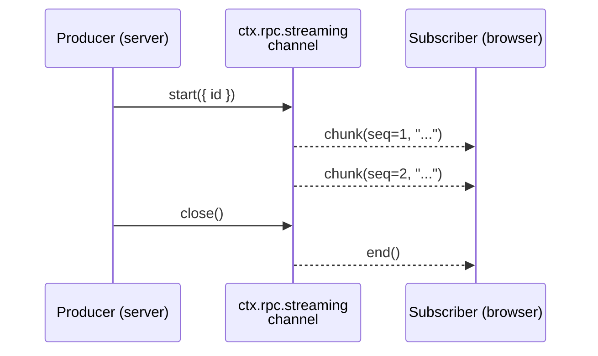

# Streaming

Devframe's streaming-channel API provides server→client push for chunk-style data — chat deltas, log lines, build progress, anything you'd otherwise express as a sequence of fire-and-forget events. It builds on the same WebSocket transport as the rest of the RPC layer, but adds the conventions every chunked feed needs: stream IDs, cooperative cancellation, replay on reconnect, and first-class **Web Streams** interop.

## Overview



A **channel** owns a wire namespace. Each call to `channel.start()` produces an individual **stream** keyed by an id (auto-generated unless you pass one). Subscribers join by `(channelName, id)`.

## Defining a Channel

In your `setup`, create the channel once. Channels are framework-neutral, so the same code works for `cli`, `vite`, `kit`, and `embedded` adapters:

```ts
import { defineDevtool, defineRpcFunction } from 'devframe'
import * as v from 'valibot'

export default defineDevtool({
  id: 'my-devtool',
  name: 'My Devtool',
  async setup(ctx) {
    const channel = ctx.rpc.streaming.create<string>('my-devtool:chat', {
      replayWindow: 256,
    })

    ctx.rpc.register(defineRpcFunction({
      name: 'my-devtool:start-chat',
      type: 'action',
      jsonSerializable: true,
      args: [v.object({ prompt: v.string() })],
      returns: v.object({ streamId: v.string() }),
      handler: async ({ prompt }) => {
        const stream = channel.start()
        ;(async () => {
          for await (const token of fakeLLM(prompt, { signal: stream.signal })) {
            stream.write(token)
          }
          stream.close()
        })()
        return { streamId: stream.id }
      },
    }))
  },
})
```

The channel name follows the same `<plugin-id>:<name>` convention as RPC functions.

## Producing — Three Surfaces, One Stream

The handle returned by `channel.start({ id? })` is both an imperative producer and a Web Streams `WritableStream<T>`:

```ts
const stream = channel.start({ id: 'optional-explicit-id' })

// Imperative — minimal, hand-rolled producers
stream.write(chunk)
stream.error(err) // terminal failure
stream.close() // terminal success
stream.signal // AbortSignal — flips when consumers cancel
stream.id // string — what clients subscribe to

// Web Streams — pipe any ReadableStream<T> in:
sourceReadable.pipeTo(stream.writable, { signal: stream.signal })

// Convenience — start + pipe in one call:
const stream = await channel.pipeFrom(sourceReadable)
```

Producers should poll `stream.signal.aborted` and exit cooperatively when it flips:

```ts
for (const token of source) {
  if (stream.signal.aborted)
    return
  stream.write(token)
}
stream.close()
```

### Node.js Stream Interop

Web Streams are the canonical surface, but Node 17+ ships free converters that bridge to `node:stream`:

```ts
import { Readable, Writable } from 'node:stream'

// Pipe a Node Readable into the streaming channel
sourceNodeReadable.pipe(Writable.fromWeb(stream.writable))

// Pipe the channel out to a Node Writable
Readable.fromWeb(reader.readable).pipe(targetNodeWritable)
```

Devframe doesn't wrap these — they're standard library, and the surface stays small.

## Consuming — `for await` or `pipeTo`

The client returns a reader that's both an `AsyncIterable<T>` and exposes a `ReadableStream<T>`:

```ts
import { connectDevtool } from 'devframe/client'

const rpc = await connectDevtool()
const { streamId } = await rpc.call('my-devtool:start-chat', {
  prompt: 'Hello',
})

const reader = rpc.streaming.subscribe<string>('my-devtool:chat', streamId)

// Async iterable — the simplest consumer pattern
for await (const token of reader)
  appendToken(token)

// Or pipe to a DOM-side WritableStream
await reader.readable.pipeTo(downloadWritable)

reader.cancel() // sends cancel upstream; server stream.signal flips
```

Pick one surface per reader — they share a single internal queue, so concurrent draining will race.

## Lifecycle and Cancellation

| Event | Server side | Client side |
|-------|-------------|-------------|
| Producer calls `stream.close()` / `stream.error(err)` | Broadcasts `end` to subscribers | `for await` resolves (success) or throws (error) |
| Consumer calls `reader.cancel()` | Server's `stream.signal` aborts when the **last** subscriber cancels — handlers should poll and exit | Reader marks itself cancelled; `for await` ends without iterating |
| WS disconnects | When the **last** subscriber drops, server aborts `stream.signal` | Reader stays alive; resubscribes automatically when trust is re-established |
| `chat` panel closes mid-stream | Reader cancel cascades upstream | — |

A stream with multiple subscribers stays alive until the last one cancels or disconnects. Producers should always make `stream.signal.aborted` part of their inner loop.

## Client-to-Server Uploads

The same channel works in reverse for chunk-style uploads — file content, mic / screen-share frames, browser-side logs forwarded to disk, anything you'd otherwise hand-roll as `multipart` over HTTP. The pattern uses one normal RPC call to allocate the id, then dedicated streaming events for the chunks:

```ts
// Server — typically inside an action handler
ctx.rpc.register(defineRpcFunction({
  name: 'my-devtool:upload-file',
  type: 'action',
  args: [v.object({ name: v.string() })],
  returns: v.object({ uploadId: v.string() }),
  handler: async ({ name }) => {
    const reader = channel.openInbound()

    // Process chunks asynchronously — the action returns immediately
    // so the client can start uploading.
    ;(async () => {
      const file = createWriteStream(name)
      for await (const chunk of reader)
        file.write(chunk)
      file.close()
    })()

    return { uploadId: reader.id }
  },
}))
```

```ts
// Client
const { uploadId } = await rpc.call('my-devtool:upload-file', {
  name: 'capture.bin',
})
const upload = rpc.streaming.upload<Uint8Array>('my-devtool:files', uploadId)

// Imperative
upload.write(chunk1)
upload.write(chunk2)
upload.close()

// Or pipe a Web ReadableStream straight in:
fileReadable.pipeTo(upload.writable, { signal: upload.signal })
```

Lifecycle mirrors the outbound case:

- `upload.signal` aborts when the **server** calls `reader.cancel()` (the server cancellation broadcasts an `upload-cancel` to the uploading session).
- `upload.error(err)` propagates as a thrown error inside the server's `for await`.
- If the client disconnects mid-upload, the server's `for await` exits with an `UploadDisconnected` error so consumers can clean up.

Each `openInbound()` allocates a fresh server-allocated id and is owned by exactly one uploading session — there's no fan-in, no shared subscribers, and no replay (the producer is the client, so reconnect means restart).

## Replay on Reconnect

When the channel is created with `replayWindow: N`, the server keeps a rolling buffer of the last `N` chunks per stream. On (re)subscribe, the client passes the highest sequence number it has seen, and the server replays anything newer before resuming live.

```ts
ctx.rpc.streaming.create<string>('my-devtool:chat', {
  replayWindow: 256, // chunks to retain per stream id
  closedStreamRetention: 30_000, // ms to hold closed streams for late subscribers
})
```

`closedStreamRetention` defaults to 30 seconds when `replayWindow > 0` (so a panel re-opened a few seconds after a chat finishes still gets the full transcript), or 0 when replay is disabled. Set it explicitly to opt in or out.

## Backpressure

The client maintains a bounded queue per subscription (`highWaterMark`, default 256). When the consumer can't keep up, the **oldest** queued chunk is dropped and a [`DF0029`](../errors/DF0029) warning is logged. This is best-effort — proper transport-level backpressure isn't worth threading through birpc for the streaming use cases that exist today.

```ts
const reader = rpc.streaming.subscribe('my-devtool:chat', id, {
  highWaterMark: 1024, // raise if you expect bursts the consumer can recover from
})
```

If you need authoritative state rather than every intermediate value, prefer [shared state](./shared-state) — it carries Immer patches with delivery guarantees, at the cost of being structured rather than streaming.

## When to Use Streaming vs Events vs Shared State

| Use streaming for | Use `event`-typed RPC for | Use shared state for |
|-------------------|---------------------------|----------------------|
| Token / chunk feeds (LLM deltas, build logs) | Notifications without payload (`refresh`, `clear`) | Long-lived UI state (selections, panel layout) |
| Per-call lifecycles with cancellation | Cross-cutting signals broadcast to all clients | Reactive snapshots that survive reconnect |
| Replay on reconnect | Fire-and-forget signaling | Diff-based sync between clients |
| Client-to-server uploads (files, mic frames) | | |

## Reference

- API surface: `RpcStreamingHost`, `RpcStreamingChannel<T>`, `StreamSink<T>`, `StreamReader<T>` in `devframe/types`.
- Working example: [`devframe/examples/devframe-streaming-chat`](https://github.com/vitejs/devtools/tree/main/devframe/examples/devframe-streaming-chat).
- Errors: [`DF0029`](../errors/DF0029) (overflow), [`DF0030`](../errors/DF0030) (unknown stream id), [`DF0031`](../errors/DF0031) (write to closed stream), [`DF0032`](../errors/DF0032) (channel name collision).
