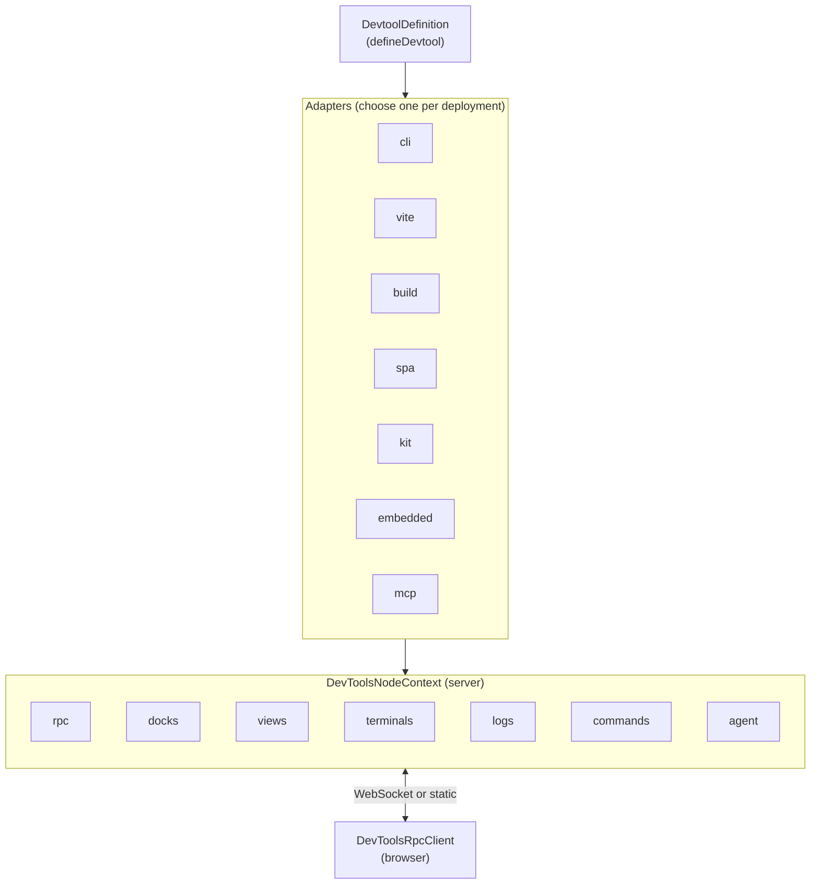

# DevFrame

**DevFrame** is the framework-neutral foundation that powers Vite DevTools. It provides the RPC layer, host abstractions, and seven runtime adapters needed to build a devtool — and it does so without depending on Vite or any framework.

If you are writing a Vite plugin and want a Vite-specific entry point, see the [DevTools Kit](/kit/) — Kit is a Vite-specific superset of DevFrame. If you want to build a standalone inspector, bundle a static snapshot of your data, drive a devtool from a CLI, or expose your tool to coding agents over MCP, start here.

> [!WARNING] Experimental
> The DevFrame API is still in development and may change between versions. The agent-native surface (`agent` field on `defineRpcFunction`, `ctx.agent`, and the MCP adapter) is additionally flagged as experimental.

## Design Principles

DevFrame keeps its surface small and pushes UX decisions to the application consuming it:

- **Headless.** No default startup banners, logging, or styling. Hook into `onReady`, `cli.configure`, and friends to print your own output.
- **App-owned file watching.** Wire your own watcher (chokidar, fs.watch, …) and signal change via `ctx.rpc.sharedState.set(...)` or event-type RPCs. DevFrame does not ship a watcher primitive.
- **Context-aware mount paths.** Standalone adapters (`cli`, `spa`, `build`) serve at `/` by default; hosted adapters (`vite`, `kit`, `embedded`) serve at `/.<id>/`. Override via `DevtoolDefinition.basePath`.
- **SPAs own their base at runtime.** Build with relative asset paths (`vite.base: './'`); `connectDevtool` discovers the effective base from the executing script's location. No HTML rewrites at build time.
- **CLI flags compose.** The `cac` instance is exposed to both the devtool (`cli.configure`) and the caller of `createCli`, so capability flags and app flags merge cleanly.

## What DevFrame Provides

| Subsystem | What it does |
|-----------|--------------|
| **[Devtool Definition](./devtool-definition)** | One `defineDevtool` call describes your tool once; seven adapters deploy it anywhere. |
| **[RPC](./rpc)** | Type-safe bidirectional calls built on birpc + valibot. Supports `query`, `static`, `action`, and `event` types. |
| **[Shared State](./shared-state)** | Observable, patch-synced state that survives reconnects and bridges server ↔ browser. |
| **[Dock System](./dock-system)** | Register panels (iframe / action / custom / launcher / json-render) with visibility rules. |
| **[Commands](./commands)** | Command palette entries with keybindings, children, and when-clause gating. |
| **[When Clauses](./when-clauses)** | VS Code-style conditional expressions for docks, commands, and custom UI. |
| **[Logs](./logs)** | Structured log entries with file/element positions, toasts, and live updates. |
| **[Terminals](./terminals)** | Spawn child processes and stream output into an xterm.js UI. |
| **[Client](./client)** | Browser-side RPC client with auto-auth and WebSocket / static modes. |
| **[Agent-Native](./agent-native)** | Opt-in exposure of your tool's surface to coding agents over MCP. |

## Architecture



## Install

```sh
pnpm add devframe
```

`devframe` ships ESM-only and has no Vite dependency. Adapters that need optional peers (MCP needs `@modelcontextprotocol/sdk`) surface that requirement at import time.

## Hello, DevFrame

A minimal devtool with a CLI entry point:

```ts twoslash
import { defineDevtool } from 'devframe'
import { createCli } from 'devframe/adapters/cli'

const devtool = defineDevtool({
  id: 'my-devtool',
  name: 'My Devtool',
  cli: {
    distDir: 'client/dist',
  },
  setup(ctx) {
    ctx.docks.register({
      id: 'my-devtool:main',
      title: 'My Devtool',
      icon: 'ph:gauge-duotone',
      type: 'iframe',
      url: '/.devtools/',
    })
  },
})

await createCli(devtool).parse()
```

Run it:

```sh
node ./my-devtool.js        # dev server on http://localhost:9999/
node ./my-devtool.js build  # static snapshot in dist-static/
node ./my-devtool.js spa    # deployable SPA bundle in dist-spa/
node ./my-devtool.js mcp    # stdio MCP server (experimental)
```

The CLI adapter serves the SPA at `/` by default. When the same devtool is embedded inside a host (`vite`, `kit`, `embedded`), the default becomes `/.my-devtool/`. Override either side via `defineDevtool({ basePath })`.

## Adapters at a Glance

DevFrame deploys the same `DevtoolDefinition` through one of seven adapters:

| Adapter | Entry | Target |
|---------|-------|--------|
| `cli` | `createCli(d).parse()` | Standalone CLI with dev / build / spa / mcp subcommands |
| `vite` | `createVitePlugin(d, opts?)` | Plain Vite plugin — mounts the SPA only (no RPC server) |
| `build` | `createBuild(d, opts?)` | Static snapshot with baked RPC dumps |
| `spa` | `createSpa(d, opts?)` | Deployable SPA (extends build with a loader descriptor) |
| `kit` | `createKitPlugin(d, opts?)` | Vite DevTools Kit plugin |
| `embedded` | `createEmbedded(d, { ctx })` | Runtime registration into an existing host |
| `mcp` | `createMcpServer(d, opts)` | Model Context Protocol server |

See [Adapters](./adapters) for the full reference.

## Dependency Boundary

DevFrame is the lowest-level package in the Vite DevTools monorepo and is positioned to be extracted into its own repo. It **must not** import from Vite or any `@vitejs/*` package — neither as a dependency nor as a source import. Consumers layer on top:

- `@vitejs/devtools-kit` — Vite-specific superset of DevFrame.
- `@vitejs/devtools` — The Vite plugin that wraps Kit + DevFrame.

If you are porting an existing inspector, prefer the [`cli`](./adapters#cli) adapter for standalone use and the [`kit`](./adapters#kit) adapter to surface inside Vite DevTools.

## What's Next

- [Devtool Definition](./devtool-definition) — understand `defineDevtool` and the `DevToolsNodeContext`
- [Adapters](./adapters) — pick the right deployment target for your tool
- [RPC](./rpc) — define type-safe server functions your client can call
- [Agent-Native](./agent-native) — expose your devtool to Claude Desktop, Cursor, or any MCP client
