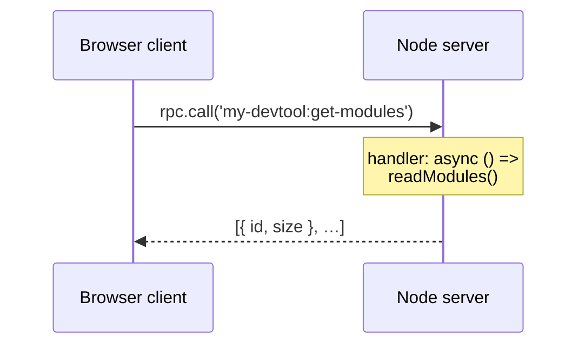

# RPC

DevFrame's RPC layer is type-safe bidirectional communication between your server (Node.js) and client (browser), built on [`birpc`](https://github.com/antfu/birpc) and validated at runtime with [`valibot`](https://valibot.dev/). In dev mode it runs over WebSocket; in build / SPA mode it falls back to a pre-computed static dump so the client still works offline.

## Overview



## Defining a Function

```ts
import { defineRpcFunction } from 'devframe'
import * as v from 'valibot'

export const getModules = defineRpcFunction({
  name: 'my-devtool:get-modules',
  type: 'query',
  args: [v.object({ limit: v.number() })],
  returns: v.array(v.object({ id: v.string(), size: v.number() })),
  setup: ctx => ({
    handler: async ({ limit }) => {
      // `ctx` is the DevToolsNodeContext.
      return loadModules().slice(0, limit)
    },
  }),
})
```

Register it in `setup`:

```ts
import { defineDevtool } from 'devframe'
import { getModules } from './rpc/get-modules'

export default defineDevtool({
  id: 'my-devtool',
  name: 'My Devtool',
  setup(ctx) {
    ctx.rpc.register(getModules)
  },
})
```

### Naming Convention

1. Scope with your devtool id: `<id>:<action>`.
2. Use kebab-case for the action segment.

Examples: `my-devtool:get-modules`, `my-devtool:read-file`, `my-devtool:trigger-rebuild`.

### Function Types

| Type | Description | Cached | Static Dump |
|------|-------------|--------|-------------|
| `query` | Read operation that can change over time. | Opt-in via `cacheable` | Manual (declare `dump`) |
| `static` | Data that never changes for a given input. | Indefinitely | Automatic |
| `action` | Mutation with side effects. | Never | Never |
| `event` | Fire-and-forget; no response. | Never | Never |

Use `static` for data collected once during `setup` and shipped to read-only static / SPA clients.

### Handler Arguments

Handlers accept any serializable arguments. When `args` supplies valibot schemas, arguments are validated at the boundary:

```ts
defineRpcFunction({
  name: 'my-devtool:get-file',
  type: 'query',
  args: [v.object({ path: v.string(), includeSource: v.optional(v.boolean()) })],
  returns: v.object({ path: v.string(), source: v.optional(v.string()) }),
  setup: () => ({
    handler: async ({ path, includeSource }) => ({
      path,
      source: includeSource ? await readFile(path, 'utf-8') : undefined,
    }),
  }),
})
```

Prefer **a single object argument** (`args: [v.object({ ... })]`) over positional args — property names are self-describing and agents / IDEs work best with object shapes.

### Setup vs Handler

Two ways to wire a handler:

- **`setup(ctx)`** — receives the `DevToolsNodeContext` and returns `{ handler, dump? }`. Use this when you need access to the context (shared state, logs, `ctx.mode`, etc.).
- **`handler(...)`** — shorthand when the handler is pure and doesn't need the context.

```ts
// With setup:
defineRpcFunction({
  name: 'my-devtool:count',
  type: 'query',
  setup: ctx => ({
    handler: async () => ctx.rpc.sharedState.keys().length,
  }),
})

// Shorthand:
defineRpcFunction({
  name: 'my-devtool:echo',
  type: 'query',
  handler: (msg: string) => msg,
})
```

## Broadcasting

`ctx.rpc.broadcast` sends a message from the server to every connected client:

```ts
defineDevtool({
  id: 'my-devtool',
  name: 'My Devtool',
  setup(ctx) {
    watcher.on('change', (file) => {
      void ctx.rpc.broadcast({
        method: 'my-devtool:on-file-changed',
        args: [{ file }],
      })
    })
  },
})
```

| Option | Type | Description |
|--------|------|-------------|
| `method` | client RPC name | Function registered on the client side. |
| `args` | any[] | Arguments passed to the client function. |
| `optional` | `boolean` | Don't throw if no client is listening. |
| `event` | `boolean` | Fire-and-forget (don't wait for responses). |
| `filter` | `(client) => boolean` | Skip specific clients. |

## Local Invocation

`ctx.rpc.invokeLocal` calls a registered server function directly without going through a transport — useful for cross-function composition on the server side:

```ts
const modules = await ctx.rpc.invokeLocal('my-devtool:get-modules', { limit: 10 })
```

## Client-Side Calls

From the browser, use [`connectDevtool`](./client) (or `getDevToolsRpcClient`) to obtain a client and call registered functions:

```ts
import { connectDevtool } from 'devframe/client'

const rpc = await connectDevtool()

const modules = await rpc.call('my-devtool:get-modules', { limit: 10 })
```

Client-side registration (for server→client calls) goes through `rpc.client.register()` — the mirror API of `ctx.rpc.register()`.

## Static Dumps

For `static` functions, DevFrame automatically records the handler's output during `createBuild` / `createSpa` and bakes it into the output:

```ts
defineRpcFunction({
  name: 'my-devtool:build-meta',
  type: 'static',
  args: [],
  returns: v.object({ version: v.string(), builtAt: v.number() }),
  setup: () => ({
    handler: async () => ({ version: '1.0.0', builtAt: Date.now() }),
  }),
})
```

For `query` functions, provide an explicit `dump` to enumerate which argument sets to pre-compute:

```ts
defineRpcFunction({
  name: 'my-devtool:get-session',
  type: 'query',
  setup: ctx => ({
    handler: async (id: string) => loadSession(id),
    dump: {
      inputs: [['session-a'], ['session-b']],
      fallback: { id: 'unknown', data: null },
    },
  }),
})
```

At runtime, static clients resolve `rpc.call('my-devtool:get-session', 'session-a')` from the baked dump; misses fall back to `dump.fallback` (or throw if not provided).

## Agent Exposure

Add an `agent` field to surface the function to coding agents over MCP. Functions without an `agent` field are not exposed (default-deny).

```ts
defineRpcFunction({
  name: 'my-devtool:get-modules',
  type: 'query',
  args: [v.object({ limit: v.number() })],
  returns: v.array(v.object({ id: v.string(), size: v.number() })),
  agent: {
    description: 'List the N largest modules in the current build. Safe to call freely.',
    title: 'List modules',
    // safety inferred from type: 'query' → 'read'
  },
  setup: () => ({
    handler: async ({ limit }) => loadModules().slice(0, limit),
  }),
})
```

See [Agent-Native](./agent-native) for the full safety model and MCP integration.

## What's Next

- [Shared State](./shared-state) — observable state synced across clients
- [Client](./client) — connecting from the browser
- [Agent-Native](./agent-native) — exposing RPCs to agents
