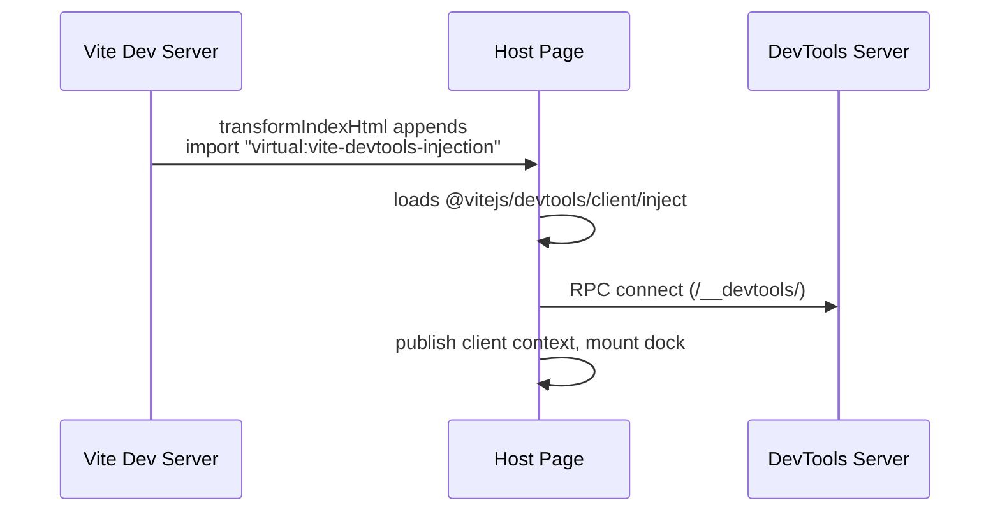

# Client Script & Client Context

In embedded mode, Vite DevTools injects a small **client script** into your app's page. The script boots the dock and publishes the **client context** — the object that every client-side surface (dock client scripts, action buttons, your own app code) uses to talk to DevTools.

## The client script

The client script is the browser entry of Vite DevTools (published as `@vitejs/devtools/client/inject`). When it runs in the host page it:

1. Connects an RPC client to the DevTools server at `/__devtools/` (WebSocket in dev mode).
2. Builds the `DevToolsClientContext` — dock entries, panel state, commands, when-clauses — on top of that RPC client.
3. Publishes the context to a global slot, so `getDevToolsClientContext()` can read it from anywhere in the page.
4. Mounts the embedded dock web component into `document.body`.

### How injection works

The `DevTools()` plugin injects the script through Vite's `transformIndexHtml` hook. During `vite dev`, every HTML page served by Vite receives a module script that imports the `virtual:vite-devtools-injection` module, which in turn loads the client entry:



Injection is scoped to where the embedded client makes sense:

- **Dev server only** — `vite build` uses the [standalone client](/guide/#standalone-mode) instead, which hosts the same context in its own page.
- **Client environments only** — SSR builds and server code stay untouched.
- **Top-level windows only** — inside an iframe (including DevTools' own iframe panels) the script logs `[VITE DEVTOOLS] Skipping in iframe` and exits, so a page never mounts a second dock.

## The client context

`DevToolsClientContext` is the client-side counterpart of the [node context](./devtools-plugin): one object carrying everything a client surface needs.

| Property | Description |
|----------|-------------|
| `rpc` | The RPC client — `call()` server functions, register [client-side functions](/kit/rpc#client-side-functions), access shared state and streaming. |
| `clientType` | `'embedded'` (dock inside your app) or `'standalone'` (independent DevTools page). |
| `docks` | Dock entries and selection — `entries`, `selected`, `switchEntry()`, `toggleEntry()`. |
| `panel` | Dock panel state: position, size, drag/resize flags. |
| `commands` | The [command palette](./commands): `register()`, `execute()`, keybindings. |
| `when` | The [when-clause](./when-clauses) evaluation context. |

### Accessing the context

From anywhere in the host page, use `getDevToolsClientContext()`. It returns `undefined` until the client script finishes initializing:

```ts
import { getDevToolsClientContext } from '@vitejs/devtools-kit/client'

const ctx = getDevToolsClientContext()
if (ctx) {
  const modules = await ctx.rpc.call('my-plugin:get-modules')
  ctx.docks.switchEntry('my-plugin')
}
```

[Dock client scripts](/kit/dock-system#client-script) — action buttons and custom renderers — receive the context directly as their argument, extended with two dock-scoped extras: `current` (this entry's state, DOM elements, and events) and `messages` (a [messages client](./messages) scoped to the entry):

```ts
import type { DockClientScriptContext } from '@vitejs/devtools-kit/client'

export default function setup(ctx: DockClientScriptContext) {
  ctx.current.events.on('entry:activated', async () => {
    const data = await ctx.rpc.call('my-plugin:get-modules')
    ctx.messages.info(`Loaded ${data.length} modules`)
  })
}
```

Iframe panels run in their own document, so they create their own RPC client with [`getDevToolsRpcClient()`](/kit/rpc#in-iframe-pages) instead — the connection details are discovered automatically from the parent window.

## Troubleshooting

### The client script isn't injected

Symptoms: the dock never appears, `getDevToolsClientContext()` always returns `undefined`, and the browser console has no `[VITE DEVTOOLS] Client injected` log.

Injection rides on Vite's `transformIndexHtml` hook, so it requires an HTML page that Vite itself serves and transforms. Setups where the HTML comes from elsewhere skip it:

- **Backend integration** — Rails, Laravel, Django, or any server rendering its own HTML while Vite only serves assets.
- **Middleware mode** — an app framework embedding Vite's dev server without serving `index.html` through it.
- **JS-only entries** — projects whose entry point is a script rather than an HTML file.

The fix is to import the client injector manually from a browser entry (`main.ts`, `entry.client.ts`):

```ts
import '@vitejs/devtools/client/inject'
```

Keep the import out of server-only and shared SSR files, and use it only when HTML injection doesn't happen — combining both mounts the client twice. To keep the client out of production bundles, guard it as a dev-only dynamic import:

```ts
if (import.meta.env.DEV)
  import('@vitejs/devtools/client/inject')
```

### Other checks

- **Plugin registered?** The `DevTools()` plugin from `@vitejs/devtools` must be in your Vite config's `plugins` for injection to run.
- **Dev mode?** The embedded client is a dev-server feature. For `vite build`, use the [standalone client](/guide/#standalone-mode) (`devtools: { enabled: true }`).
- **Dock appears but asks for authorization?** That's client trust, a separate layer from injection — see [DTK0008](/errors/DTK0008) and the `devtools.clientAuth` option.
