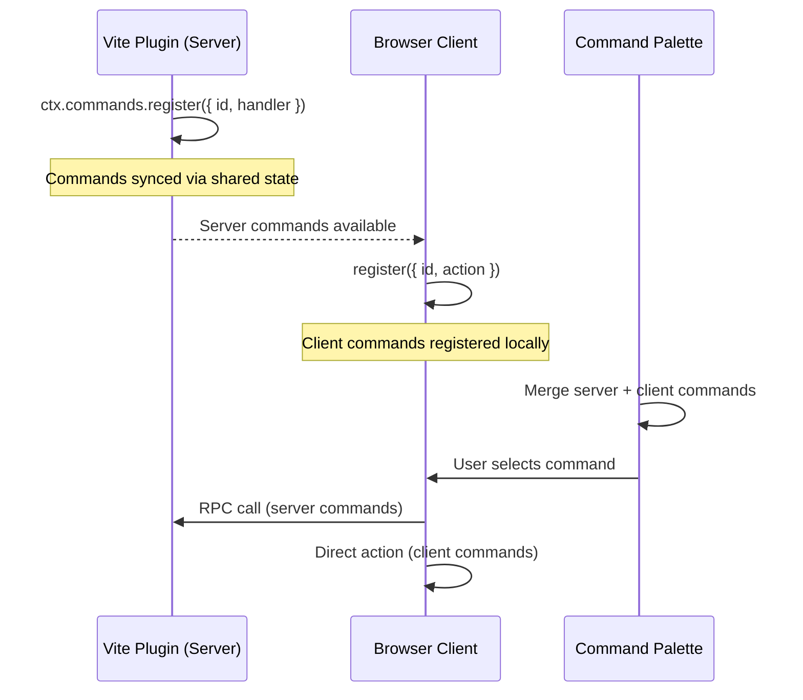

# Commands & Command Palette

DevTools Kit provides a commands system that lets plugins register executable commands — both on the server and client side. Users can discover and run commands through a built-in command palette, and customize keyboard shortcuts.

## Overview



## Server-Side Commands

### Defining Commands

Use `defineCommand` and register via `ctx.commands.register()`:

```ts
import { defineCommand } from '@vitejs/devtools-kit'

const clearCache = defineCommand({
  id: 'my-plugin:clear-cache',
  title: 'Clear Build Cache',
  description: 'Remove all cached build artifacts',
  icon: 'ph:trash-duotone',
  category: 'tools',
  handler: async () => {
    await fs.rm('.cache', { recursive: true })
  },
})
```

Register it in your plugin setup:

```ts
const plugin: Plugin = {
  devtools: {
    setup(ctx) {
      ctx.commands.register(clearCache)
    },
  },
}
```

### Command Options

| Field | Type | Description |
|-------|------|-------------|
| `id` | `string` | **Required.** Unique namespaced ID (e.g. `my-plugin:action`) |
| `title` | `string` | **Required.** Human-readable title shown in the palette |
| `description` | `string` | Optional description text |
| `icon` | `string` | Iconify icon string (e.g. `ph:trash-duotone`) |
| `category` | `string` | Category for grouping |
| `showInPalette` | `boolean` | Whether to show in command palette (default: `true`) |
| `when` | `string` | Conditional visibility expression (see [When Clauses](#when-clauses)) |
| `keybindings` | `DevToolsCommandKeybinding[]` | Default keyboard shortcuts |
| `handler` | `Function` | Server-side handler. Optional if the command is a group for children. |
| `children` | `DevToolsServerCommandInput[]` | Static sub-commands (two levels max) |

### Command Handle

`register()` returns a handle for live updates:

```ts
const handle = ctx.commands.register({
  id: 'my-plugin:status',
  title: 'Show Status',
  handler: () => { /* ... */ },
})

// Update later
handle.update({ title: 'Show Status (3 items)' })

// Remove
handle.unregister()
```

## Sub-Commands

Commands can have static children, creating a two-level hierarchy. In the palette, selecting a parent drills down into its children.

```ts
ctx.commands.register({
  id: 'git',
  title: 'Git',
  icon: 'ph:git-branch-duotone',
  category: 'tools',
  // No handler — group-only parent
  children: [
    {
      id: 'git:commit',
      title: 'Commit',
      icon: 'ph:check-duotone',
      keybindings: [{ key: 'Mod+Shift+G' }],
      handler: async () => { /* ... */ },
    },
    {
      id: 'git:push',
      title: 'Push',
      handler: async () => { /* ... */ },
    },
    {
      id: 'git:pull',
      title: 'Pull',
      handler: async () => { /* ... */ },
    },
  ],
})
```

In the palette, users see **Git** → select it → drill down to see **Commit**, **Push**, **Pull**. Sub-commands with keybindings (like `Mod+Shift+G` above) can be executed directly via the shortcut without opening the palette.

> [!NOTE]
> Each child must have a globally unique `id`. We recommend the pattern `parentId:childAction` (e.g. `git:commit`).

## Keyboard Shortcuts

### Defining Shortcuts

Add default keybindings when registering a command:

```ts
ctx.commands.register({
  id: 'my-plugin:toggle-overlay',
  title: 'Toggle Overlay',
  keybindings: [
    { key: 'Mod+Shift+O' },
  ],
  handler: () => { /* ... */ },
})
```

### Key Format

Use `Mod` as a platform-aware modifier — it maps to `Cmd` on macOS and `Ctrl` on other platforms.

| Key string | macOS | Windows/Linux |
|------------|-------|---------------|
| `Mod+K` | `Cmd+K` | `Ctrl+K` |
| `Mod+Shift+P` | `Cmd+Shift+P` | `Ctrl+Shift+P` |
| `Alt+N` | `Option+N` | `Alt+N` |

### When Clauses {#when-clauses}

Both commands and keybindings support a `when` expression for conditional activation.

**On a command** — controls whether the command appears in the palette and whether it can be executed:

```ts
ctx.commands.register(defineCommand({
  id: 'my-plugin:embedded-only',
  title: 'Embedded-Only Action',
  when: 'clientType == embedded',
  handler: async () => { /* ... */ },
}))
```

**On a keybinding** — controls whether the shortcut activates in the current context:

```ts
keybindings: [
  { key: 'Mod+Shift+D', when: 'dockOpen && !paletteOpen' },
]
```

When both a command and its keybinding have `when` expressions, both must evaluate to `true` for the shortcut to fire.

#### Context Variables

| Variable | Type | Description |
|----------|------|-------------|
| `clientType` | `'embedded' \| 'standalone'` | Current client mode |
| `dockOpen` | `boolean` | Whether the dock panel is open |
| `paletteOpen` | `boolean` | Whether the command palette is open |
| `dockSelectedId` | `string` | ID of the currently selected dock entry (empty string if none) |

Custom context variables can be added by plugins and referenced in `when` expressions the same way.

#### Operators

| Operator | Example | Description |
|----------|---------|-------------|
| bare truthy | `dockOpen` | True if the value is truthy |
| `!` | `!paletteOpen` | Negation |
| `==` | `clientType == embedded` | Equality (string comparison) |
| `!=` | `clientType != standalone` | Inequality |
| `&&` | `dockOpen && !paletteOpen` | Logical AND |
| `\|\|` | `paletteOpen \|\| dockOpen` | Logical OR |

Operator precedence: `||` splits first (lowest), then `&&` (each OR-branch is a chain of AND-parts). Use explicit grouping with separate commands if you need complex logic.

### User Overrides

Users can customize shortcuts in the DevTools Settings page under **Keyboard Shortcuts**. Overrides are stored in shared state and persist across sessions. Setting an empty array disables a shortcut.

### Shortcut Editor

The Settings page includes an inline shortcut editor with:

- **Key capture** — click the input and press any key combination
- **Modifier toggles** — toggle Cmd/Ctrl, Alt, Shift individually
- **Conflict detection** — warns when a shortcut conflicts with:
  - Common browser shortcuts (e.g. `Cmd+T` → "Open new tab", `Cmd+W` → "Close tab")
  - Other registered commands
  - Weak shortcuts (single key without modifiers)

The list of known browser shortcuts (`KNOWN_BROWSER_SHORTCUTS`) is exported from `@vitejs/devtools-kit` and maps each key combination to a human-readable description.

## Command Palette

The built-in command palette is toggled with `Mod+K` (or `Ctrl+K` on Windows/Linux). It provides:

- **Fuzzy search** across all registered commands (including sub-commands)
- **Keyboard navigation** — Arrow keys to navigate, Enter to select, Escape to close
- **Drill-down** — Commands with children show a breadcrumb navigation
- **Server command execution** — Server commands are executed via RPC with a loading indicator
- **Dynamic sub-menus** — Client commands can return sub-items at runtime

### Embedded vs Standalone

- **Embedded mode**: The palette floats over the user's application as part of the DevTools overlay
- **Standalone mode**: The palette appears as a modal dialog in the standalone DevTools window

## Client-Side Commands

Client commands are registered in the webcomponent context and execute directly in the browser:

```ts
// From within the DevTools client context
context.commands.register({
  id: 'devtools:theme',
  source: 'client',
  title: 'Theme',
  icon: 'ph:palette-duotone',
  children: [
    {
      id: 'devtools:theme:light',
      source: 'client',
      title: 'Light',
      action: () => setTheme('light'),
    },
    {
      id: 'devtools:theme:dark',
      source: 'client',
      title: 'Dark',
      action: () => setTheme('dark'),
    },
  ],
})
```

Client commands can also return dynamic sub-items:

```ts
context.commands.register({
  id: 'devtools:docs',
  source: 'client',
  title: 'Documentation',
  action: async () => {
    const docs = await fetchDocs()
    return docs.map(doc => ({
      id: `docs:${doc.slug}`,
      source: 'client' as const,
      title: doc.title,
      action: () => window.open(doc.url, '_blank'),
    }))
  },
})
```

## Complete Example

::: code-group

```ts [plugin.ts]
/// <reference types="@vitejs/devtools-kit" />
import type { Plugin } from 'vite'
import { defineCommand } from '@vitejs/devtools-kit'

export default function myPlugin(): Plugin {
  return {
    name: 'my-plugin',

    devtools: {
      setup(ctx) {
        // Simple command
        ctx.commands.register(defineCommand({
          id: 'my-plugin:restart',
          title: 'Restart Dev Server',
          icon: 'ph:arrow-clockwise-duotone',
          keybindings: [{ key: 'Mod+Shift+R' }],
          handler: async () => {
            await ctx.viteServer?.restart()
          },
        }))

        // Command with sub-commands
        ctx.commands.register(defineCommand({
          id: 'my-plugin:cache',
          title: 'Cache',
          icon: 'ph:database-duotone',
          children: [
            {
              id: 'my-plugin:cache:clear',
              title: 'Clear Cache',
              handler: async () => { /* ... */ },
            },
            {
              id: 'my-plugin:cache:inspect',
              title: 'Inspect Cache',
              handler: async () => { /* ... */ },
            },
          ],
        }))
      },
    },
  }
}
```

:::
