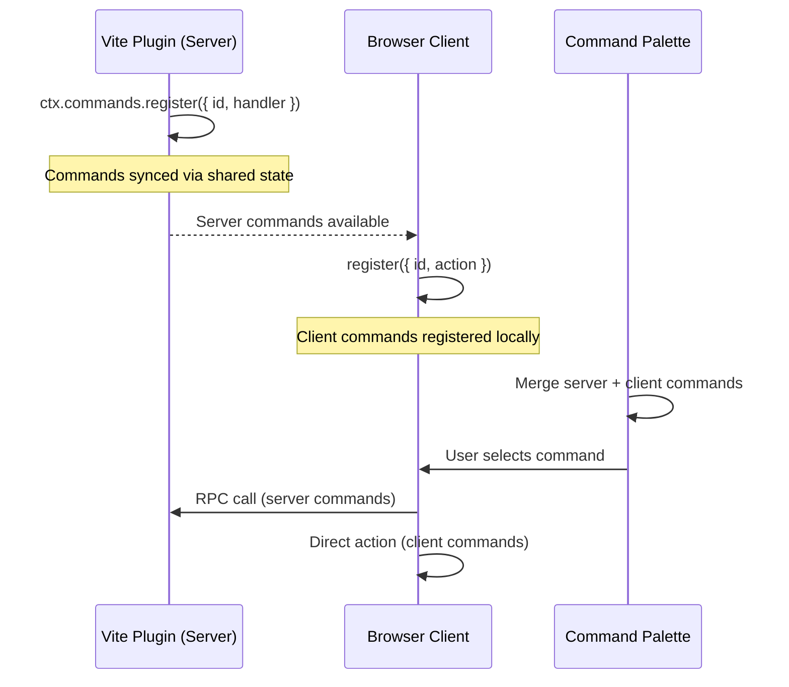

# Commands & Command Palette

DevTools Kit's commands system lets plugins register executable commands on the server and client. Users discover and run them through the built-in command palette, and rebind keyboard shortcuts to taste.

## Overview



## Server-side commands

### Defining commands

Use `defineCommand` and register through `ctx.commands.register()`:

```ts
import { defineCommand } from '@vitejs/devtools-kit'

const clearCache = defineCommand({
  id: 'my-plugin:clear-cache',
  title: 'Clear Build Cache',
  description: 'Remove all cached build artifacts',
  icon: 'ph:trash-duotone',
  category: 'tools',
  handler: async () => {
    await fs.rm('.cache', { recursive: true })
  },
})
```

Register it in your plugin setup:

```ts
const plugin: Plugin = {
  devtools: {
    setup(ctx) {
      ctx.commands.register(clearCache)
    },
  },
}
```

### Command options

| Field | Type | Description |
|-------|------|-------------|
| `id` | `string` | **Required.** Unique namespaced ID (e.g. `my-plugin:action`) |
| `title` | `string` | **Required.** Human-readable title shown in the palette |
| `description` | `string` | Optional description text |
| `icon` | `string` | Iconify icon string (e.g. `ph:trash-duotone`) |
| `category` | `string` | Category for grouping |
| `showInPalette` | `boolean \| 'without-children'` | Whether to show in command palette (default: `true`). `'without-children'` shows the command but doesn't flatten children into search — they're only accessible via drill-down. |
| `when` | `string` | Conditional visibility expression (see [When Clauses](/kit/when-clauses)) |
| `keybindings` | `DevToolsCommandKeybinding[]` | Default keyboard shortcuts |
| `handler` | `Function` | Server-side handler. Optional if the command is a group for children. |
| `children` | `DevToolsServerCommandInput[]` | Static sub-commands (two levels max) |

### Command handle

`register()` returns a handle for live updates:

```ts
const handle = ctx.commands.register({
  id: 'my-plugin:status',
  title: 'Show Status',
  handler: () => { /* ... */ },
})

// Update later
handle.update({ title: 'Show Status (3 items)' })

// Remove
handle.unregister()
```

## Sub-commands

Commands can have static children, forming a two-level hierarchy. Selecting a parent in the palette drills into its children.

```ts
ctx.commands.register({
  id: 'git',
  title: 'Git',
  icon: 'ph:git-branch-duotone',
  category: 'tools',
  // No handler — group-only parent
  children: [
    {
      id: 'git:commit',
      title: 'Commit',
      icon: 'ph:check-duotone',
      keybindings: [{ key: 'Mod+Shift+G' }],
      handler: async () => { /* ... */ },
    },
    {
      id: 'git:push',
      title: 'Push',
      handler: async () => { /* ... */ },
    },
    {
      id: 'git:pull',
      title: 'Pull',
      handler: async () => { /* ... */ },
    },
  ],
})
```

In the palette, users see **Git** → select → drill into **Commit**, **Push**, **Pull**. Sub-commands with keybindings (like `Mod+Shift+G` above) execute directly from the shortcut without opening the palette.

Each child needs a globally unique `id`; the recommended pattern is `parentId:childAction` (`git:commit`).

## Keyboard shortcuts

### Defining shortcuts

Add default keybindings when registering a command:

```ts
ctx.commands.register({
  id: 'my-plugin:toggle-overlay',
  title: 'Toggle Overlay',
  keybindings: [
    { key: 'Mod+Shift+O' },
  ],
  handler: () => { /* ... */ },
})
```

### Key format

Use `Mod` as a platform-aware modifier — it maps to `Cmd` on macOS and `Ctrl` on other platforms.

| Key string | macOS | Windows/Linux |
|------------|-------|---------------|
| `Mod+K` | `Cmd+K` | `Ctrl+K` |
| `Mod+Shift+P` | `Cmd+Shift+P` | `Ctrl+Shift+P` |
| `Alt+N` | `Option+N` | `Alt+N` |

### Conditional `when` clauses

Commands support a `when` expression for conditional visibility and activation:

```ts
ctx.commands.register(defineCommand({
  id: 'my-plugin:embedded-only',
  title: 'Embedded-Only Action',
  when: 'clientType == embedded',
  handler: async () => { /* ... */ },
}))
```

When set, the command shows in the palette and triggers via its shortcut only while the expression evaluates to `true`. The grammar covers `==`, `!=`, `&&`, `||`, `!`, bare truthy, literal `true`/`false`, and namespaced keys like `vite.mode` — see [When Clauses](/kit/when-clauses) for the full reference.

### User overrides

Users customise shortcuts in the DevTools Settings page under **Keyboard Shortcuts**. Overrides land in shared state and persist across sessions; setting an empty array disables a shortcut.

### Shortcut editor

The Settings page includes an inline shortcut editor with:

- **Key capture** — click the input and press any key combination.
- **Modifier toggles** — toggle Cmd/Ctrl, Alt, Shift individually.
- **Conflict detection** — warns when a shortcut conflicts with common browser shortcuts (`Cmd+T` → "Open new tab", `Cmd+W` → "Close tab"), with another registered command, or with a weak single-key combo without modifiers.

`KNOWN_BROWSER_SHORTCUTS` is exported from `@vitejs/devtools-kit` and maps each key combination to a human-readable description.

## Command palette

`Mod+K` (or `Ctrl+K` on Windows/Linux) toggles the built-in palette. It offers:

- **Fuzzy search** across all registered commands (including sub-commands).
- **Keyboard navigation** — arrow keys, Enter to select, Escape to close.
- **Drill-down** — commands with children show breadcrumb navigation.
- **Server-command execution** — RPC with a loading indicator.
- **Dynamic sub-menus** — client commands can return sub-items at runtime.

### Embedded vs standalone

In embedded mode, the palette floats over the user's app as part of the DevTools overlay. In standalone mode, it appears as a modal dialog in the standalone DevTools window.

## Client-side commands

Client commands register in the webcomponent context and execute directly in the browser:

```ts
// From within the DevTools client context
context.commands.register({
  id: 'devtools:theme',
  source: 'client',
  title: 'Theme',
  icon: 'ph:palette-duotone',
  children: [
    {
      id: 'devtools:theme:light',
      source: 'client',
      title: 'Light',
      action: () => setTheme('light'),
    },
    {
      id: 'devtools:theme:dark',
      source: 'client',
      title: 'Dark',
      action: () => setTheme('dark'),
    },
  ],
})
```

Client commands can also return dynamic sub-items:

```ts
context.commands.register({
  id: 'devtools:docs',
  source: 'client',
  title: 'Documentation',
  action: async () => {
    const docs = await fetchDocs()
    return docs.map(doc => ({
      id: `docs:${doc.slug}`,
      source: 'client' as const,
      title: doc.title,
      action: () => window.open(doc.url, '_blank'),
    }))
  },
})
```

## Executing programmatically

Code with access to the kit context can trigger a command by id:

```ts
await ctx.commands.execute('my-plugin:clear-cache')

// With arguments:
await ctx.commands.execute('my-plugin:open-file', '/src/main.ts')
```

`execute` searches both top-level commands and children, and throws when the command isn't registered or has no handler.

## Listing & introspection

The host exposes a `list()` method returning serializable command entries (without handlers) — useful for custom palette UIs or exporting the current command set:

```ts
const commands = ctx.commands.list()
for (const cmd of commands) {
  console.log(cmd.id, cmd.title, cmd.keybindings)
}
```

Subscribe to lifecycle events to react to registrations:

```ts
ctx.commands.events.on('command:registered', (cmd) => {
  console.log('new command:', cmd.id)
})
ctx.commands.events.on('command:unregistered', (id) => {
  console.log('removed:', id)
})
```

## Complete example

::: code-group

```ts [plugin.ts]
/// <reference types="@vitejs/devtools-kit" />
import type { Plugin } from 'vite'
import { defineCommand } from '@vitejs/devtools-kit'

export default function myPlugin(): Plugin {
  return {
    name: 'my-plugin',

    devtools: {
      setup(ctx) {
        // Simple command
        ctx.commands.register(defineCommand({
          id: 'my-plugin:restart',
          title: 'Restart Dev Server',
          icon: 'ph:arrow-clockwise-duotone',
          keybindings: [{ key: 'Mod+Shift+R' }],
          handler: async () => {
            await ctx.viteServer?.restart()
          },
        }))

        // Command with sub-commands
        ctx.commands.register(defineCommand({
          id: 'my-plugin:cache',
          title: 'Cache',
          icon: 'ph:database-duotone',
          children: [
            {
              id: 'my-plugin:cache:clear',
              title: 'Clear Cache',
              handler: async () => { /* ... */ },
            },
            {
              id: 'my-plugin:cache:inspect',
              title: 'Inspect Cache',
              handler: async () => { /* ... */ },
            },
          ],
        }))
      },
    },
  }
}
```

:::
