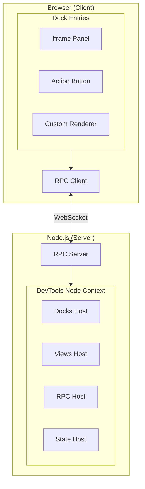

# DevTools Kit

> [!WARNING] Experimental
> The API is still in development and may change in any version. If you are building on top of it, please mind the version of packages you are using and warn your users about the experimental status.

The vision of DevTools Kit is to provide a unified foundation for building custom developer tools that integrate seamlessly with Vite and frameworks built on top of it.

We imagine a future where integrations can provide powerful tools for developers and agents to understand your application better, and be composable based on each specific use case:


If you are interested in more details, you can also check out [Anthony Fu's talk on ViteConf 2025](https://www.youtube.com/watch?v=tVd0JeSr8kg).

## What DevTools Kit Provides

DevTools Kit offers a complete toolkit for building DevTools integrations:

| Feature | Description |
|---------|-------------|
| **[Extensible Architecture](./devtools-plugin)** | Simple, well-typed APIs for registering custom visualizations, actions, and interactions |
| **[Dock System](./dock-system)** | A unified entry point where users can discover and switch between all DevTools integrations |
| **[Built-in RPC Layer](./rpc)** | Type-safe bidirectional communication between Node.js server and browser clients |
| **[Shared State](./shared-state)** | Share data between server and client with automatic synchronization |
| **Isomorphic Views** | Deploy your UI as embedded panels, browser extensions, or standalone webpages |

## Architecture Overview



## Why DevTools Kit?

Traditionally, each framework or tool has had to build its own isolated DevTools from scratch—resulting in duplicated effort, inconsistent user experiences, and maintenance overhead. DevTools Kit changes this by providing a **unified, extensible foundation** that allows plugin and framework authors to focus on what makes their tools unique, rather than rebuilding common infrastructure.

Whether you're building a framework-specific inspector, a build analysis tool, or a custom debugging interface, DevTools Kit handles the heavy lifting of communication, UI hosting, and integration, so you can focus on delivering value to your users.

## Quick Example

Here's a minimal example to add a DevTools panel to your Vite plugin:

```ts
/// <reference types="@vitejs/devtools-kit" />
import type { Plugin } from 'vite'

export default function myPlugin(): Plugin {
  return {
    name: 'my-plugin',
    devtools: {
      setup(ctx) {
        // Register a dock entry that shows an iframe
        ctx.docks.register({
          id: 'my-plugin',
          title: 'My Plugin',
          icon: 'https://example.com/icon.svg',
          type: 'iframe',
          url: 'https://example.com/devtools',
        })
      },
    },
  }
}
```

## Getting Started

If you're building a Vite plugin and want to add DevTools capabilities, or if you're creating a framework-specific DevTools integration, DevTools Kit makes it straightforward:

1. **[DevTools Plugin](./devtools-plugin)** - Learn how to create a DevTools plugin and understand the setup context
2. **[Dock System](./dock-system)** - Create UI panels, action buttons, or custom renderers
3. **[RPC](./rpc)** - Enable bidirectional communication between server and client
4. **[Shared State](./shared-state)** - Share data between server and client with automatic synchronization

> [!TIP] Help Us Improve
> If you are building something on top of Vite DevTools, we invite you to label your repository with `vite-devtools` on GitHub to help us track usage and improve the project. Thank you!

## Real-World Examples

The docs might not cover all the details—please help us improve them by submitting PRs. In the meantime, refer to these existing DevTools integrations:

- **[UnoCSS Inspector](https://github.com/unocss/unocss/blob/25c0dd737132dc20b257c276ee2bc3ccc05e2974/packages-integrations/inspector/src/index.ts#L140-L150)** - A simple iframe-based dock entry
- **[vite-plugin-vue-tracer](https://github.com/antfu/vite-plugin-vue-tracer)** - An action button that triggers a DOM inspector
  - [Plugin hook](https://github.com/antfu/vite-plugin-vue-tracer/blob/9f86fe723543405eea5d30588fe783796193bfd8/src/plugin.ts#L139-L157)
  - [Client script](https://github.com/antfu/vite-plugin-vue-tracer/blob/main/src/client/vite-devtools.ts)
