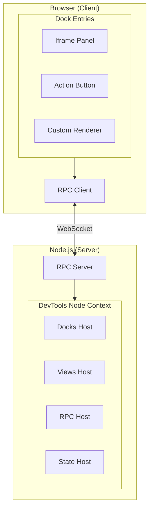

# DevTools Kit

> [!WARNING] Experimental
> The API is still in development and may change in any release. Pin the package version and let your users know they're on an experimental surface.

DevTools Kit is the integration hub for Vite DevTools. It owns the dock, the command palette, terminal aggregation, cross-tool toasts, and the `Plugin.devtools.setup` hook that any Vite plugin can implement to surface a UI inside DevTools.

For a fresh Vite-specific integration, reach for `Plugin.devtools.setup` directly — that's where docks, terminals, the palette, and custom renderers live. Kit is built on [DevFrame](https://devfra.me/guide/), the framework-neutral foundation; tools that already have a portable DevFrame definition drop into the hub via `createPluginFromDevframe`, and standalone single-tool deployments can build on DevFrame directly.


For background, see [Anthony Fu's ViteConf 2025 talk](https://www.youtube.com/watch?v=tVd0JeSr8kg).

## What DevTools Kit provides

Kit owns the hub-level surface — the things that only matter once multiple integrations share a UI:

| Feature | Description |
|---------|-------------|
| **[DevTools Plugin](./devtools-plugin)** | The `Plugin.devtools.setup` hook, plus `createPluginFromDevframe` for porting DevFrame apps into the hub. |
| **[Dock System](./dock-system)** | The unified dock — iframe / action / custom / launcher / json-render entries — with categories, when-clauses, and remote dock support. |
| **[Commands](./commands)** | The shared command palette: keybindings, children, when-gating across every integration. |
| **[Messages](./messages)** | Cross-tool toast notifications and the unified messages dock. |
| **[Terminals](./terminals)** | Aggregate terminal output from any integration into one xterm.js view. |
| **[RPC](./rpc)** | Type-safe bidirectional RPC backed by DevFrame's birpc + valibot. |
| **[Shared State](./shared-state)** | Patch-synced state that bridges server ↔ client across every integration. |
| **Isomorphic Views** | Deploy your UI as embedded panels, browser extensions, or standalone webpages. |

## Architecture Overview


```mermaid
flowchart TB
  subgraph Browser["Browser (Client)"]
    direction TB
    subgraph DockEntries["Dock Entries"]
      Iframe["Iframe Panel"]
      Action["Action Button"]
      Custom["Custom Renderer"]
    end
    RpcClient["RPC Client"]
    DockEntries --> RpcClient
  end

  RpcClient <-->|WebSocket| RpcServer

  subgraph Server["Node.js (Server)"]
    direction TB
    RpcServer["RPC Server"]
    subgraph Context["DevTools Node Context"]
      Docks["Docks Host"]
      Views["Views Host"]
      Rpc["RPC Host"]
      State["State Host"]
    end
    RpcServer --> Context
  end
```

## Quick example

Authoring a Vite plugin? Add a `devtools.setup` hook and register a dock entry:

```ts
/// <reference types="@vitejs/devtools-kit" />
import type { Plugin } from 'vite'

export default function myPlugin(): Plugin {
  return {
    name: 'my-plugin',
    devtools: {
      setup(ctx) {
        // ctx is the kit-augmented context: rpc + docks + terminals + messages + commands
        ctx.docks.register({
          id: 'my-plugin',
          title: 'My Plugin',
          icon: 'https://example.com/icon.svg',
          type: 'iframe',
          url: 'https://example.com/devtools',
        })
      },
    },
  }
}
```

Already have a portable DevFrame app? Wrap it once and Kit synthesises the iframe dock entry from the definition's `id` / `name` / `icon` / `basePath`:

```ts
// vite.config.ts
import { createPluginFromDevframe } from '@vitejs/devtools-kit/node'
import devtool from './my-devtool'

export default {
  plugins: [
    createPluginFromDevframe(devtool, {
      // Optional kit-only setup for hub features:
      setup(ctx) {
        ctx.commands.register({
          id: 'my-devtool:clear-cache',
          title: 'Clear Cache',
          handler: () => { /* ... */ },
        })
      },
    }),
  ],
}
```

## Getting started

1. **[DevTools Plugin](./devtools-plugin)** — register a hub plugin and walk the kit-augmented context.
2. **[Dock System](./dock-system)** — iframe panels, action buttons, custom renderers, launchers, json-render specs.
3. **[RPC](./rpc)** — bidirectional, type-safe communication between server and client.
4. **[Shared State](./shared-state)** — patch-synced state that bridges every integration.

If you're shipping something on Kit, tag the repo with `vite-devtools` on GitHub so we can see what folks are building.
