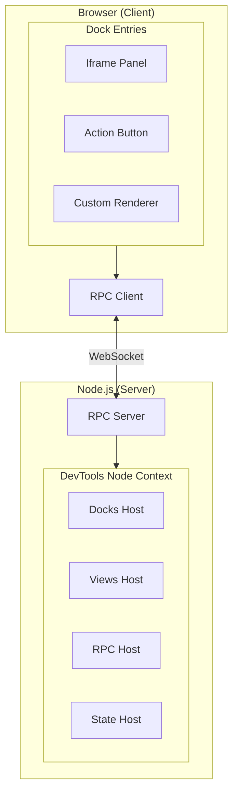

# DevTools Kit

> [!WARNING] Experimental
> The API is still in development and may change in any version. If you are building on top of it, please mind the version of packages you are using and warn your users about the experimental status.

DevTools Kit is **the hub that unites many DevTools integrations**. While [DevFrame](https://devfra.me/guide/) describes one tool — its RPC, its data, its SPA — Kit is the layer that takes many of those tools and gives them a single home: the dock, the command palette, terminal aggregation, cross-tool toasts, and the Vite plugin glue (`Plugin.devtools.setup`) that ties it all together.

If you have a portable DevFrame app, drop it in via `createPluginFromDevframe(d)` from `@vitejs/devtools-kit/node` — the kit auto-derives an iframe dock entry from the definition's `id` / `name` / `icon` / `basePath`. If you're authoring a fresh Vite-specific integration that needs hub features (terminals, palette, custom-render docks), reach for the `Plugin.devtools.setup` hook directly. If you have a tool that doesn't need a hub at all, stay in [DevFrame](https://devfra.me/guide/).

The vision of DevTools Kit is to provide a unified foundation for building custom developer tools that integrate seamlessly with Vite and frameworks built on top of it.

We imagine a future where integrations can provide powerful tools for developers and agents to understand your application better, and be composable based on each specific use case:


If you are interested in more details, you can also check out [Anthony Fu's talk on ViteConf 2025](https://www.youtube.com/watch?v=tVd0JeSr8kg).

## What DevTools Kit Provides

DevTools Kit owns the **hub-level surface** — the things that only make sense once you have multiple integrations sharing a UI:

| Feature | Description |
|---------|-------------|
| **[DevTools Plugin](./devtools-plugin)** | The `Plugin.devtools.setup` hook, plus `createPluginFromDevframe` for porting DevFrame apps into the hub. |
| **[Dock System](./dock-system)** | The unified dock — iframe / action / custom / launcher / json-render entries — with categories, when-clauses, and remote dock support. |
| **[Commands](./commands)** | The shared command palette: keybindings, children, when-gating across every integration. |
| **[Messages](./messages)** | Cross-tool toast notifications and the unified messages dock. |
| **[Terminals](./terminals)** | Aggregate terminal output from any integration into one xterm.js view. |
| **[RPC](./rpc)** | Type-safe bidirectional RPC backed by DevFrame's birpc + valibot. |
| **[Shared State](./shared-state)** | Patch-synced state that bridges server ↔ client across every integration. |
| **Isomorphic Views** | Deploy your UI as embedded panels, browser extensions, or standalone webpages. |

## Architecture Overview


```mermaid
flowchart TB
  subgraph Browser["Browser (Client)"]
    direction TB
    subgraph DockEntries["Dock Entries"]
      Iframe["Iframe Panel"]
      Action["Action Button"]
      Custom["Custom Renderer"]
    end
    RpcClient["RPC Client"]
    DockEntries --> RpcClient
  end

  RpcClient <-->|WebSocket| RpcServer

  subgraph Server["Node.js (Server)"]
    direction TB
    RpcServer["RPC Server"]
    subgraph Context["DevTools Node Context"]
      Docks["Docks Host"]
      Views["Views Host"]
      Rpc["RPC Host"]
      State["State Host"]
    end
    RpcServer --> Context
  end
```

## Why DevTools Kit?

Traditionally, each framework or tool has had to build its own isolated DevTools from scratch—resulting in duplicated effort, inconsistent user experiences, and maintenance overhead. DevTools Kit changes this by providing a **unified, extensible foundation** that allows plugin and framework authors to focus on what makes their tools unique, rather than rebuilding common infrastructure.

Whether you're building a framework-specific inspector, a build analysis tool, or a custom debugging interface, DevTools Kit handles the heavy lifting of communication, UI hosting, and integration, so you can focus on delivering value to your users.

## Quick Example

Two paths into the hub.

**Have a portable DevFrame app already?** Wrap it once. The kit auto-derives an iframe dock from the definition:

```ts
// vite.config.ts
import { createPluginFromDevframe } from '@vitejs/devtools-kit/node'
import devtool from './my-devtool'

export default {
  plugins: [
    createPluginFromDevframe(devtool, {
      // Optional kit-only setup for hub features:
      setup(ctx) {
        ctx.commands.register({
          id: 'my-devtool:clear-cache',
          title: 'Clear Cache',
          handler: () => { /* ... */ },
        })
      },
    }),
  ],
}
```

**Authoring a fresh Vite-specific integration?** Reach for the hook directly:

```ts
/// <reference types="@vitejs/devtools-kit" />
import type { Plugin } from 'vite'

export default function myPlugin(): Plugin {
  return {
    name: 'my-plugin',
    devtools: {
      setup(ctx) {
        // ctx is the kit-augmented context: rpc + docks + terminals + messages + commands
        ctx.docks.register({
          id: 'my-plugin',
          title: 'My Plugin',
          icon: 'https://example.com/icon.svg',
          type: 'iframe',
          url: 'https://example.com/devtools',
        })
      },
    },
  }
}
```

## Getting Started

1. **[DevTools Plugin](./devtools-plugin)** — Learn how to register a hub plugin and understand the kit-augmented context
2. **[Dock System](./dock-system)** — Iframe panels, action buttons, custom renderers, launchers, json-render specs
3. **[RPC](./rpc)** — Bidirectional, type-safe communication between server and client
4. **[Shared State](./shared-state)** — Patch-synced cross-integration state

> [!TIP] Help Us Improve
> If you are building something on top of Vite DevTools Kit, we invite you to label your repository with `vite-devtools` on GitHub to help us track usage and improve the project. Thank you!
