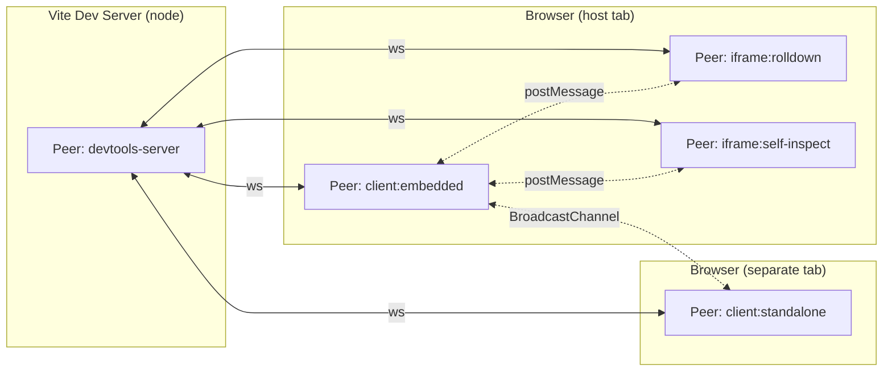

# Peer Mesh

The peer mesh is the communication layer that sits underneath DevTools Kit's [RPC](./rpc) system. It provides a uniform, pluggable foundation for any-to-any messaging between the many runtime contexts that make up a DevTools-enabled Vite application — the devtools server (node), parent client (browser), standalone client (browser), iframe panels (browser), workers, web extensions, and — in future — Nitro runtimes.

> [!NOTE]
> The peer mesh is currently in **Phase 2**: the abstraction is in place, the existing WebSocket transport flows through it, and **cross-peer calls now work via server relay**. Direct peer-to-peer transports (postMessage, in-process, BroadcastChannel, etc.) are rolling out across subsequent phases. See [Roadmap](#roadmap).

## Why a mesh?

Historically every conversation between DevTools components flowed through a single hub — the WebSocket server in the Vite plugin host. That works well for server↔client traffic, but leaves gaps:

- **Iframe panels cannot reach the parent client directly** — e.g. a panel inspecting the host app's DOM must round-trip through the server.
- **Nitro / plugin server endpoints have no back-channel** to the devtools server.
- **Same-origin peers** (standalone client, iframe) cannot talk to each other at all without server relay.

The peer mesh addresses these by introducing stable peer identity, pluggable transports, and (in future phases) a router that picks the cheapest available link between any two peers.

## Conceptual model



Every runtime context is a **peer**. Each peer holds a `PeerMesh` — a small object that owns:

| Piece | Responsibility |
|-------|----------------|
| `self: PeerDescriptor` | Identity + role + capabilities of this process |
| `directory: PeerDirectory` | Registry of known remote peers |
| `links: LinkTable` | Active connections to other peers (one `Link` per transport) |
| `TransportAdapter`s | Pluggable — establish and tear down links |

Peers are addressed by **role** (e.g. `'iframe:rolldown'`, `'client:embedded'`, `'devtools-server'`) or by **capability** (e.g. `{ capability: 'dom-access' }`). The mesh resolves the address to a concrete peer id, picks the best available link, and dispatches the call.

### Peer roles

Built-in role names:

| Role | Who |
|------|-----|
| `devtools-server` | The Vite plugin host (node) |
| `client:embedded` | The webcomponents client injected into a host app |
| `client:standalone` | The standalone DevTools page |
| `iframe:<name>` | An iframe panel (e.g. `iframe:rolldown`, `iframe:vite`, `iframe:self-inspect`) |
| `worker:<name>` | A Web Worker participating in RPC |
| `nitro:<name>` | A Nitro runtime peer (future) |
| `webext:devtools-panel` | Browser extension devtools page |
| `plugin:<name>` | Plugin-declared custom roles |

### Transport adapters

An adapter implements one kind of transport. Adapters register with the mesh; the mesh hands them a context so they can attach links as they establish connections.

| Adapter | Direction | Status |
|--------|-----------|--------|
| `ws-server` | Node listens for browser/node clients | ✅ Phase 1 |
| `ws-client` | Browser/node connects to devtools-server | ✅ Phase 1 |
| `postmessage` | Parent ↔ iframe (same tab) | Phase 4 |
| `in-process` | Node ↔ node (same process) | Phase 3 |
| `broadcastchannel` | Browser ↔ browser (same origin) | Phase 6 |
| `http` | Node/browser one-shot or polling | Phase 6 |
| `message-channel` | Browser ↔ browser (transferred port) | Phase 6 |
| `comlink-worker` | Main ↔ worker | Phase 6 |

Adapters are published as subpath exports from `@vitejs/devtools-rpc/peer/adapters/*`, so tree-shaking keeps node-only transports out of the browser bundle.

## Current state (Phase 2)

Phase 1 introduced the abstraction. Phase 2 lights up cross-peer messaging: any peer can call any other peer's functions through the devtools-server acting as a relay. Everything that worked before still works — `rpc.call()`, `rpc.callEvent()`, `rpcHost.broadcast()`, shared state, auth — unchanged. What's new:

- Every `DevToolsRpcClient` carries a `mesh: PeerMesh` field.
- Every server-side `RpcFunctionsHost` has an internal `_mesh` that `createWsServer` wires up.
- The mesh directory is populated automatically: the server is authoritative, clients receive `directory-delta` events and maintain a replica.
- On trust, each client announces its role/capabilities via `devtoolskit:internal:peer:announce`, and the server broadcasts the change to all other peers.
- `rpc.mesh.peer('role-or-id').call('fn', args)` works: if a direct link exists it's used, otherwise the call is wrapped in `devtoolskit:internal:mesh:relay` and forwarded via the server.

### Inspecting the mesh

On the browser side:

```ts
import { getDevToolsRpcClient } from '@vitejs/devtools-kit/client'

const rpc = await getDevToolsRpcClient()

// The mesh this client participates in
console.log(rpc.mesh.self)
// { id: 'peer-xYz...', role: 'client:unknown', capabilities: [], meta: {...}, links: [...] }

// Peers known to this client (Phase 1: just self + devtools-server)
console.log(rpc.mesh.directory.list())

// Active links held by this client
console.log(rpc.mesh.links.all())
```

On the server side you can reach the mesh through the host's internal field:

```ts
const plugin: Plugin = {
  devtools: {
    setup(ctx) {
      const host = ctx.rpc as any // internal in Phase 1
      const mesh = host._mesh

      // Every connected client appears here
      console.log(mesh.directory.list().map(p => p.role))
      // => ['devtools-server', 'client:unknown', 'client:unknown', ...]

      mesh.on('peer:connected', (peer) => {
        console.log('peer joined:', peer.id, peer.role)
      })
      mesh.on('peer:disconnected', (id) => {
        console.log('peer left:', id)
      })
    },
  },
}
```

### Declaring a peer role

The `getDevToolsRpcClient(options)` accepts peer-shaped fields; bootstrap code (e.g. the embedded inject script, standalone entry, iframe panel) should pass its role so the mesh directory reflects what each peer is:

```ts
const rpc = await getDevToolsRpcClient({
  peerRole: 'iframe:my-plugin',
  peerCapabilities: ['dom-access'],
  peerMeta: { url: location.href },
})
```

Right after the client is trusted, it calls `devtoolskit:internal:peer:announce` automatically with the declared role/capabilities/meta; the server updates its directory entry and broadcasts a delta to every other peer, which then apply it to their local replica.

### Calling another peer

Once peers have announced, any peer can call another through `rpc.mesh.peer(...)`. The handle transparently picks the best available path:

```ts
import { getDevToolsRpcClient } from '@vitejs/devtools-kit/client'

const rpc = await getDevToolsRpcClient({ peerRole: 'client:standalone' })

// Target by role — resolved via the directory replica
await rpc.mesh.peer('iframe:rolldown').call('rolldown:graph:get', { id: 'root' })

// Target by role pattern — first match wins
await rpc.mesh.peer('iframe:*').call('theme:changed', { theme: 'dark' })

// Target by capability query
await rpc.mesh.peer({ capability: 'dom-access' }).call('dom:snapshot', { selector: '#app' })

// Fire-and-forget
rpc.mesh.peer('iframe:rolldown').callEvent('rolldown:refresh')
```

In Phase 2 all cross-peer calls are relayed through the devtools-server. That means one server hop each way; direct transports (postMessage, in-process, BroadcastChannel) arrive in later phases and will slot in transparently.

> [!TIP]
> On the server, you can call any connected peer directly too:
> ```ts
> ctx.rpc._mesh.peer('iframe:rolldown').call('rolldown:graph:get', { id: 'root' })
> ```
> Server-originated calls never go through relay — the server already has a direct link to every connected peer.

### Internal protocol summary

| Method | Kind | Direction | Purpose |
|--------|------|-----------|---------|
| `devtoolskit:internal:peer:announce` | action | client → server | Client declares its role/capabilities; server upserts directory entry |
| `devtoolskit:internal:peer:directory-delta` | event | server → clients | Broadcast when any peer joins/leaves/updates (sent to all but the subject peer) |
| `devtoolskit:internal:mesh:relay` | action | any → server | Forward an awaited call to another peer |
| `devtoolskit:internal:mesh:relay-event` | event | any → server | Forward a fire-and-forget call to another peer |

These are implementation details — consumer code should use `rpc.mesh.peer(...)`.

> [!WARNING]
> In Phase 2, relayed calls arrive at the target with the server's session identity — the origin peer id is not signed across the hop. HMAC-signed origin identity lands in Phase 5. Plugins that need to know the original caller should check that the target peer is the expected one and/or wait for Phase 5 before gating sensitive operations on peer identity.

## Roadmap

| Phase | Capability | User-visible impact |
|-------|-----------|---------------------|
| 1 ✅ | Mesh / directory / link foundation, WS transport routed through it | No behavior change; `rpc.mesh` available for inspection |
| 2 ✅ | Peer announce + directory-delta protocol; `mesh:relay` / `mesh:relay-event` RPC functions; `PeerHandle.call` falls back to relay via the server | `rpc.mesh.peer('role').call(...)` works across peers via one server hop |
| 3 | `in-process` adapter | `ctx.rpc.invokeLocal()` skips serialization; unlocks Nitro ↔ devtools-server in-process calls |
| 4 | `postmessage` adapter | Parent ↔ iframe direct, no server hop; unlocks DOM-access use case |
| 5 | Capability gating + HMAC-signed origin identity | Plugins can restrict who can call which methods; trust preserved across relays |
| 6 | Remaining adapters (BroadcastChannel, HTTP, MessageChannel, Comlink) | Same-origin tab-to-tab, edge/serverless Nitro, worker peers |
| 7 | Docs finalized; `presets/ws/*` direct imports deprecated | `@vitejs/devtools-rpc/presets/ws/*` becomes a legacy alias over the peer adapters |

The plan is **additive** for public APIs — existing callers (`rpc.call()`, `ctx.rpc.broadcast()`, etc.) keep working; new capabilities show up through new APIs.

## API reference (Phase 2)

### `PeerMesh`

```ts
class PeerMesh {
  readonly self: PeerDescriptor
  readonly directory: PeerDirectory
  readonly links: LinkTable

  register(adapter: TransportAdapter, disposer?: () => void): Promise<() => void>
  attachLink(link: Link): void

  peer(target: PeerId | PeerRole | PeerRolePattern | PeerQuery): PeerHandle
  findPeers(query: PeerQuery): PeerHandle[]

  broadcast(options: {
    to?: PeerId | PeerRole | PeerRolePattern | PeerQuery
    method: string
    args: any[]
    event?: boolean
    optional?: boolean
  }): Promise<void>

  on(event: 'peer:connected' | 'peer:disconnected' | 'peer:updated', fn): () => void
}
```

### `PeerDescriptor`

```ts
interface PeerDescriptor {
  id: string
  role: PeerRole
  capabilities: readonly string[]
  meta: Record<string, unknown>
  links: readonly TransportLinkInfo[]
}
```

### `PeerDirectory`

```ts
class PeerDirectory {
  list(): PeerDescriptor[]
  get(id: string): PeerDescriptor | undefined
  query(q: PeerQuery): PeerDescriptor[]
  resolve(target): PeerDescriptor[]
  upsert(peer: PeerDescriptor): 'added' | 'updated'
  remove(id: string): boolean
  onChange(fn): () => void
}
```

### `TransportAdapter`

```ts
interface TransportAdapter {
  readonly kind: TransportKind
  setup?: (ctx: TransportAdapterContext) => void | Promise<void>
  dispose?: () => void | Promise<void>
  connect?: (args: TransportConnectArgs) => Promise<LinkChannel>
  canServe?: (local: PeerDescriptor, remote: PeerDescriptor) => boolean
}
```

Built-in adapters:

```ts
import { createWsClientAdapter } from '@vitejs/devtools-rpc/peer/adapters/ws-client'
import { createWsServerAdapter } from '@vitejs/devtools-rpc/peer/adapters/ws-server'
```

## Relationship to the RPC layer

Calls you make through `rpc.call('my:fn', args)` still work exactly as before — the mesh brokers the underlying connection. `rpc.call(...)` is shorthand for `rpc.mesh.peer('devtools-server').call(...)`; the peer-scoped API opens up cross-peer targeting:

```ts
// Unchanged — call the server
await rpc.call('my-plugin:get-data')

// Phase 2 (current) — call other peers via server relay
await rpc.mesh.peer('iframe:rolldown').call('rolldown:graph:get', { id })
await rpc.mesh.peer({ capability: 'dom-access' }).call('dom:snapshot', { selector })
await rpc.mesh.broadcast({ to: 'iframe:*', method: 'theme:changed', args: [{ theme: 'dark' }] })
```

See [RPC](./rpc) for server/client function definitions and call patterns.
