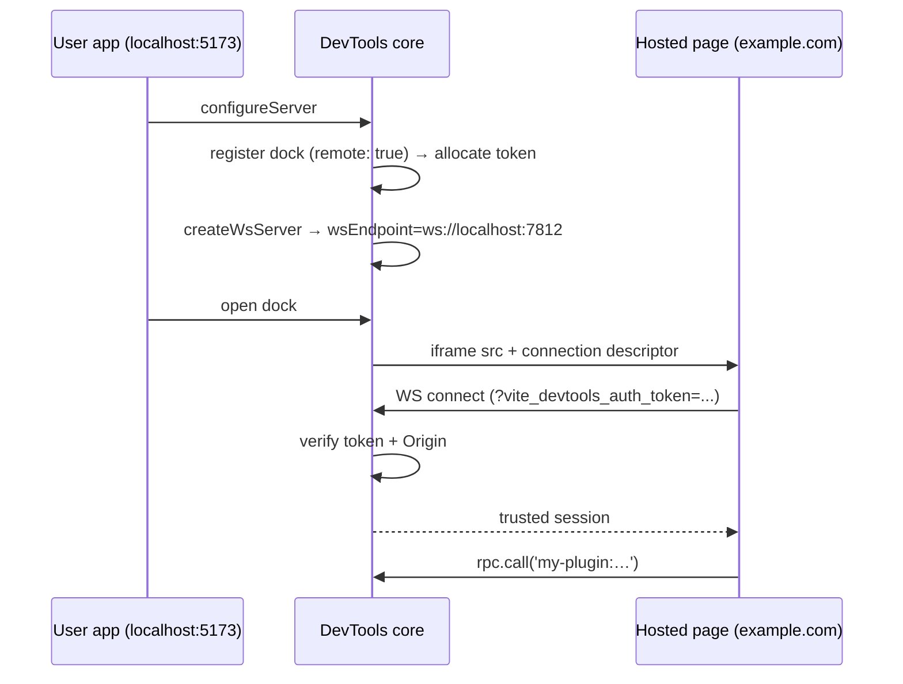

# Remote Client

Remote client mode lets a dock point at a **hosted website** — e.g. `https://example.com/devtools` — instead of bundling a SPA dist with your plugin. The hosted page opens a WebSocket connection back to the local Vite dev server and talks to your plugin using the same RPC and shared-state APIs as an embedded client.

> [!TIP]
> A live demo is hosted on this site at [Remote Connection Demo](./remote-demo). Register a dock pointing at that URL and open it to see the flow end-to-end.

Compared to the bundled approach described in [Dock System → Iframe Panels](./dock-system#iframe-panels), remote mode means:

- **No client dist shipped with your plugin.** Your npm package stays small; you ship only node-side code.
- **Iterate on the hosted app independently.** Deploy updates to the UI without republishing the plugin.
- **Use the production URL of an existing dashboard.** If your team already hosts something, surface it directly inside DevTools.

The tradeoff: users must be online to load the hosted page, and you trust the hosted origin to faithfully render local data.

## How it works

When you register an iframe dock with `remote: true`, DevTools:

1. Allocates a session-only, pre-approved auth token for that dock.
2. Injects a connection descriptor — the WS URL, the token, and the user's dev-server origin — into the iframe's `src` attribute.
3. Accepts the token on WebSocket handshake (after verifying the `Origin` header, if origin-lock is on).

On the hosted page, `connectRemoteDevTools()` parses the descriptor out of the URL and hands back a fully connected [`DevToolsRpcClient`](./rpc) — the same client you'd get from `getDevToolsRpcClient()` in an embedded page.



## Register a remote dock

```ts
import type { Plugin } from 'vite'

export function myPlugin(): Plugin {
  return {
    name: 'my-plugin',
    devtools: {
      setup(ctx) {
        ctx.docks.register({
          id: 'my-remote-tool',
          title: 'My Tool',
          icon: 'ph:cloud-duotone',
          type: 'iframe',
          url: 'https://example.com/devtools',
          remote: true,
        })
      },
    },
  }
}
```

That's the whole node-side change. The dock renders exactly like a normal iframe panel — with the connection descriptor invisibly appended to the URL.

### Options

```ts
interface RemoteDockOptions {
  /** @default 'fragment' */
  transport?: 'fragment' | 'query'
  /** @default true */
  originLock?: boolean
}

// in ctx.docks.register({ ... }):
//   remote: true
// or:
//   remote: { transport: 'query', originLock: false }
```

#### `transport`

- **`'fragment'` (default)** — the descriptor is appended as a URL fragment (`#vite-devtools-kit-connection=...`). Fragments are **not** sent to servers, **not** written to access logs, and **stripped from `Referer`** on outbound sub-resource requests. This is the safest place to carry an auth token.
- **`'query'`** — the descriptor is appended as a query parameter (`?vite-devtools-kit-connection=...`). Use this when:
  - Your SPA router uses the fragment for navigation (and strips unknown fragments).
  - Your hosting platform or CDN rewrites URLs in a way that drops fragments.

  The token **will** appear in server access logs and outbound `Referer` headers when transport is `'query'`. Only opt in if you control the analytics / log pipeline for the hosted origin.

#### `originLock`

When on (default), the WebSocket handshake is rejected if the browser's `Origin` header doesn't match the origin of the dock URL you registered. If the token leaks (e.g. logged to an external analytics tool that ingests URLs), a different origin can't use it to talk to the local dev server.

Turn off only when the same hosted app is served from multiple origins (e.g. preview deploys on `pr-123.preview.example.com`):

```ts
ctx.docks.register({
  id: 'my-remote-tool',
  title: 'My Tool',
  icon: 'ph:cloud-duotone',
  type: 'iframe',
  url: 'https://example.com/devtools',
  remote: { originLock: false },
})
```

## Connect from the hosted page

Install `@vitejs/devtools-kit` as a dependency of your hosted page — it's browser-safe for this entrypoint:

```sh
pnpm add @vitejs/devtools-kit
```

Then, on page load:

```ts
import { connectRemoteDevTools } from '@vitejs/devtools-kit/client'

const rpc = await connectRemoteDevTools()

// From here, use it like any other DevToolsRpcClient:
const data = await rpc.call('my-plugin:get-data')
```

`connectRemoteDevTools()` reads the descriptor from the current URL, opens the WebSocket, and resolves to a `DevToolsRpcClient` with `.call`, `.callEvent`, `.callOptional`, `.sharedState`, and the rest of the standard API documented in [RPC](./rpc).

If the page is loaded without a descriptor in the URL (someone opening `https://example.com/devtools` directly), the call throws. That's a useful signal — render a friendly "Open me through Vite DevTools" placeholder in that case:

```ts
import { connectRemoteDevTools, parseRemoteConnection } from '@vitejs/devtools-kit/client'

if (!parseRemoteConnection()) {
  renderStandaloneLandingPage()
}
else {
  const rpc = await connectRemoteDevTools()
  renderConnectedUi(rpc)
}
```

### Advanced: custom URL / options

`connectRemoteDevTools` forwards any [`DevToolsRpcClientOptions`](./rpc) except `connectionMeta` and `authToken` (those come from the descriptor). Use this for RPC caching, custom `rpcOptions`, etc.

```ts
const rpc = await connectRemoteDevTools({
  cacheOptions: { maxAge: 5000 },
})
```

For testing or non-browser environments you can pass an explicit URL or raw fragment/query string to `parseRemoteConnection`:

```ts
parseRemoteConnection('https://example.com/p#vite-devtools-kit-connection=...')
parseRemoteConnection('?vite-devtools-kit-connection=...')
```

## Descriptor shape

The descriptor is a superset of [`ConnectionMeta`](./rpc), so `getDevToolsRpcClient({ connectionMeta })` accepts a parsed descriptor directly:

```ts
interface RemoteConnectionInfo {
  v: 1
  backend: 'websocket'
  /** Full ws:// or wss:// URL. */
  websocket: string
  authToken: string
  /** Dev-server origin, e.g. http://localhost:5173. */
  origin: string
}
```

It's JSON-encoded and base64url-encoded, then appended to the iframe URL under the parameter name `vite-devtools-kit-connection`.

## Trust boundary

Enabling remote mode extends the following trust chain:

1. The user **installs your plugin** and opts into DevTools.
2. Your plugin **declares a remote URL**.
3. DevTools **hands the hosted origin a session token** scoped to that URL.

The session token is:

- **Pre-approved** — no interactive "trust this browser?" prompt fires. The user already agreed to the integration when they installed your plugin.
- **Session-scoped** — stored in memory only, regenerated on every dev-server restart.
- **Re-register-scoped** — calling `ctx.docks.register(..., true)` again for the same id revokes the previous token before allocating a new one. Any live WS clients using the old token receive `devtoolskit:internal:auth:revoked` and become untrusted.
- **Origin-locked by default** — only connections whose `Origin` header matches the dock URL's origin are accepted.

Because the token rides in the URL (fragment or query), it should be treated as a session secret: don't log URLs to external services on the hosted page, and prefer `transport: 'fragment'` unless you have a specific reason not to.

## Build mode

The WebSocket server exists only in dev mode (`vite`), not in build mode (`vite build`). When `remote` is set, DevTools automatically hides the dock in build mode by defaulting its [`when` clause](./when-clauses) to `'mode != build'`. You can still set your own `when` if you need different behavior:

```ts
ctx.docks.register({
  // ...
  remote: true,
  when: 'clientType == embedded', // overrides the default
})
```

## Related

- [Dock System](./dock-system) — the full list of dock types.
- [RPC](./rpc) — the `DevToolsRpcClient` API.
- [When Clauses](./when-clauses) — conditional dock visibility.
