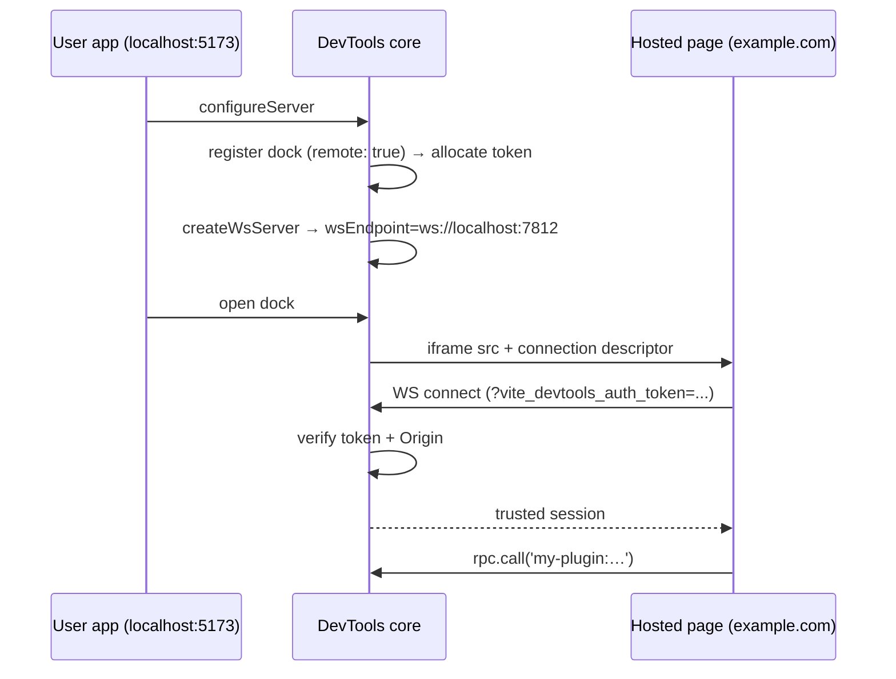

# Remote Client

Remote client mode points a dock at a hosted website (e.g. `https://example.com/devtools`) instead of bundling a SPA dist with your plugin. The hosted page opens a WebSocket back to the local Vite dev server and uses the same RPC and shared-state APIs as an embedded client. A live demo lives at [Remote Connection Demo](./remote-demo) — register a dock pointing at that URL to see the flow end-to-end.

Compared to the bundled approach in [Dock System → Iframe Panels](./dock-system#iframe-panels), remote mode:

- **Keeps your npm package small.** Ship node-side code only.
- **Decouples release cadences.** Update the hosted UI without republishing the plugin.
- **Surfaces existing dashboards.** Drop in a production URL your team already runs.

The tradeoff: users need to be online to load the hosted page, and the hosted origin gets trusted access to render local data.

## How it works

When you register an iframe dock with `remote: true`, DevTools:

1. Allocates a session-only, pre-approved auth token for that dock.
2. Injects a connection descriptor — the WS URL, the token, and the user's dev-server origin — into the iframe's `src` attribute.
3. Accepts the token on WebSocket handshake (after verifying the `Origin` header, if origin-lock is on).

On the hosted page, `connectRemoteDevTools()` parses the descriptor out of the URL and returns a fully connected [`DevToolsRpcClient`](./rpc) — the same client you'd get from `getDevToolsRpcClient()` in an embedded page.



## Registering a remote dock

```ts
import type { Plugin } from 'vite'

export function myPlugin(): Plugin {
  return {
    name: 'my-plugin',
    devtools: {
      setup(ctx) {
        ctx.docks.register({
          id: 'my-remote-tool',
          title: 'My Tool',
          icon: 'ph:cloud-duotone',
          type: 'iframe',
          url: 'https://example.com/devtools',
          remote: true,
        })
      },
    },
  }
}
```

That's the whole node-side change. The dock renders like a regular iframe panel, with the connection descriptor appended invisibly to the URL.

### Options

```ts
interface RemoteDockOptions {
  /** @default 'fragment' */
  transport?: 'fragment' | 'query'
  /** @default true */
  originLock?: boolean
}

// in ctx.docks.register({ ... }):
//   remote: true
// or:
//   remote: { transport: 'query', originLock: false }
```

#### `transport`

- **`'fragment'` (default)** — the descriptor rides as a URL fragment (`#vite-devtools-kit-connection=...`). Fragments stay client-side: they don't reach servers, don't enter access logs, and get stripped from `Referer` on sub-resource requests. The safest place to carry an auth token.
- **`'query'`** — the descriptor rides as a query parameter (`?vite-devtools-kit-connection=...`). Pick this when your SPA router uses the fragment for navigation, or when your hosting platform / CDN rewrites URLs in a way that drops fragments.

> [!WARNING]
> With `'query'` transport, the auth token appears in server access logs and outbound `Referer` headers. Use it only when you control the analytics / log pipeline on the hosted origin.

#### `originLock`

When on (default), the WebSocket handshake is rejected if the browser's `Origin` header doesn't match the origin of the registered dock URL. If the token leaks (for example to an external analytics tool that ingests URLs), the wrong origin can't reuse it.

Turn it off only when the same hosted app is served from multiple origins (e.g. preview deploys on `pr-123.preview.example.com`):

```ts
ctx.docks.register({
  id: 'my-remote-tool',
  title: 'My Tool',
  icon: 'ph:cloud-duotone',
  type: 'iframe',
  url: 'https://example.com/devtools',
  remote: { originLock: false },
})
```

## Connecting from the hosted page

Install `@vitejs/devtools-kit` as a dependency of your hosted page — the client entrypoint is browser-safe:

```sh
pnpm add @vitejs/devtools-kit
```

Then, on page load:

```ts
import { connectRemoteDevTools } from '@vitejs/devtools-kit/client'

const rpc = await connectRemoteDevTools()

// From here, use it like any other DevToolsRpcClient:
const data = await rpc.call('my-plugin:get-data')
```

`connectRemoteDevTools()` reads the descriptor from the current URL, opens the WebSocket, and resolves to a `DevToolsRpcClient` with `.call`, `.callEvent`, `.callOptional`, `.sharedState`, and the rest of the standard API documented in [RPC](./rpc).

When someone opens the page directly (no descriptor in the URL), the call throws. Use that as a cue to render a friendly "Open me through Vite DevTools" placeholder:

```ts
import { connectRemoteDevTools, parseRemoteConnection } from '@vitejs/devtools-kit/client'

if (!parseRemoteConnection()) {
  renderStandaloneLandingPage()
}
else {
  const rpc = await connectRemoteDevTools()
  renderConnectedUi(rpc)
}
```

### Advanced: custom URL / options

`connectRemoteDevTools` forwards any [`DevToolsRpcClientOptions`](./rpc) — RPC caching, custom `rpcOptions`, and so on — while keeping `connectionMeta` and `authToken` sourced from the descriptor.

```ts
const rpc = await connectRemoteDevTools({
  cacheOptions: { maxAge: 5000 },
})
```

For testing or non-browser environments, pass an explicit URL or raw fragment/query string to `parseRemoteConnection`:

```ts
parseRemoteConnection('https://example.com/p#vite-devtools-kit-connection=...')
parseRemoteConnection('?vite-devtools-kit-connection=...')
```

## Descriptor shape

The descriptor is a superset of [`ConnectionMeta`](./rpc), so `getDevToolsRpcClient({ connectionMeta })` accepts a parsed descriptor directly:

```ts
interface RemoteConnectionInfo {
  v: 1
  backend: 'websocket'
  /** Full ws:// or wss:// URL. */
  websocket: string
  authToken: string
  /** Dev-server origin, e.g. http://localhost:5173. */
  origin: string
}
```

It's JSON-encoded and base64url-encoded, then appended to the iframe URL under the parameter name `vite-devtools-kit-connection`.

## Trust boundary

Remote mode extends the following trust chain:

1. The user installs your plugin and opts into DevTools.
2. Your plugin declares a remote URL.
3. DevTools hands the hosted origin a session token scoped to that URL.

Properties of the session token:

- **Pre-approved.** No interactive "trust this browser?" prompt fires; the user agreed to the integration when they installed the plugin.
- **Session-scoped.** Stored in memory only and regenerated on every dev-server restart.
- **Re-register-scoped.** Calling `ctx.docks.register(...)` again for the same id revokes the previous token; live WS clients on the old token receive `devframe:auth:revoked` and become untrusted.
- **Origin-locked by default.** Only connections whose `Origin` matches the dock URL are accepted.

> [!WARNING]
> The token rides in the URL — treat it as a session secret. Avoid logging URLs to external services on the hosted page, and prefer `transport: 'fragment'` unless you have a specific reason to use `'query'`.

## Build mode

The WebSocket server runs in dev mode (`vite`); remote-iframe docks skip themselves in static-dump output, so no [`when` clause](./when-clauses) is needed. Add one if you want different visibility in embedded vs. standalone clients:

```ts
ctx.docks.register({
  // ...
  remote: true,
  when: 'clientType == embedded',
})
```

## Related

- [Dock System](./dock-system) — the full list of dock types.
- [RPC](./rpc) — the `DevToolsRpcClient` API.
- [When Clauses](./when-clauses) — conditional dock visibility.
