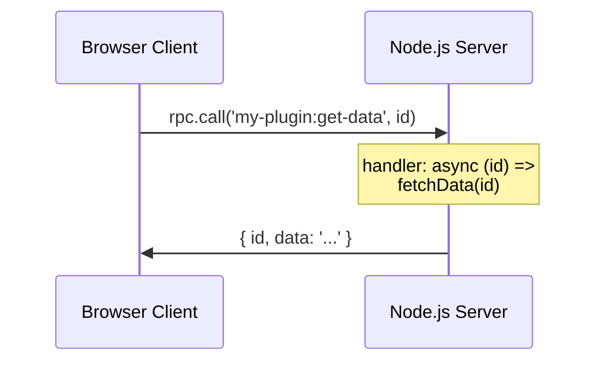

# Remote Procedure Calls (RPC)

DevTools Kit provides a built-in RPC layer for type-safe bidirectional communication between your Node.js server and browser clients.

## Overview



## Server-Side Functions

### Defining RPC Functions

Use `defineRpcFunction` to create type-safe server functions:

```ts
import { defineRpcFunction } from '@vitejs/devtools-kit'

const getModules = defineRpcFunction({
  name: 'my-plugin:get-modules',
  type: 'query',
  setup: ctx => ({
    handler: async () => {
      // Access DevTools context
      console.log('Mode:', ctx.mode)

      return [
        { id: '/src/main.ts', size: 1024 },
        { id: '/src/App.vue', size: 2048 },
      ]
    },
  }),
})
```

### Registering Functions

Register your RPC function in the `devtools.setup`:

```ts
const plugin: Plugin = {
  devtools: {
    setup(ctx) {
      ctx.rpc.register(getModules)
    }
  }
}
```

### Function Types

| Type | Description | Caching | Dump Support |
|------|-------------|---------|--------------|
| `query` | Fetch data, read operations | Can be cached | ✓ (manual) |
| `static` | Constant data that never changes | Cached indefinitely | ✓ (automatic) |
| `action` | Side effects, mutations | Not cached | ✗ |
| `event` | Emit events, no response | Not cached | ✗ |

### Handler Arguments

Handlers can accept any serializable arguments:

```ts
const getModule = defineRpcFunction({
  name: 'my-plugin:get-module',
  type: 'query',
  setup: () => ({
    handler: async (id: string, options?: { includeSource: boolean }) => {
      // id and options are passed from the client
      return { id, source: options?.includeSource ? '...' : undefined }
    },
  }),
})
```

### Context in Setup

The `setup` function receives the full `DevToolsNodeContext`:

```ts
setup: (ctx) => {
  // Access Vite config
  const root = ctx.viteConfig.root

  // Access dev server (if in dev mode)
  const server = ctx.viteServer

  return {
    handler: async () => {
      // Use ctx here too
      return { root, mode: ctx.mode }
    },
  }
}
```

> [!IMPORTANT]
> For build mode compatibility, compute data in the setup function using the context rather than relying on runtime global state. This allows the dump feature to pre-compute results at build time.

### Dump Feature for Build Mode

When using `vite devtools build` to create a static DevTools build, the server cannot execute functions at runtime. The **dump feature** solves this by pre-computing RPC results at build time.

#### How It Works

1. At build time, `dumpFunctions()` executes your RPC handlers with predefined arguments
2. Results are stored in `.vdt-rpc-dump.json` in the build output
3. The static client reads from this JSON file instead of making live RPC calls

#### Static Functions (Recommended)

Functions with `type: 'static'` are **automatically dumped** with no arguments:

```ts
const getConfig = defineRpcFunction({
  name: 'my-plugin:get-config',
  type: 'static', // Auto-dumped with inputs: [[]]
  setup: ctx => ({
    handler: async () => ({
      root: ctx.viteConfig.root,
      plugins: ctx.viteConfig.plugins.map(p => p.name),
    }),
  }),
})
```

This works in both dev mode (live) and build mode (pre-computed).

#### Query Functions with Dumps

For `query` functions that need arguments, define `dump` in the setup:

```ts
const getModule = defineRpcFunction({
  name: 'my-plugin:get-module',
  type: 'query',
  setup: (ctx) => {
    // Collect all module IDs at build time
    const moduleIds = Array.from(ctx.viteServer?.moduleGraph?.idToModuleMap.keys() || [])

    return {
      handler: async (id: string) => {
        const module = ctx.viteServer?.moduleGraph?.getModuleById(id)
        return module ? { id, size: module.transformResult?.code.length } : null
      },
      dump: {
        inputs: moduleIds.map(id => [id]), // Pre-compute for all modules
        fallback: null, // Return null for unknown modules
      },
    }
  },
})
```

#### Recommendations for Plugin Authors

To ensure your DevTools work in build mode:

1. **Prefer `type: 'static'`** for functions that return constant data
2. **Return context-based data in setup** rather than accessing global state in handlers
3. **Define dumps in setup function** for query functions that need pre-computation
4. **Use fallback values** for graceful degradation when arguments don't match

```ts
// ✓ Good: Returns static data, works in build mode
const getPluginInfo = defineRpcFunction({
  name: 'my-plugin:info',
  type: 'static',
  setup: ctx => ({
    handler: async () => ({
      version: '1.0.0',
      root: ctx.viteConfig.root,
    }),
  }),
})

// ✗ Avoid: Depends on runtime server state
const getLiveMetrics = defineRpcFunction({
  name: 'my-plugin:metrics',
  type: 'query', // No dump - won't work in build mode
  handler: async () => {
    return getCurrentMetrics() // Requires live server
  },
})
```

> [!TIP]
> If your data genuinely needs live server state, use `type: 'query'` without dumps. The function will work in dev mode but gracefully fail in build mode.

## Client-Side Calls

### In Iframe Pages

Use `getDevToolsRpcClient()` to get the RPC client:

```ts
import { getDevToolsRpcClient } from '@vitejs/devtools-kit/client'

async function loadData() {
  const rpc = await getDevToolsRpcClient()

  // Call server function
  const modules = await rpc.call('my-plugin:get-modules')

  // With arguments
  const module = await rpc.call('my-plugin:get-module', '/src/main.ts', {
    includeSource: true,
  })
}
```

### In Action/Renderer Scripts

Use `ctx.current.rpc` from the script context:

```ts
import type { DevToolsClientScriptContext } from '@vitejs/devtools-kit/client'

export default function setup(ctx: DevToolsClientScriptContext) {
  ctx.current.events.on('entry:activated', async () => {
    const data = await ctx.current.rpc.call('my-plugin:get-modules')
    console.log(data)
  })
}
```

## Client-Side Functions

You can also define functions on the client that the server can call.

### Registering Client Functions

```ts
import type { DevToolsClientScriptContext } from '@vitejs/devtools-kit/client'

export default function setup(ctx: DevToolsClientScriptContext) {
  ctx.current.rpc.client.register({
    name: 'my-plugin:highlight-element',
    type: 'action',
    handler: (selector: string) => {
      const el = document.querySelector(selector)
      if (el) {
        el.style.outline = '2px solid red'
        setTimeout(() => {
          el.style.outline = ''
        }, 2000)
      }
    },
  })
}
```

### Broadcasting from Server

Use `ctx.rpc.broadcast()` to call client functions from the server:

```ts
const plugin: Plugin = {
  devtools: {
    setup(ctx) {
    // Later, when you want to notify clients...
      ctx.rpc.broadcast('my-plugin:highlight-element', '#app')
    }
  }
}
```

> [!NOTE]
> `broadcast` calls all connected clients. The returned promise resolves to an array of results (one per client).

## Type Safety

For full type safety, extend the DevTools Kit interfaces.

### Server Functions

```ts
// src/types.ts
import '@vitejs/devtools-kit'

declare module '@vitejs/devtools-kit' {
  interface DevToolsRpcFunctions {
    'my-plugin:get-modules': () => Promise<Module[]>
    'my-plugin:get-module': (
      id: string,
      options?: { includeSource: boolean }
    ) => Promise<Module | null>
  }
}

interface Module {
  id: string
  size: number
  source?: string
}
```

### Client Functions

```ts
// src/types.ts
declare module '@vitejs/devtools-kit' {
  interface DevToolsRpcClientFunctions {
    'my-plugin:highlight-element': (selector: string) => void
    'my-plugin:refresh-ui': () => void
  }
}
```

Now TypeScript will autocomplete and validate your RPC calls:

```ts
// ✓ Type-checked
const modules = await rpc.call('my-plugin:get-modules')

// ✓ Argument types validated
const module = await rpc.call('my-plugin:get-module', '/src/main.ts')

// ✗ Error: unknown function name
const data = await rpc.call('my-plugin:unknown')
```

## Complete Example

Here's a complete example with both server and client RPC functions:

::: code-group

```ts [plugin.ts]
/// <reference types="@vitejs/devtools-kit" />
import type { Plugin } from 'vite'
import { defineRpcFunction } from '@vitejs/devtools-kit'

export default function analyticsPlugin(): Plugin {
  const metrics = new Map<string, number>()

  return {
    name: 'analytics',

    transform(code, id) {
      metrics.set(id, code.length)
    },

    devtools: {
      setup(ctx) {
        // Server function: get metrics
        ctx.rpc.register(
          defineRpcFunction({
            name: 'analytics:get-metrics',
            type: 'query',
            setup: () => ({
              handler: async () => Object.fromEntries(metrics),
            }),
          })
        )

        // Broadcast to clients when metrics change
        ctx.viteServer?.watcher.on('change', (file) => {
          ctx.rpc.broadcast('analytics:metrics-updated', file)
        })
      },
    },
  }
}
```

```ts [client.ts]
import type { DevToolsClientScriptContext } from '@vitejs/devtools-kit/client'

export default function setup(ctx: DevToolsClientScriptContext) {
  // Register client function
  ctx.current.rpc.client.register({
    name: 'analytics:metrics-updated',
    type: 'action',
    handler: (file: string) => {
      console.log('File changed:', file)
      refreshUI()
    },
  })

  async function refreshUI() {
    const metrics = await ctx.current.rpc.call('analytics:get-metrics')
    console.log('Updated metrics:', metrics)
  }
}
```

```ts [types.ts]
import '@vitejs/devtools-kit'

declare module '@vitejs/devtools-kit' {
  interface DevToolsRpcFunctions {
    'analytics:get-metrics': () => Promise<Record<string, number>>
  }

  interface DevToolsRpcClientFunctions {
    'analytics:metrics-updated': (file: string) => void
  }
}
```

:::
