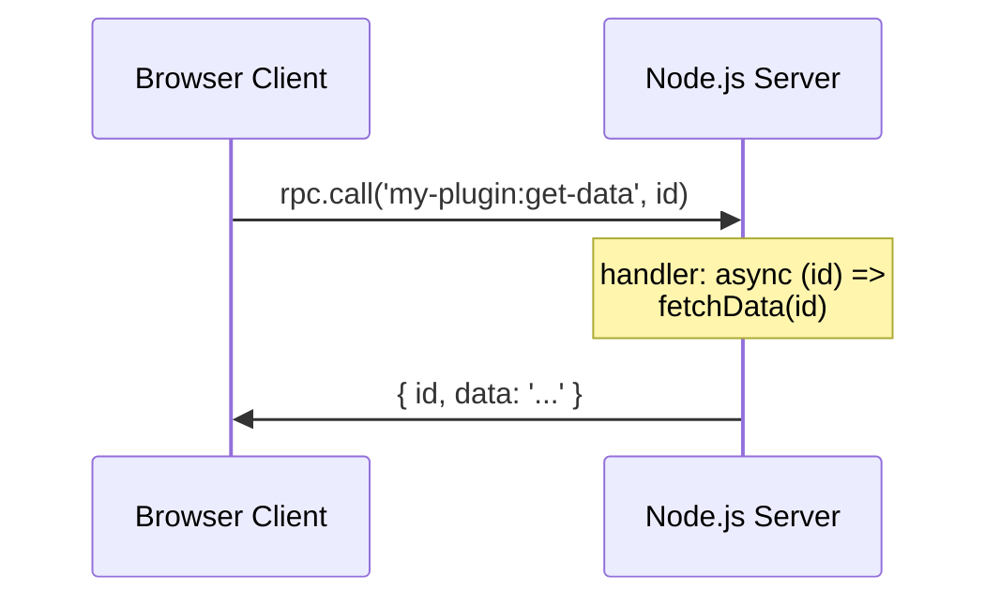

# Remote Procedure Calls (RPC)

DevTools Kit's RPC layer is type-safe, bidirectional, and works between your Node.js server and any connected browser client.

## Overview


```mermaid
sequenceDiagram
  participant Client as Browser Client
  participant Server as Node.js Server

  Client->>Server: rpc.call('my-plugin:get-data', id)
  Note over Server: handler: async (id) =><br/>fetchData(id)
  Server->>Client: { id, data: '...' }
```

## Server-side functions

### Defining RPC functions

Use `defineRpcFunction` for type-safe server functions:

```ts
import { defineRpcFunction } from '@vitejs/devtools-kit'

const getModules = defineRpcFunction({
  name: 'my-plugin:get-modules',
  type: 'query',
  setup: ctx => ({
    handler: async () => {
      // Access DevTools context
      console.log('Mode:', ctx.mode)

      return [
        { id: '/src/main.ts', size: 1024 },
        { id: '/src/App.vue', size: 2048 },
      ]
    },
  }),
})
```

### Naming convention

Scope each function with your package prefix and use kebab-case for the function part: `my-plugin:get-modules`, `my-plugin:read-file`.

### Function types

| Type | Use for | Cached | Dump support |
|------|---------|--------|--------------|
| `query` | Fetch data, read operations | Yes | Manual |
| `static` | Constant data | Indefinitely | Automatic |
| `action` | Side effects, mutations | No | — |
| `event` | Notifications without a response | No | — |

For chunk-style data (LLM deltas, log lines, build progress, file uploads), reach for [streaming channels](./streaming) — they handle stream IDs, cancellation, replay, and Web Streams interop for you.

### Handler arguments

Handlers can accept any serializable arguments:

```ts
const getModule = defineRpcFunction({
  name: 'my-plugin:get-module',
  type: 'query',
  setup: () => ({
    handler: async (id: string, options?: { includeSource: boolean }) => {
      // id and options are passed from the client
      return { id, source: options?.includeSource ? '...' : undefined }
    },
  }),
})
```

### Context in setup

The `setup` function receives the full `ViteDevToolsNodeContext`:

```ts
setup: (ctx) => {
  // Access Vite config
  const root = ctx.viteConfig.root

  // Access dev server (if in dev mode)
  const server = ctx.viteServer

  return {
    handler: async () => {
      // Use ctx here too
      return { root, mode: ctx.mode }
    },
  }
}
```

For build-mode compatibility, compute data in `setup` using the context and let the handler use it. The dump feature then pre-computes results at build time using values that already exist in `setup`'s closure.

### Registering functions

Register the RPC function from `devtools.setup`:

```ts
const plugin: Plugin = {
  devtools: {
    setup(ctx) {
      ctx.rpc.register(getModules)
    }
  }
}
```

### Dump feature for build mode

A static DevTools build (via `vite devtools build` or the [`build.withApp`](/guide/#building-with-the-app) plugin option) has no live server. The dump feature pre-computes RPC results at build time and bakes them into the static output.

#### How it works

1. At build time, `dumpFunctions()` runs each RPC handler with predefined arguments.
2. Results land in `__rpc-dump/index.json` (and sharded `__rpc-dump/*.json` files) in the build output.
3. The static client reads from those files instead of making live RPC calls.

Function names in shard file keys replace `:` with `~` (e.g. `my-plugin:get-data` → `my-plugin~get-data`). Query record maps are embedded directly in `__rpc-dump/index.json`.

#### Static functions

Functions with `type: 'static'` are dumped automatically with no arguments — the recommended default for constant data:

```ts
const getConfig = defineRpcFunction({
  name: 'my-plugin:get-config',
  type: 'static', // Auto-dumped with inputs: [[]]
  setup: ctx => ({
    handler: async () => ({
      root: ctx.viteConfig.root,
      plugins: ctx.viteConfig.plugins.map(p => p.name),
    }),
  }),
})
```

Works in both dev mode (live) and build mode (pre-computed).

#### Query functions with dumps

For `query` functions that need arguments, define `dump` in the setup:

```ts
const getModule = defineRpcFunction({
  name: 'my-plugin:get-module',
  type: 'query',
  setup: (ctx) => {
    // Collect all module IDs at build time
    const moduleIds = Array.from(ctx.viteServer?.moduleGraph?.idToModuleMap.keys() || [])

    return {
      handler: async (id: string) => {
        const module = ctx.viteServer?.moduleGraph?.getModuleById(id)
        return module ? { id, size: module.transformResult?.code.length } : null
      },
      dump: {
        inputs: moduleIds.map(id => [id]), // Pre-compute for all modules
        fallback: null, // Return null for unknown modules
      },
    }
  },
})
```

#### Recommendations for plugin authors

For DevTools that work in both dev and build:

1. Prefer `type: 'static'` for functions that return constant data.
2. Compute context-based data in `setup` rather than accessing global state in handlers.
3. Define `dump` in `setup` for query functions that need pre-computation.
4. Provide fallback values so unmatched arguments degrade gracefully.

```ts
// ✓ Good: returns static data, works in build mode
const getPluginInfo = defineRpcFunction({
  name: 'my-plugin:info',
  type: 'static',
  setup: ctx => ({
    handler: async () => ({
      version: '1.0.0',
      root: ctx.viteConfig.root,
    }),
  }),
})

// ✗ Avoid: depends on runtime server state, dev-mode only
const getLiveMetrics = defineRpcFunction({
  name: 'my-plugin:metrics',
  type: 'query',
  handler: async () => {
    return getCurrentMetrics() // requires live server
  },
})
```

`type: 'query'` without a dump still works in dev mode — use it when the data genuinely needs live server state.

### Organization convention

For plugin-scale RPC modules, we recommend:

1. One RPC function per file — small and focused.
2. `src/node/rpc/index.ts` as the single composition point for registration and type augmentation.
3. Plugin-specific runtime options stored in `src/node/rpc/context.ts` rather than mutated onto the base DevTools context.
4. `context.rpc.invokeLocal(...)` for server-side cross-function composition.

Rough file tree:

```text
src/node/rpc/
├─ index.ts                # exports rpcFunctions + module augmentation
├─ context.ts              # WeakMap-backed helpers (set/get shared rpc context)
└─ functions/
   ├─ get-info.ts          # metadata-style query/static function
   ├─ list-files.ts        # list operation, reusable by other functions
   ├─ read-file.ts         # can invoke `list-files` via invokeLocal
   └─ write-file.ts        # mutation-oriented function
```

1. `src/node/rpc/index.ts`
Keep all RPC declarations in one exported list (for example `rpcFunctions`) and centralize type augmentation (`DevToolsRpcServerFunctions`) in the same file.

```ts
// src/node/rpc/index.ts
import type { RpcDefinitionsToFunctions } from '@vitejs/devtools-kit'
import { getInfo } from './functions/get-info'
import { listFiles } from './functions/list-files'
import { readFile } from './functions/read-file'
import '@vitejs/devtools-kit'

export const rpcFunctions = [
  getInfo,
  listFiles,
  readFile,
] as const // use `as const` to allow type inference

export type ServerFunctions = RpcDefinitionsToFunctions<typeof rpcFunctions>

declare module '@vitejs/devtools-kit' {
  export interface DevToolsRpcServerFunctions extends ServerFunctions {}
}
```

2. `src/node/rpc/context.ts`
Use a shared context helper (for example `WeakMap`-backed `set/get`) to provide plugin-specific options across RPC functions without mutating the base context shape.

```ts
// src/node/rpc/context.ts
import type { ViteDevToolsNodeContext } from '@vitejs/devtools-kit'

const rpcContext = new WeakMap<ViteDevToolsNodeContext, { targetDir: string }>()

export function setRpcContext(context: ViteDevToolsNodeContext, options: { targetDir: string }) {
  rpcContext.set(context, options)
}

export function getRpcContext(context: ViteDevToolsNodeContext) {
  const value = rpcContext.get(context)
  if (!value)
    throw new Error('Missing RPC context')
  return value
}
```

```ts
// plugin setup
const plugin = {
  devtools: {
    setup(context) {
      setRpcContext(context, { targetDir: 'src' })
      rpcFunctions.forEach(fn => context.rpc.register(fn))
    },
  },
}
```

3. `src/node/rpc/functions/read-file.ts`
For cross-function calls on the server, use `context.rpc.invokeLocal('<package-name>:list-files')` rather than network-style calls.

```ts
// src/node/rpc/functions/read-file.ts
export const readFile = defineRpcFunction({
  name: 'my-plugin:read-file',
  type: 'query',
  dump: async (context) => {
    const files = await context.rpc.invokeLocal('my-plugin:list-files')
    return {
      inputs: files.map(file => [file.path] as [string]),
    }
  },
  setup: () => ({
    handler: async (path: string) => {
      // ...
    },
  }),
})
```

The [File Explorer example](/kit/examples#file-explorer) follows these conventions for a plugin with RPC functions and dump support.

## Schema validation

The RPC system supports runtime schema validation through [Valibot](https://valibot.dev). When you provide schemas, TypeScript types are inferred and validation runs at the call site. Schemas are optional — without them, RPC works on plain TypeScript types.

```ts
import { defineRpcFunction } from '@vitejs/devtools-kit'
import * as v from 'valibot'

const getModule = defineRpcFunction({
  name: 'my-plugin:get-module',
  type: 'query',
  args: [
    v.string(),
    v.optional(v.object({
      includeSource: v.boolean(),
    })),
  ],
  returns: v.object({
    id: v.string(),
    source: v.optional(v.string()),
  }),
  setup: () => ({
    handler: (id, options) => {
      // Types are automatically inferred from schemas
      // id: string
      // options: { includeSource: boolean } | undefined
      return {
        id,
        source: options?.includeSource ? '...' : undefined,
      }
    },
  }),
})
```

## Client-side calls

### In iframe pages

Use `getDevToolsRpcClient()` to get the RPC client:

```ts
import { getDevToolsRpcClient } from '@vitejs/devtools-kit/client'

async function loadData() {
  const rpc = await getDevToolsRpcClient()

  // Call server function
  const modules = await rpc.call('my-plugin:get-modules')

  // With arguments
  const module = await rpc.call('my-plugin:get-module', '/src/main.ts', {
    includeSource: true,
  })
}
```

### In action/renderer scripts

Use `ctx.rpc` from the script context:

```ts
import type { DockClientScriptContext } from '@vitejs/devtools-kit/client'

export default function setup(ctx: DockClientScriptContext) {
  ctx.current.events.on('entry:activated', async () => {
    const data = await ctx.rpc.call('my-plugin:get-modules')
    console.log(data)
  })
}
```

### Sharing state across RPC functions

When multiple RPC functions need the same plugin-specific state (a manager instance, plugin options, cached data), key a `WeakMap` by `ViteDevToolsNodeContext`. This keeps the plugin state scoped, garbage-collectable, and out of the base context.

Create a helper file with get/set functions:

```ts
// src/node/rpc/context.ts
import type { ViteDevToolsNodeContext } from '@vitejs/devtools-kit'

interface MyPluginContext {
  dataDir: string
  manager: DataManager
}

const pluginContext = new WeakMap<ViteDevToolsNodeContext, MyPluginContext>()

export function getPluginContext(ctx: ViteDevToolsNodeContext): MyPluginContext {
  const value = pluginContext.get(ctx)
  if (!value)
    throw new Error('Plugin context not initialized')
  return value
}

export function setPluginContext(ctx: ViteDevToolsNodeContext, value: MyPluginContext) {
  pluginContext.set(ctx, value)
}
```

Initialize the state in your plugin's `devtools.setup`, then access it from any RPC function's `setup`:

::: code-group

```ts [plugin.ts]
import { rpcFunctions } from './rpc'
import { setPluginContext } from './rpc/context'

const plugin: Plugin = {
  devtools: {
    setup(ctx) {
      setPluginContext(ctx, {
        dataDir: resolve(ctx.cwd, 'data'),
        manager: new DataManager(),
      })
      rpcFunctions.forEach(fn => ctx.rpc.register(fn))
    },
  },
}
```

```ts [functions/get-data.ts]
import { defineRpcFunction } from '@vitejs/devtools-kit'
import { getPluginContext } from '../context'

export const getData = defineRpcFunction({
  name: 'my-plugin:get-data',
  type: 'query',
  setup: (ctx) => {
    const { manager } = getPluginContext(ctx)
    return {
      handler: async () => manager.getData(),
    }
  },
})
```

:::

### Global client context

Beyond RPC, the full client context — docks, commands, panel state — is available anywhere in the host page via `getDevToolsClientContext()`. See [Client Script & Context](/kit/client-context).

## Client-side functions

The client can also expose functions that the server calls.

### Registering client functions

```ts
import type { DockClientScriptContext } from '@vitejs/devtools-kit/client'

export default function setup(ctx: DockClientScriptContext) {
  ctx.rpc.client.register({
    name: 'my-plugin:highlight-element',
    type: 'action',
    handler: (selector: string) => {
      const el = document.querySelector(selector)
      if (el) {
        el.style.outline = '2px solid red'
        setTimeout(() => {
          el.style.outline = ''
        }, 2000)
      }
    },
  })
}
```

### Broadcasting from server

`ctx.rpc.broadcast()` sends an event-style call to every connected client and resolves once dispatch completes:

```ts
const plugin: Plugin = {
  devtools: {
    setup(ctx) {
    // Later, when you want to notify clients...
      ctx.rpc.broadcast({
        method: 'my-plugin:highlight-element',
        args: ['#app'],
      })
    }
  }
}
```

## Type safety

Extend the DevTools Kit interfaces for end-to-end type checking.

### Server functions

```ts
// src/types.ts
import '@vitejs/devtools-kit'

declare module '@vitejs/devtools-kit' {
  interface DevToolsRpcServerFunctions {
    'my-plugin:get-modules': () => Promise<Module[]>
    'my-plugin:get-module': (
      id: string,
      options?: { includeSource: boolean }
    ) => Promise<Module | null>
  }
}

interface Module {
  id: string
  size: number
  source?: string
}
```

### Client functions

```ts
// src/types.ts
declare module '@vitejs/devtools-kit' {
  interface DevToolsRpcClientFunctions {
    'my-plugin:highlight-element': (selector: string) => void
    'my-plugin:refresh-ui': () => void
  }
}
```

Now TypeScript will autocomplete and validate your RPC calls:

```ts
// ✓ Type-checked
const modules = await rpc.call('my-plugin:get-modules')

// ✓ Argument types validated
const module = await rpc.call('my-plugin:get-module', '/src/main.ts')

// ✗ Error: unknown function name
const data = await rpc.call('my-plugin:unknown')
```

## Complete example

A plugin with both server and client RPC functions:

::: code-group

```ts [plugin.ts]
/// <reference types="@vitejs/devtools-kit" />
import type { Plugin } from 'vite'
import { defineRpcFunction } from '@vitejs/devtools-kit'

export default function analyticsPlugin(): Plugin {
  const metrics = new Map<string, number>()

  return {
    name: 'analytics',

    transform(code, id) {
      metrics.set(id, code.length)
    },

    devtools: {
      setup(ctx) {
        // Server function: get metrics
        ctx.rpc.register(
          defineRpcFunction({
            name: 'analytics:get-metrics',
            type: 'query',
            setup: () => ({
              handler: async () => Object.fromEntries(metrics),
            }),
          })
        )

        // Broadcast to clients when metrics change
        ctx.viteServer?.watcher.on('change', (file) => {
          ctx.rpc.broadcast({
            method: 'analytics:metrics-updated',
            args: [file],
          })
        })
      },
    },
  }
}
```

```ts [client.ts]
import type { DockClientScriptContext } from '@vitejs/devtools-kit/client'

export default function setup(ctx: DockClientScriptContext) {
  // Register client function
  ctx.rpc.client.register({
    name: 'analytics:metrics-updated',
    type: 'action',
    handler: (file: string) => {
      console.log('File changed:', file)
      refreshUI()
    },
  })

  async function refreshUI() {
    const metrics = await ctx.rpc.call('analytics:get-metrics')
    console.log('Updated metrics:', metrics)
  }
}
```

```ts [types.ts]
import '@vitejs/devtools-kit'

declare module '@vitejs/devtools-kit' {
  interface DevToolsRpcServerFunctions {
    'analytics:get-metrics': () => Promise<Record<string, number>>
  }

  interface DevToolsRpcClientFunctions {
    'analytics:metrics-updated': (file: string) => void
  }
}
```

:::
