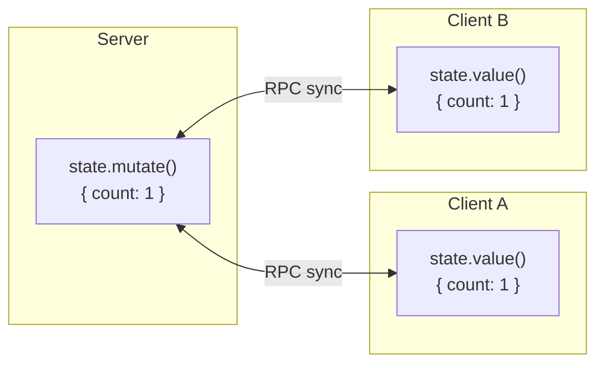

# Shared State

DevTools Kit's shared-state system synchronizes data between server and clients. Changes on either side propagate to every connected party.

## Overview



## Server-side usage

### Creating shared state

`ctx.rpc.sharedState.get()` creates or returns shared state:

```ts
const plugin: Plugin = {
  devtools: {
    async setup(ctx) {
      const state = await ctx.rpc.sharedState.get('my-plugin:state', {
        initialValue: {
          count: 0,
          items: [],
          settings: { theme: 'dark' },
        },
      })

      // Read current value
      console.log(state.value())
    // => { count: 0, items: [], settings: { theme: 'dark' } }
    }
  }
}
```

### Reading state

```ts
const state = await ctx.rpc.sharedState.get('my-plugin:state', {
  initialValue: { count: 0 },
})

// Get current value
const current = state.value()
console.log(current.count) // 0
```

### Mutating state

`state.mutate()` updates the state and syncs the change to every connected client:

```ts
// Mutate with a function (recommended)
state.mutate((draft) => {
  draft.count += 1
  draft.items.push({ id: 1, name: 'New item' })
})
```

The mutation function receives a mutable draft; changes are batched and synced automatically.

### Example: real-time updates

```ts
const plugin: Plugin = {
  devtools: {
    async setup(ctx) {
      const state = await ctx.rpc.sharedState.get('my-plugin:state', {
        initialValue: { modules: [], lastUpdate: 0 },
      })

      // Update state when Vite processes modules
      ctx.viteServer?.watcher.on('change', (file) => {
        state.mutate((draft) => {
          draft.modules.push(file)
          draft.lastUpdate = Date.now()
        })
      })
    }
  }
}
```

## Client-side usage

### Accessing shared state

`client.sharedState.get()` returns the shared state from the client:

```ts
import { getDevToolsRpcClient } from '@vitejs/devtools-kit/client'

const client = await getDevToolsRpcClient()

const state = await client.sharedState.get('my-plugin:state')

// Read current value
console.log(state.value())
```

The [global client context](/kit/client-context) exposes the same API via `ctx.rpc.sharedState`.

### Subscribing to changes

`state.on('updated', ...)` reacts to state changes:

```ts
const state = await client.sharedState.get('my-plugin:state')

// Initial value
console.log(state.value()) // { count: 0 }

// Subscribe to updates
state.on('updated', (newState) => {
  console.log('State updated:', newState)
  // { count: 1 } - after server mutation
})
```

## Framework integration

### Vue

A reactive ref that syncs with shared state:

```ts
import { getDevToolsRpcClient } from '@vitejs/devtools-kit/client'
import { shallowRef } from 'vue'

export async function useSharedState<T>(name: string) {
  const client = await getDevToolsRpcClient()
  const sharedState = await client.sharedState.get<T>(name)

  const state = shallowRef(sharedState.value())

  sharedState.on('updated', (newState) => {
    state.value = newState
  })

  return state
}

// Usage in component
const state = await useSharedState('my-plugin:state')
// `state` is now reactive and auto-updates
```

### Vue composable (full example)

```vue
<script setup lang="ts">
import { getDevToolsRpcClient } from '@vitejs/devtools-kit/client'
import { onMounted, shallowRef } from 'vue'

interface PluginState {
  count: number
  items: string[]
}

const state = shallowRef<PluginState | null>(null)

onMounted(async () => {
  const client = await getDevToolsRpcClient()
  const shared = await client.sharedState.get<PluginState>('my-plugin:state')

  state.value = shared.value()

  shared.on('updated', (newState) => {
    state.value = newState
  })
})
</script>

<template>
  <div v-if="state">
    <p>Count: {{ state.count }}</p>
    <ul>
      <li v-for="item in state.items" :key="item">
        {{ item }}
      </li>
    </ul>
  </div>
</template>
```

### React

```tsx
import { getDevToolsRpcClient } from '@vitejs/devtools-kit/client'
import { useEffect, useState } from 'react'

function useSharedState<T>(name: string, fallback: T) {
  const [state, setState] = useState<T>(fallback)

  useEffect(() => {
    let mounted = true

    async function init() {
      const client = await getDevToolsRpcClient()
      const sharedState = await client.sharedState.get<T>(name)

      if (mounted) {
        setState(sharedState.value() ?? fallback)

        sharedState.on('updated', (newState) => {
          if (mounted) {
            setState(newState)
          }
        })
      }
    }

    init()

    return () => {
      mounted = false
    }
  }, [name])

  return state
}

// Usage
function MyComponent() {
  const state = useSharedState('my-plugin:state', { count: 0 })

  return (
    <div>
      Count:
      {state.count}
    </div>
  )
}
```

### Svelte

```svelte
<script lang="ts">
  import { onMount } from 'svelte'
  import { writable } from 'svelte/store'
  import { getDevToolsRpcClient } from '@vitejs/devtools-kit/client'

  interface PluginState {
    count: number
  }

  const state = writable<PluginState>({ count: 0 })

  onMount(async () => {
    const client = await getDevToolsRpcClient()
    const sharedState = await client.sharedState.get<PluginState>('my-plugin:state')

    state.set(sharedState.value())

    sharedState.on('updated', (newState) => {
      state.set(newState)
    })
  })
</script>

<p>Count: {$state.count}</p>
```

## Type safety

Extend `DevToolsRpcSharedStates` for type-safe shared state:

```ts
// src/types.ts
import '@vitejs/devtools-kit'

interface MyPluginState {
  count: number
  items: Array<{ id: string, name: string }>
  settings: {
    theme: 'light' | 'dark'
    notifications: boolean
  }
}

declare module '@vitejs/devtools-kit' {
  interface DevToolsRpcSharedStates {
    'my-plugin:state': MyPluginState
  }
}
```

Now TypeScript will validate your state access:

```ts
const state = await ctx.rpc.sharedState.get('my-plugin:state', {
  initialValue: {
    count: 0,
    items: [],
    settings: { theme: 'dark', notifications: true },
  },
})

// ✓ Type-checked
state.mutate((draft) => {
  draft.count += 1
  draft.settings.theme = 'light'
})

// ✗ Error: 'invalid' is not assignable to 'light' | 'dark'
state.mutate((draft) => {
  draft.settings.theme = 'invalid'
})
```

## Best practices

### Namespaced keys

Prefix state keys with your plugin name to avoid collisions:

```ts
// ✓ Good
'my-plugin:state'
'my-plugin:settings'

// ✗ Bad — may conflict with other plugins
'state'
'settings'
```

### Keep state serializable

Shared state travels over JSON. Stick to plain data — no functions, no circular references:

<!-- eslint-skip -->

```ts
// ✗ Bad — functions don't serialize
{
  count: 0,
  increment: () => this.count++
}

// ✗ Bad — circular references
const obj = { child: null }
obj.child = obj

// ✓ Good — plain data
{
  count: 0,
  items: [{ id: 1, name: 'Item' }]
}
```

### Batch updates

Group multiple changes into a single `mutate` call to broadcast one sync event:

```ts
// ✓ Good — single sync event
state.mutate((draft) => {
  draft.count += 1
  draft.lastUpdate = Date.now()
  draft.items.push(newItem)
})

// ✗ Bad — three sync events
state.mutate((d) => {
  d.count += 1
})
state.mutate((d) => {
  d.lastUpdate = Date.now()
})
state.mutate((d) => {
  d.items.push(newItem)
})
```

### Mind state size

Large state objects can drag on sync performance. For large datasets, keep IDs in shared state and fetch the full records via RPC on demand:

<!-- eslint-skip -->

```ts
// ✓ Store just IDs and fetch details via RPC
{
  moduleIds: ['a', 'b', 'c'],
  selectedModule: 'a'
}

const module = await rpc.call('my-plugin:get-module', state.selectedModule)
```
