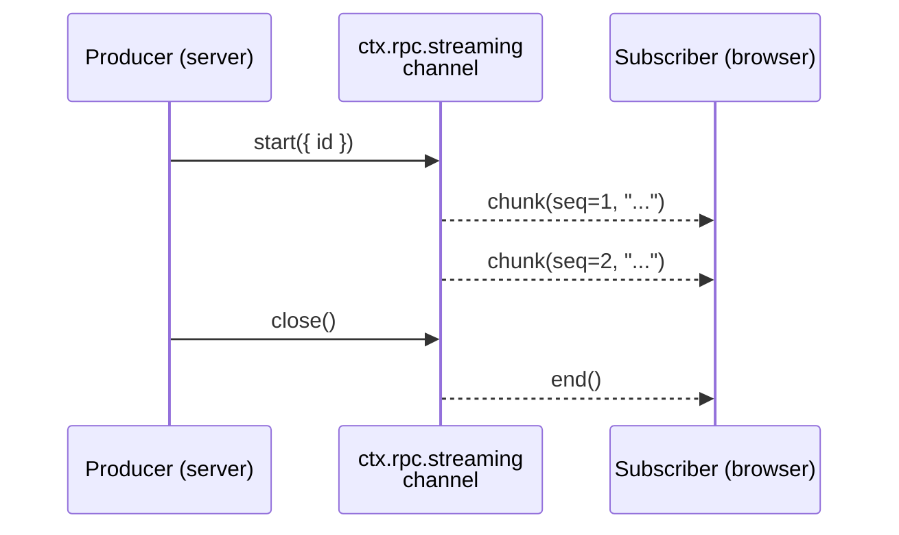

# Streaming

DevTools Kit ships a streaming-channel API for chunk-style data flowing in either direction between server and client — chat deltas, log lines, build progress, file uploads, mic / screen-share frames.

Reach for streaming when you need:

- Token-by-token rendering with low latency (LLM deltas, terminal output).
- Per-call lifecycles with cooperative cancellation.
- Replay on reconnect — a panel reopened mid-stream picks up where it left off.
- Client-to-server uploads without inventing a multipart protocol.

For *snapshot* state that survives reconnect and syncs across panels, use [shared state](./shared-state) instead.

## Overview



A **channel** owns a wire namespace. Each call to `channel.start()` produces an individual **stream** keyed by an id (auto-generated unless you pass one). Subscribers join by `(channelName, id)`.

## Server-to-client (the common case)

### Defining a channel

Create the channel once in `devtools.setup`:

```ts
/// <reference types="@vitejs/devtools-kit" />
import type { Plugin } from 'vite'
import { defineRpcFunction } from '@vitejs/devtools-kit'
import * as v from 'valibot'

export default function chatPlugin(): Plugin {
  return {
    name: 'my-plugin',
    devtools: {
      async setup(ctx) {
        const channel = ctx.rpc.streaming.create<string>('my-plugin:chat', {
          replayWindow: 256,
        })

        ctx.rpc.register(defineRpcFunction({
          name: 'my-plugin:start-chat',
          type: 'action',
          jsonSerializable: true,
          args: [v.object({ prompt: v.string() })],
          returns: v.object({ streamId: v.string() }),
          handler: async ({ prompt }) => {
            const stream = channel.start()
            ;(async () => {
              for await (const token of fakeLLM(prompt, { signal: stream.signal })) {
                if (stream.signal.aborted)
                  break
                stream.write(token)
              }
              stream.close()
            })()
            return { streamId: stream.id }
          },
        }))
      },
    },
  }
}
```

Channel names follow the `<plugin-id>:<name>` convention used by RPC functions and shared-state keys.

### Producing — three surfaces, one stream

The handle returned by `channel.start({ id? })` is both an imperative producer and a Web Streams `WritableStream<T>`:

```ts
const stream = channel.start({ id: 'optional-explicit-id' })

// Imperative — minimal, hand-rolled producers
stream.write(chunk)
stream.error(err) // terminal failure
stream.close() // terminal success
stream.signal // AbortSignal — flips when consumers cancel
stream.id // string — what clients subscribe to

// Web Streams — pipe any ReadableStream<T> in:
sourceReadable.pipeTo(stream.writable, { signal: stream.signal })

// Convenience — start + pipe in one call:
const stream2 = await channel.pipeFrom(sourceReadable)
```

Producers should poll `stream.signal.aborted` and exit cooperatively when it flips:

```ts
for (const token of source) {
  if (stream.signal.aborted)
    return
  stream.write(token)
}
stream.close()
```

#### Node.js stream interop

Web Streams are the canonical surface. Node 17+ ships standard-library converters for bridging to `node:stream`:

```ts
import { Readable, Writable } from 'node:stream'

// Pipe a Node Readable into the streaming channel
sourceNodeReadable.pipe(Writable.fromWeb(stream.writable))

// Pipe the channel out to a Node Writable
Readable.fromWeb(reader.readable).pipe(targetNodeWritable)
```

### Consuming — `for await` or `pipeTo`

The client returns a reader that's both an `AsyncIterable<T>` and exposes a `ReadableStream<T>`:

```ts
import { getDevToolsRpcClient } from '@vitejs/devtools-kit/client'

const rpc = await getDevToolsRpcClient()
const { streamId } = await rpc.call('my-plugin:start-chat', {
  prompt: 'Hello',
})

const reader = rpc.streaming.subscribe<string>('my-plugin:chat', streamId)

// Async iterable — the simplest consumer pattern
for await (const token of reader)
  appendToken(token)

// Or pipe to a DOM-side WritableStream
await reader.readable.pipeTo(downloadWritable)

reader.cancel() // sends cancel upstream; server stream.signal flips
```

Use one surface per reader — they share a single internal queue, so concurrent draining races.

## Client-to-server uploads

The same channel works in reverse for chunk-style uploads — file content, mic / screen-share frames, browser-side logs forwarded to disk, anything that would otherwise need a hand-rolled multipart-over-HTTP. The pattern: one regular RPC call allocates the id, then dedicated streaming events carry the chunks.

```ts
// Server — typically inside an action handler
ctx.rpc.register(defineRpcFunction({
  name: 'my-plugin:upload-file',
  type: 'action',
  args: [v.object({ name: v.string() })],
  returns: v.object({ uploadId: v.string() }),
  handler: async ({ name }) => {
    const reader = channel.openInbound()

    // Process chunks asynchronously — the action returns immediately
    // so the client can start uploading.
    ;(async () => {
      const file = createWriteStream(name)
      for await (const chunk of reader)
        file.write(chunk)
      file.close()
    })()

    return { uploadId: reader.id }
  },
}))
```

```ts
// Client
const { uploadId } = await rpc.call('my-plugin:upload-file', {
  name: 'capture.bin',
})
const upload = rpc.streaming.upload<Uint8Array>('my-plugin:files', uploadId)

// Imperative
upload.write(chunk1)
upload.write(chunk2)
upload.close()

// Or pipe a Web ReadableStream straight in:
fileReadable.pipeTo(upload.writable, { signal: upload.signal })
```

Lifecycle mirrors the outbound case:

- `upload.signal` aborts when the **server** calls `reader.cancel()` (the server cancellation broadcasts an `upload-cancel` to the uploading session).
- `upload.error(err)` propagates as a thrown error inside the server's `for await`.
- If the client disconnects mid-upload, the server's `for await` exits with an `UploadDisconnected` error so consumers can clean up.

Each `openInbound()` allocates a fresh server-side id owned by exactly one uploading session. Uploads are point-to-point: one producer, no fan-in, no shared subscribers, no replay (reconnect means the client restarts).

## Lifecycle and cancellation

| Event | Server side | Client side |
|-------|-------------|-------------|
| Producer calls `stream.close()` / `stream.error(err)` | Broadcasts `end` to subscribers | `for await` resolves (success) or throws (error) |
| Consumer calls `reader.cancel()` | `stream.signal` aborts when the **last** subscriber cancels — handlers should poll and exit | Reader marks itself cancelled; `for await` ends without iterating |
| WS disconnects | When the **last** subscriber drops, server aborts `stream.signal` | Reader stays alive; resubscribes automatically when trust is re-established |
| Panel closes mid-stream | Reader cancel cascades upstream | — |

A stream with multiple subscribers stays alive until the last one cancels or disconnects. Producers should make `stream.signal.aborted` part of their inner loop.

## Replay on reconnect

With `replayWindow: N`, the server keeps a rolling buffer of the last `N` chunks per stream. On (re)subscribe, the client passes the highest sequence number it has seen, and the server replays anything newer before resuming live.

```ts
ctx.rpc.streaming.create<string>('my-plugin:chat', {
  replayWindow: 256, // chunks to retain per stream id
  closedStreamRetention: 30_000, // ms to hold closed streams for late subscribers
})
```

`closedStreamRetention` defaults to 30 seconds when `replayWindow > 0` (so a panel re-opened seconds after a chat finishes still gets the full transcript). Set it explicitly to tune retention.

## Backpressure

The client maintains a bounded queue per subscription (`highWaterMark`, default 256). When the consumer falls behind, the oldest queued chunk drops and a [`DF0029`](https://devfra.me/errors/DF0029) warning is logged. This is best-effort — sufficient for current streaming use cases without threading transport-level backpressure through the RPC layer.

```ts
const reader = rpc.streaming.subscribe('my-plugin:chat', id, {
  highWaterMark: 1024, // raise if you expect bursts the consumer can recover from
})
```

When you need authoritative state rather than every intermediate value, [shared state](./shared-state) carries Immer patches with delivery guarantees — structured rather than streaming.

## Combining streaming with shared state

Token-level streaming and shared-state snapshots compose naturally for chat-style UIs:

- The conversation **log** lives in shared state (survives reloads, syncs across panels).
- Active responses use a **streaming** channel for low-latency token rendering.
- The action that starts a response appends a user message + assistant placeholder to shared state, kicks off the producer, and on producer close commits the joined content back to shared state.

```ts
const channel = ctx.rpc.streaming.create<string>('my-plugin:chat-tokens', {
  replayWindow: 1024,
})
const history = await ctx.rpc.sharedState.get('my-plugin:chat-history', {
  initialValue: { messages: [] as ChatMessage[] },
})

ctx.rpc.register(defineRpcFunction({
  name: 'my-plugin:send',
  type: 'action',
  args: [v.object({ prompt: v.string() })],
  returns: v.object({ streamId: v.string(), assistantId: v.string() }),
  handler: async ({ prompt }) => {
    const stream = channel.start()
    const assistantId = crypto.randomUUID()

    history.mutate((draft) => {
      draft.messages.push({
        id: crypto.randomUUID(),
        role: 'user',
        content: prompt,
      })
      draft.messages.push({
        id: assistantId,
        role: 'assistant',
        content: '',
        streamId: stream.id,
      })
    })

    let acc = ''
    ;(async () => {
      for await (const token of fakeLLM(prompt, { signal: stream.signal })) {
        if (stream.signal.aborted)
          break
        stream.write(token)
        acc += token
      }
      stream.close()
      // Commit final content; clients now read the message from
      // shared state and drop the live overlay.
      history.mutate((draft) => {
        const msg = draft.messages.find(m => m.id === assistantId)
        if (msg) {
          msg.content = acc
          msg.streamId = undefined
        }
      })
    })()

    return { streamId: stream.id, assistantId }
  },
}))
```

A working version of this pattern lives in [`devframe-streaming-chat`](https://github.com/devframes/devframe/tree/main/examples/devframe-streaming-chat).

## When to use streaming vs events vs shared state

| Use streaming for | Use `event`-typed RPC for | Use shared state for |
|-------------------|---------------------------|----------------------|
| Token / chunk feeds (LLM deltas, build logs) | Notifications without payload (`refresh`, `clear`) | Long-lived UI state (selections, panel layout) |
| Per-call lifecycles with cancellation | Cross-cutting signals broadcast to all clients | Reactive snapshots that survive reconnect |
| Replay on reconnect | Fire-and-forget signaling | Diff-based sync between clients |
| Client-to-server uploads (files, mic frames) | | |

## Reference

The API surface — `RpcStreamingHost`, `RpcStreamingChannel<T>`, `StreamSink<T>`, `StreamReader<T>` — is re-exported from `@vitejs/devtools-kit`. Streaming is built on the same primitive as Devframe's [streaming guide](https://devfra.me/guide/streaming); error codes for backpressure and lifecycle live there: [`DF0029`](https://devfra.me/errors/DF0029), [`DF0030`](https://devfra.me/errors/DF0030), [`DF0031`](https://devfra.me/errors/DF0031), [`DF0032`](https://devfra.me/errors/DF0032).
